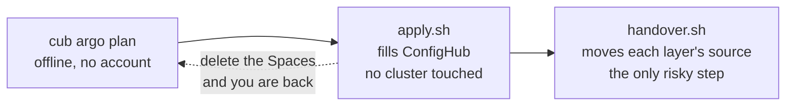
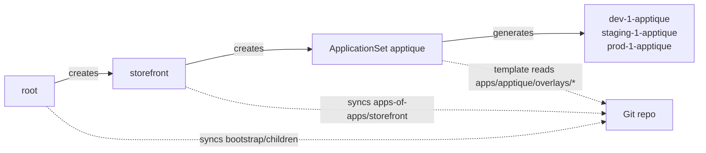
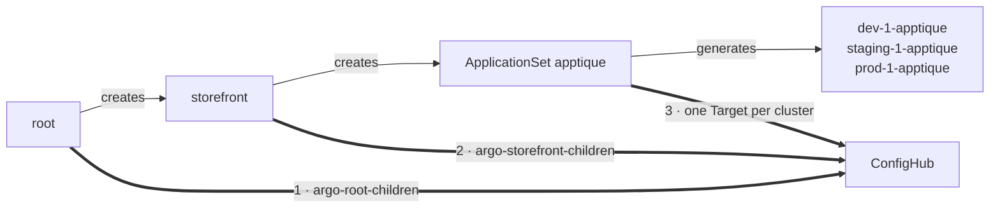
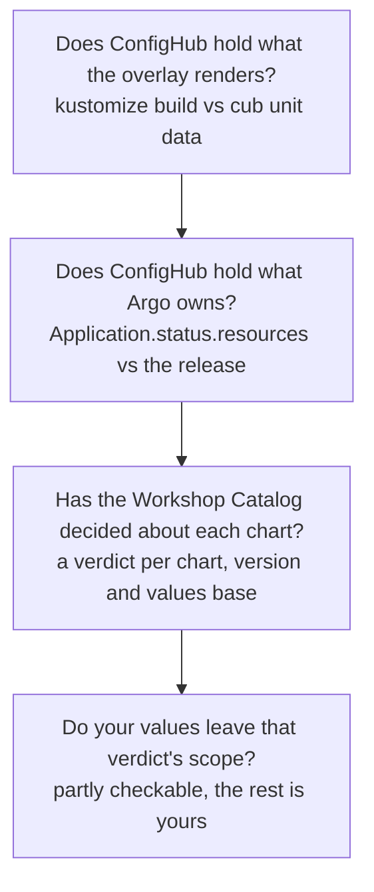
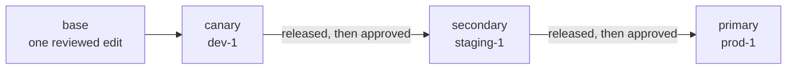

# Onboard your Argo CD estate

You already describe your estate in Argo's own terms: a root Application, an
app of apps or two, ApplicationSets that generate one Application per cluster.
This guide turns that into a governed estate in ConfigHub, and the first two
commands change nothing at all.

It is deliberately two phases, because they carry very different risk:



**Onboarding** fills ConfigHub while Argo carries on syncing Git. Afterwards
ConfigHub holds a complete parallel copy that nothing reads, so deleting those
Spaces puts you back exactly where you started. **Handover** is the step that
changes which source feeds your clusters.

You need the `cub` CLI logged in to your organization (`cub auth login`),
`kustomize` on your PATH, `kubectl` access to the cluster Argo CD runs on, and
the plugin:

```bash
cub plugin install confighub/cub-argo
```

## The words you will meet

- **Layer**: one thing in your Argo tree that syncs a source — the root
  Application, an app of apps, an ApplicationSet. A handover repoints layers.
- **Base**: the shared render an app's overlays build on, stored once in
  ConfigHub. A change to the app is made here.
- **Variant**: a copy of the base for one cluster, holding only what that
  cluster's overlay renders differently.
- **Departure**: a field in which a variant differs from its base.
- **Space**: ConfigHub's folder for configuration. The base and each variant
  get one; your organization has a quota of them.
- **Component**: the group of one base and its variants. There is one per app.
- **Target**: a named destination, one per cluster, plus one for the cluster
  Argo CD itself runs on. A variant's releases go to its cluster's Target.
- **Change order**: one change moving through the stages, with an approval
  recorded in each. **Workflow**: the stages and what each waits for.

## 1. See the plan

Point it at your checkout:

```bash
cub argo plan . --stage-label rollout-phase --stages canary,secondary,primary
```

The plan runs offline, with no account and no cluster, and shows what ConfigHub
would hold. For the [expert example](../../gitops/argo/expert-app-of-apps/) in
this repository:

```text
Argo CD estate: 3 clusters, 3 components, 9 variants

Control tree (stays as it is: this is the management record)
  Application root                           wave   0  root, applied by hand
    AppProject platform                      wave -10  project
    AppProject storefront                    wave -10  project, 1 sync window
    ApplicationSet platform-addons           wave   0  generates 3 Applications
    Application storefront                   wave  10  app of apps
      ApplicationSet checkout-cache          wave   0  generates 3 Applications
      ApplicationSet apptique                wave   5  generates 3 Applications

Stages by rollout-phase: canary, secondary, primary

apptique  (ApplicationSet, owned by storefront, project storefront, wave 5)
  selects  clusters where storefront=true
  base     argo-apptique-base  reaches no cluster: its destination is empty
  stage canary
    dev-1       variant argo-apptique-dev-1  ->  Target argo-targets/dev-1
                Application dev-1-apptique, namespace storefront-dev
  ...
  in flight  nginx: 1.27-alpine on dev-1, staging-1; 1.26-alpine on prod-1
```

`plan` expands your generators the way Argo does, so those Application names
are the ones you already have, not a guess. It also exits non-zero when it
finds something to fix first — a cluster label that renders an overlay path
which does not exist, for instance, which Argo would only tell you about as a
failed sync.

The committed output for the example is
[`testdata/expert-app-of-apps.plan.txt`](../testdata/expert-app-of-apps.plan.txt),
so you can see the whole shape before running anything.

Leave out the stage options and every cluster is in one stage, `fleet`.

## 2. Write the steps, read them, run them

```bash
cub argo apply . --stage-label rollout-phase --stages canary,secondary,primary --out onboard
bash onboard/apply.sh
```

`apply` writes files and two scripts, and runs nothing. It checks `cub` is
logged in and `kustomize` is present, then:

1. Creates one Target per cluster, named for it, plus `argocd` for the cluster
   Argo runs on, all on a server-hosted worker.
2. Stores each app of apps' children as Units — your `AppProject`,
   `ApplicationSet` and child `Application` manifests, copied byte for byte, so
   reviewing what ConfigHub holds is reviewing what Argo reads today.
3. Renders each app's base with `kustomize build` and stores it, with the
   workflow its changes follow.
4. Creates each cluster's variant, bound to its Target, holding what that
   cluster's overlay renders.
5. Releases the first version stage by stage: promote, approve, publish.

Nothing above touches a cluster. The whole script is safe to re-run: it picks
up where ConfigHub says each step stands, and never writes over a change made
in ConfigHub since.

## 3. Hand the estate over

This is the step that moves your clusters, so read it first:

```bash
ARGOCD_CONTEXT=<kubectl context of the cluster Argo CD runs on> bash onboard/handover.sh
```

Each layer is **repointed**, never orphaned or deleted. That matters because an
app of apps does not own its children through `ownerReferences` — it owns them
by syncing a directory and pruning whatever is not in it. There is nothing to
sever, so repointing the parent is both the gentler move and the only one that
survives the parent's next reconcile.

Before, every layer reads Git:



After, the same layers read ConfigHub. Same objects, same names, three
sources moved, in this order:



The tree is the same on both sides. Only the three sources move, and in that
order, because a parent pointed at a Space that holds nothing is a parent
syncing an empty source — and with `prune: true` it deletes the children it
applied. `apply.sh` publishes each Space before `handover.sh` repoints the layer
that syncs it.

`root` is patched in the cluster, because nothing above it can repoint it under
review. `storefront` is a Unit by then, so its repoint is promoted and approved
like any other change. Each ApplicationSet's template is repointed last, and it
goes on generating the same Applications under the same names, so Argo's
tracking does not change and no workload is recreated.

**What the script checks before it changes anything.** That Argo CD is v3.1 or
newer, which is where an `oci://` source is read natively, and that your
AppProjects allow the gateway under `sourceRepos` — until they do, every repoint
is refused. Then two comparisons, and only the second can see your cluster:

| Question | What it compares | What it can catch |
|---|---|---|
| Does ConfigHub hold what the overlay renders? | `kustomize build` against `cub unit data` | Git moving since `apply.sh` ran. Both sides come from Git, so nothing more |
| Does ConfigHub hold what Argo actually owns? | `Application.status.resources` against the release | An object on the cluster that Git has never described. Where Argo prunes, that object is **deleted** when the source moves |

The second is `cub argo check`, and it runs for every variant before anything
is repointed. It reads Argo's own record — not an inference from labels — and
`requiresPruning` is Argo's own answer to what it would delete. Objects the
release holds but Argo does not own are named too, as additions. Sync hooks are
a note, since Argo runs rather than holds them.

Afterwards the script asks `cub scout map list -q "owner=Native ..."` for what
no controller claims in those namespaces: things applied by hand, which neither
record mentions and which a handover leaves behind. That one is a cross-check,
not a gate, and cub-scout's absence is not a failure.

**Nothing is deleted.** `root` and `storefront` carry
`resources-finalizer.argocd.argoproj.io`, which deletes everything they
deployed. Every step is a patch for exactly that reason. To go back, patch each
source to its Git `repoURL` and path.

## What the plugin checks for you, and what it cannot

Three of these run on your behalf. The fourth is yours, and the plan says so
rather than pretending otherwise.



**Would the swap change the cluster?** `cub argo check` reads
`Application.status.resources` — Argo's own record of what it reconciles, not
an inference from labels — and compares it with what the release holds. It names
any object Argo owns that the release lacks, and says what would happen to it:

```text
prod-1-apptique: 3 objects match what Argo owns
  ServiceAccount storefront-prod/frontend: Argo owns it and the release does
  not hold it, and this Application prunes, so it would be DELETED from the cluster
```

Whether that reads DELETED or "left on the cluster, managed by nothing" comes
from the Application's own `spec.syncPolicy.automated.prune`. `handover.sh`
runs this for every variant before anything moves, passing the cluster's
context so it reads the estate being handed over rather than whichever context
happens to be current.

**Has the chart been audited?** Where an overlay inflates a Helm chart, the
plan reports what the Workshop Catalog has already decided about it — one
verdict per chart, version **and values base**, because a verdict is not a
property of a chart. The Catalog's own data makes the point: `cloudpirates/redis`
0.34.11 is `unsafe-to-flatten` on its default base and `safe-to-flatten` on
`reuse-existing-secret`, because the default leaves `auth.existingSecret` unset,
so the Secret template renders, mints a password and fires a lookup.

A chart the Catalog has not audited is reported as undecided, and a verdict for
another version is reported as not carrying. Neither reads as safe.

**Do your own values leave that verdict's scope?** Each verdict names the values
changes that take a variant out of it. Where the scope names a path and you set
it, the plan says the verdict does not carry. Much of the scope is written for a
reader — "authentication or TLS enabled", "certificates supplied from outside
the render" — and that part is handed back to you explicitly rather than passed
over in silence.

**What none of this can see:** whether anyone edited an object on the cluster by
hand. The object sets still match, so the check passes. `cub scout compare` is
the tool for that — it reads Kubernetes `managedFields` and attributes each
field path to whoever last wrote it. `handover.sh` also asks cub-scout what no
controller claims in your namespaces, which is a cross-check rather than a gate.

## Making a change afterwards

ConfigHub now holds each app's base, so a change starts there. It is made once
and moves through the stages with an approval in each:

```bash
cub unit data --space argo-apptique-base apptique > apptique.yaml
# edit it, then store it on the base
cub unit update --space argo-apptique-base apptique apptique.yaml \
  --change-desc "Raise the frontend to 4 replicas"
cub changeorder create --space argo-apptique-base more-replicas \
  --change-workflow argo-apptique-base/rollout --description "Raise replicas"

cub variant promote --change-order argo-apptique-base/more-replicas --target-stage canary
cub variant approve --change-order argo-apptique-base/more-replicas --stage canary
cub release publish argo-apptique-dev-1 --revision ChangeOrder:argo-apptique-base/more-replicas
```

ConfigHub refuses to promote into the next stage until this one has released
the change, and refuses each release until the change is approved in its stage.
Both refusals come from the server, in its own words.



The generated workflow lets the person who promotes a change also approve it,
which one person trying this needs. Once a second person can approve, set
`AllowAuthors: false` in each app's `change-workflow.yaml`.

## When a cluster joins

Register the cluster with Argo and label it as you always have. Then plan and
apply again with a fresh export, and re-run the script:

```bash
kubectl get secrets -n argocd -l argocd.argoproj.io/secret-type=cluster -o yaml > clusters.yaml
cub argo plan . clusters.yaml --stage-label rollout-phase --stages canary,secondary,primary
```

The plan shows the new cluster's variants. The script leaves every existing
variant as it is, clones the new one from the base as the base stands today,
including every change made since, and releases it through its stages with an
approval in each. Joining is a reviewed change rather than a side effect of a
label.

## What this leaves alone

- The `argocd` install itself, and anything Argo does not manage.
- Cluster Secret credentials. The plan reads names, servers and labels only.
- AppProject RBAC, and sync windows: those stay runtime settings in Argo. The
  plan reports which of your Applications a window covers, and `handover.sh`
  says when a repoint's first sync will wait for one to close.
- Sync waves. ConfigHub's stages own the rollout order between clusters; waves
  still order objects within a sync.
- Generators it does not read offline: git, SCM provider, pull request, merge
  and plugin. The plan names them rather than guessing.
- Multi-source Applications' paths, and anything needing Sprig functions.

## What has and has not been checked

Nothing in this guide is claimed without something having run.

**Checked here, offline:** every render in the example's script runs against
kustomize 5.8.1 and gives the same bytes twice over. Both generated scripts are
valid bash. `plan` reads every Argo example in this repository. One command,
`scripts/verify-gitops-plugins.sh`, runs all of that and has twice caught
defects nobody was looking for.

**Checked on a live cluster:** `cub argo check` was run against Argo CD v3.5.3
on kind, syncing this repository's `beginner-applicationset` example, with the
render stored in ConfigHub. It reported four matching objects; with one object
removed from the release it caught the difference and exited non-zero.

That rehearsal found two bugs no test had:

- The message said an object would be "left on the cluster, managed by nothing"
  when the Application prunes and Argo would have **deleted** it. The code read
  the per-resource `requiresPruning` flag, which describes what is out of sync
  *now* — and with everything in sync it is absent on every entry, which is
  exactly the state a handover is checked in. It reads
  `spec.syncPolicy.automated.prune` instead.
- The check read whichever kubectl context happened to be current. On a fleet
  handed over cluster by cluster, it could have reported on one cluster while
  another was being changed, and passed. It now takes `--kube-context`, and
  `handover.sh` passes it.

Every unit test passed throughout both bugs, because the fakes were written
from the same wrong beliefs as the code.

**Not yet run:** the handover itself. Every check in front of it has been
exercised against a real cluster; repointing a live Application at ConfigHub
has not. Until that is recorded, read `handover.sh` before running it, and
start with one non-production estate.

**Not claimed at all:** that a plain directory of manifests can be onboarded
(`kustomize build` will not read one, though Argo will — the plan says so),
that git, SCM-provider, pull-request, merge or plugin generators are resolved,
or that an Application whose source is a Helm chart can be governed yet.
