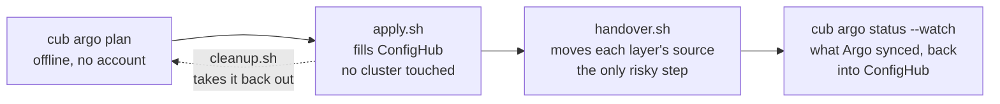
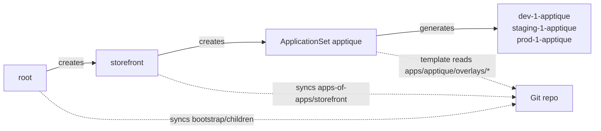
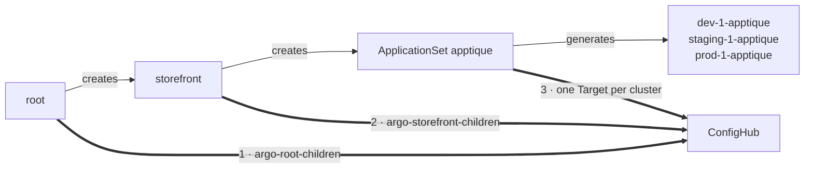
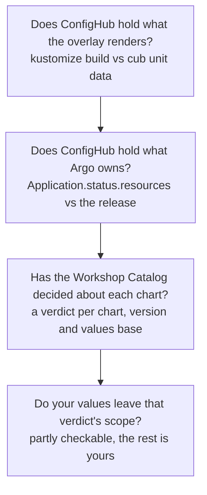
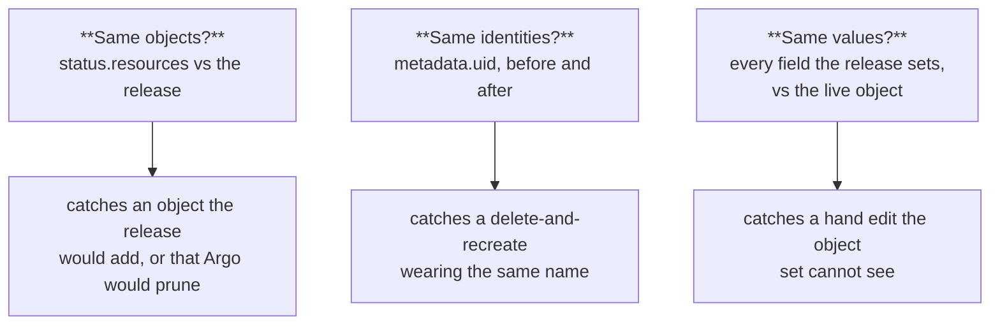
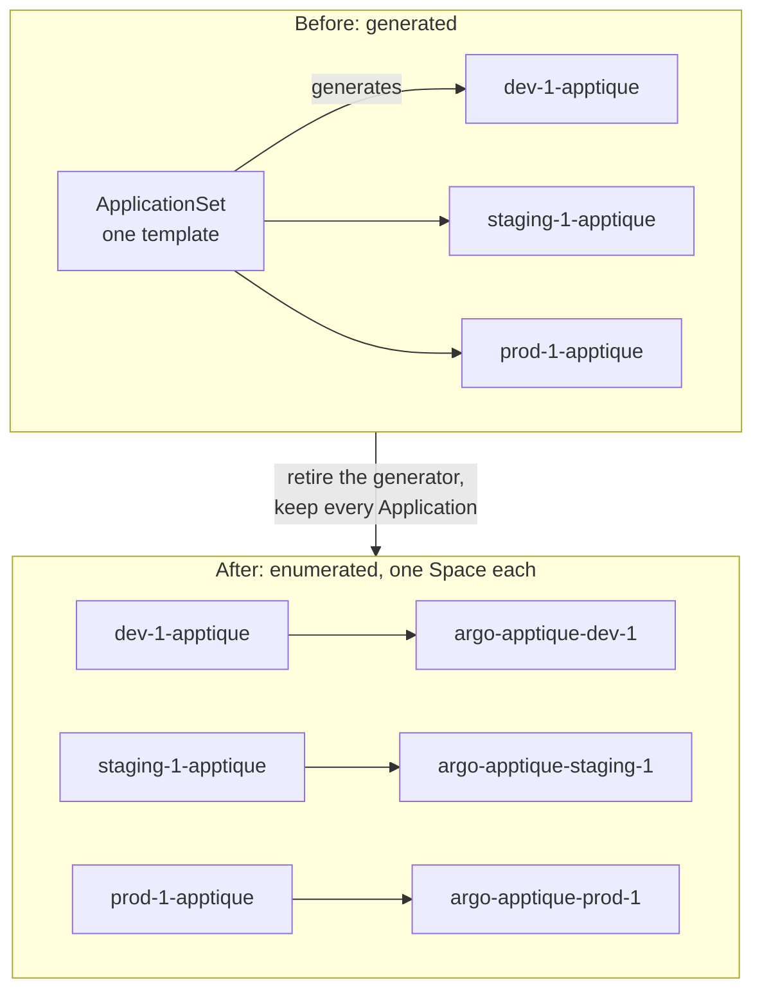
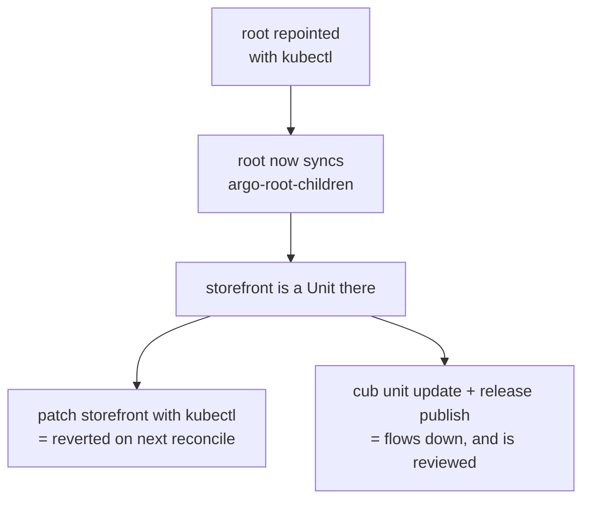
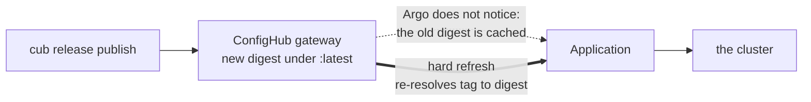
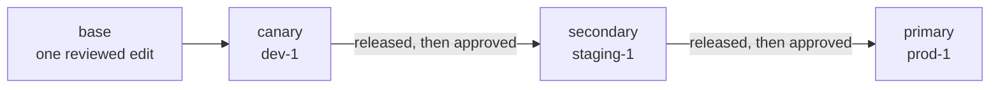

# Onboard your Argo CD estate

You already describe your estate in Argo's own terms: a root Application, an
app of apps or two, ApplicationSets that generate one Application per cluster.
This guide turns that into a governed estate in ConfigHub, and the first two
commands change nothing at all.

It is deliberately two phases, because they carry very different risk:



**Onboarding** fills ConfigHub while Argo carries on syncing Git. Afterwards
ConfigHub holds a complete parallel copy that nothing reads, and `cleanup.sh`
— written beside `apply.sh` — takes it all back out. It is a script rather than
a line in this guide because the order is not guessable: a variant's Release
points at a Tag in its base Space, so the variants have to go before the bases
they were promoted from. Each Space then goes in one
`cub space delete --recursive --detach`.

**Handover** is the step that changes which source feeds your clusters, and it
is not undone by deleting Spaces — put each Application's source back to Git
first. Given `ARGOCD_CONTEXT`, `cleanup.sh` reads the Applications itself and
refuses, naming each one, while any still reads a Space it would delete;
without it, it asks.

The `plan` command needs the `cub` CLI and plugin, but no login, `kustomize`,
or cluster access. To run the generated `apply.sh`, log into your organization
(`cub auth login`) and have `kustomize` on your PATH. To run `handover.sh`, you
also need `kubectl` access to the cluster Argo CD runs on and to each destination
cluster. The plugin lives in this repository rather than in one of its own, so
build it from a checkout (it needs Go):

```bash
git clone https://github.com/confighub/examples
cd examples/cub-argo
go build -o bin/cub-argo . && cub plugin install ./bin/cub-argo
cub plugin list   # argo should be listed, status ok
```

## The words you will meet

- **Layer**: one thing in your Argo tree that syncs a source — the root
  Application, an app of apps, an ApplicationSet. A handover repoints layers.
- **Base**: the shared render an app's overlays build on, stored once in
  ConfigHub. A change to the app is made here.
- **Variant**: a copy of the base for one cluster, holding only what that
  cluster's overlay renders differently.
- **Departure**: a field in which a variant differs from its base.
- **Space**: ConfigHub's folder for configuration. The base and each variant
  get one; your organization has a quota of them.
- **Component**: the group of one base and its variants. There is one per app.
- **Target**: a named destination, one per cluster, plus one for the cluster
  Argo CD itself runs on. A variant's releases go to its cluster's Target.
- **Change order**: one change moving through the stages, with an approval
  recorded in each. **Workflow**: the stages and what each waits for.

## 1. See the plan

Point it at your checkout:

```bash
cub argo plan . --stage-label rollout-phase --stages canary,secondary,primary
```

The plan runs offline, with no account and no cluster, and shows what ConfigHub
would hold. For the [expert example](../../gitops/argo/expert-app-of-apps/) in
this repository:

```text
Argo CD estate: 3 clusters, 3 components, 9 variants

Control tree (stays as it is: this is the management record)
  Application root                           wave   0  root, applied by hand
    AppProject platform                      wave -10  project
    AppProject storefront                    wave -10  project, 1 sync window
    ApplicationSet platform-addons           wave   0  generates 3 Applications
    Application storefront                   wave  10  app of apps
      ApplicationSet checkout-cache          wave   0  generates 3 Applications
      ApplicationSet apptique                wave   5  generates 3 Applications

Stages by rollout-phase: canary, secondary, primary

apptique  (ApplicationSet, owned by storefront, project storefront, wave 5)
  selects  clusters where storefront=true
  base     argo-apptique-base  reaches no cluster: its destination is empty
  stage canary
    dev-1       variant argo-apptique-dev-1  ->  Target argo-targets/dev-1
                Application dev-1-apptique, namespace storefront-dev
  ...
  in flight  nginx: 1.27-alpine on dev-1, staging-1; 1.26-alpine on prod-1
```

`plan` expands your generators the way Argo does, so those Application names
are the ones you already have, not a guess. It also exits non-zero when it
finds something to fix first — a cluster label that renders an overlay path
which does not exist, for instance, which Argo would only tell you about as a
failed sync.

The committed output for the example is
[`testdata/expert-app-of-apps.plan.txt`](../testdata/expert-app-of-apps.plan.txt),
so you can see the whole shape before running anything.

Leave out the stage options and every cluster is in one stage, `fleet`.

## 2. Write the steps, read them, run them

```bash
cub argo apply . --stage-label rollout-phase --stages canary,secondary,primary --out onboard
bash onboard/apply.sh
```

`apply` writes files and two scripts, and runs nothing. It checks `cub` is
logged in and `kustomize` is present, then:

1. Creates one Target per cluster, named for it, plus `argocd` for the cluster
   Argo runs on, all on a server-hosted worker.
2. Stores each app of apps' children as Units — your `AppProject`,
   `ApplicationSet` and child `Application` manifests, copied byte for byte, so
   reviewing what ConfigHub holds is reviewing what Argo reads today.
3. Renders each app's base with `kustomize build` and stores it, with the
   workflow its changes follow.
4. Creates each cluster's variant, bound to its Target, holding what that
   cluster's overlay renders.
5. Releases the first version stage by stage: promote, approve, publish. One
   operator does all three, as the workflow is generated (see "Making a change
   afterwards").

Nothing above touches a cluster. The whole script is safe to re-run: it picks
up where ConfigHub says each step stands, and never writes over a change made
in ConfigHub since.

## 3. Hand the estate over

This is the step that moves your clusters, so read it first:

```bash
ARGOCD_CONTEXT=<kubectl context of the cluster Argo CD runs on> \
  DEST_CONTEXT_prod_1=<kubectl context of prod-1> ... \
  bash onboard/handover.sh
```

One `DEST_CONTEXT_<cluster>` for each cluster Argo deploys to other than its
own; step 0 names any that are missing.

Each layer is **repointed**, never orphaned or deleted. That matters because an
app of apps does not own its children through `ownerReferences` — it owns them
by syncing a directory and pruning whatever is not in it. There is nothing to
sever, so repointing the parent is both the gentler move and the only one that
survives the parent's next reconcile.

Before, every layer reads Git:



After, the same layers read ConfigHub. Same objects, same names, three
sources moved, in this order:



The tree is the same on both sides. Only the three sources move, and in that
order, because a parent pointed at a Space that holds nothing is a parent
syncing an empty source — and with `prune: true` it deletes the children it
applied. `apply.sh` publishes each Space before `handover.sh` repoints the layer
that syncs it.

`root` is patched in the cluster, because nothing above it can repoint it under
review. `storefront` is a Unit by then, so its repoint is promoted and approved
like any other change. Each ApplicationSet's template is repointed last, and it
goes on generating the same Applications under the same names, so Argo's
tracking does not change and no workload is recreated.

**Applications that are neither roots nor generated.** Most app-of-apps estates
are a root whose children are ordinary Applications, one per app and
environment, and some Applications are simply applied by hand. Each is checked
like a generated one, against the release it will read, and then:

- **A child its parent syncs** is a Unit in the parent's control Space by then.
  Patched on the cluster, the parent would put it back on its next reconcile.
  So `apply` writes each such Unit already repointed, under
  `repointed/<space>/`, and `handover.sh` fills in the gateway and prints the
  two commands that put it in place: `cub unit update` for each Unit, then one
  `cub release publish` of the control Space. A reviewed change, in one
  publish.
- **An Application applied by hand** is patched by `handover.sh` itself, the
  way `root` is: its source recorded first, the patch, a hard refresh, then a
  wait until it has synced the digest that was checked.

Either way the repoint clears the `kustomize`, `helm` and `directory` settings
the Application had: a release is rendered already, and a tool setting left in
place would have Argo build it a second time.

**What the script checks before it changes anything.** That Argo CD is v3.1 or
newer, which is where an `oci://` source is read natively, and that your
AppProjects allow the gateway under `sourceRepos` — until they do, every repoint
is refused. Then two comparisons, and only the second can see your cluster:

| Question | What it compares | What it can catch |
|---|---|---|
| Does ConfigHub hold what the overlay renders? | `kustomize build` against `cub unit data` | Git moving since `apply.sh` ran. Both sides come from Git, so nothing more |
| Does ConfigHub hold what Argo actually owns? | `Application.status.resources` against the release | An object on the cluster that Git has never described. Where Argo prunes, that object is **deleted** when the source moves |

The second is `cub argo check`, and it runs for every variant before anything
is repointed. It reads Argo's own record — not an inference from labels — and
`requiresPruning` is Argo's own answer to what it would delete. Objects the
release holds but Argo does not own are named too, as additions. Sync hooks are
a note, since Argo runs rather than holds them.

Afterwards the script asks `cub scout map list -q "owner=Native ..."` for what
no controller claims in those namespaces: things applied by hand, which neither
record mentions and which a handover leaves behind. That one is a cross-check,
not a gate, and cub-scout's absence is not a failure.

**The repository Secret, verified against Argo CD v3.5.3.** The Application's
`repoURL` and the Secret's `url` both need the `oci://` scheme — without it Argo
treats the address as a git repository and fails with `list refs: invalid auth
method`. The Secret's `type` is `oci`, and the worker is the username and
password:

```yaml
stringData:
  type: oci
  url: oci://<gateway>/space/<prefix>-
  username: <the Targets' server worker id>
  password: <its secret>
  # only for a gateway served over plain HTTP:
  insecureOCIForceHttp: "true"
```

**Nothing is deleted.** `root` and `storefront` carry
`resources-finalizer.argocd.argoproj.io`, which deletes everything they
deployed. Every step is a patch for exactly that reason.

**The way back is printed, leaves first.** Before `handover.sh` patches an
Application, it records that Application's whole source as it was, in
`handover-state/argo.txt`: the settings the repoint clears are put back too. A
record written by an earlier version of the script, which kept three fields of
it, is still read, since a handover can outlive a plugin upgrade. After the
repoint it checks that the digest `root` synced is the control Space's newest
release, and stops if not. If the run stops anywhere after `root` moved, it
prints the way back, in this order, and rolls nothing back by itself. It prints
the same at the end of a clean run.

1. Undo `create-only` on any retired ApplicationSet: in its Unit, then
   publish, or on the cluster when it was applied by hand. The controller then
   puts its Applications back on the template's Git source.
2. Put back each Unit repointed through ConfigHub, a child or a nested app of
   apps, from the copy `apply` wrote under `control/<space>/`, and publish its
   Space. The script prints the exact `cub unit update` and `cub release
   publish` commands, children before parents.
3. Patch each Application it patched back to its recorded source, on the
   context the run used, the last moved first.

Moving `root` back alone also puts everything back, with every UID intact. It
was run live on 2026-09-30. But for a moment it restores the Git AppProjects
while a generated Application still reads the gateway, and that Application is
refused until it moves too. Undoing from the bottom avoids that.

## What the plugin checks for you, and what it cannot

Three of these run on your behalf. The fourth is yours, and the plan says so
rather than pretending otherwise.



**Would the swap change the cluster?** `cub argo check` reads
`Application.status.resources` — Argo's own record of what it reconciles, not
an inference from labels — and compares it with what the release holds. It names
any object Argo owns that the release lacks, and says what would happen to it:

```text
prod-1-apptique: 3 objects match what Argo owns
  ServiceAccount storefront-prod/frontend: Argo owns it and the release does
  not hold it, and this Application prunes, so it would be DELETED from the cluster
```

Whether that reads DELETED or "left on the cluster, managed by nothing" comes
from the Application's own `spec.syncPolicy.automated.prune`. `handover.sh`
runs this for every variant before anything moves, passing the cluster's
context so it reads the estate being handed over rather than whichever context
happens to be current.

**You run it the way you ran `plan`.** `check` takes the same repository
directory and works the estate out for itself — there is no per-Application
flag to get right, and no list to keep in step with the repository:

```bash
cub argo check ./my-estate --stage-label rollout-phase --stages canary,secondary,primary
```

```text
prod-1-apptique: 3 objects match what Argo owns
staging-apptique: 3 objects match what Argo owns
...
9 of 9 clean
```

It exits non-zero if any Application is not clean, so it drops into CI as it
is. `--kube-context` names the cluster to read; without it kubectl uses
whatever context is current, which during a handover is very likely the wrong
one.

**Has the chart been audited?** Where an overlay inflates a Helm chart, the
plan reports what the Workshop Catalog has already decided about it — one
verdict per chart, version **and values base**, because a verdict is not a
property of a chart. The Catalog's own data makes the point: `cloudpirates/redis`
0.34.11 is `unsafe-to-flatten` on its default base and `safe-to-flatten` on
`reuse-existing-secret`, because the default leaves `auth.existingSecret` unset,
so the Secret template renders, mints a password and fires a lookup.

A chart the Catalog has not audited is reported as undecided, and a verdict for
another version is reported as not carrying. Neither reads as safe.

**Do your own values leave that verdict's scope?** Each verdict names the values
changes that take a variant out of it. Where the scope names a path and you set
it, the plan says the verdict does not carry. Much of the scope is written for a
reader — "authentication or TLS enabled", "certificates supplied from outside
the render" — and that part is handed back to you explicitly rather than passed
over in silence.

## Three questions, not one: objects, identities, fields

A handover is safe when swapping the source changes nothing. "Nothing" breaks
into three questions, and each needs a different thing to be read.



The first two are the object-set check and the UID comparison the handover
rehearsal runs. The third is `--fields`, and it is the one that sees a person.

```bash
cub argo check ./my-estate --fields
```

For every object the release holds, it reads the live object and compares
**only the fields the release sets**. That restriction is the whole design:
Kubernetes fills in defaults a release never mentions and controllers own
others, so comparing everything the cluster holds reports noise as drift. It is
the same rule a reconciler applies.

Each difference is reported with Kubernetes' own record of who has written that
object:

```text
Deployment apptique-dev/frontend .spec.replicas: cluster has 4, the release
holds 2 (written on this object by kubectl-scale, argocd-controller)
```

**It checks the release, not the head.** A handover delivers a published
release, and a unit changed since the last publish holds something the cluster
will not get. So `check` reads the newest published release, or the one
`--release sha256:...` names, finds the revision of the unit it bundled, and
compares that. It prints the release number and manifest digest, and says so
when the unit's head has moved past it. `handover.sh` records each digest
before checking it, and prints it beside each repoint, so the digest Argo then reports in
`status.sync.revision` can be compared with the one that was checked.

**`--record` keeps the verdict in ConfigHub.** `cub argo check --fields
--record` writes each Application's verdict as a `LiveCheck` attestation on the Unit
revision the checked release bundled. A clean check is a Pass. Anything that
differs is a rejection that names it: an object the release would add or prune,
a field, or an object it could not read. The claims name the Application and the
release digest. `LiveCheck` is the type `cub kubara check --record` uses for
the same claim, so a workflow can require one type whichever plugin checked. It
needs `--fields`: a claim that the cluster runs this release rests on every
field the release sets. The recording is the same code as `cub flux`,
which was run live on 2026-09-30.

**It reads each object where it runs.** The Application is read on the cluster
Argo CD runs on, and the objects it deploys on the cluster it deploys them to.
Those are the same cluster only when the destination is Argo's own
(`in-cluster`). For any other, pass that cluster's context:

```bash
cub argo check ./my-estate --cluster prod-1 --fields \
  --kube-context <Argo CD's cluster> --destination-context <prod-1's context>
```

The check accepts that context only if kubectl reaches it at the address the
Application deploys to. A kind cluster, say, is `127.0.0.1:<port>` from your
laptop and something else from inside Argo, and then you say which destination
it is with `--destination <server>`. Without either, it refuses rather than read
the management cluster, where an object of the same name would be compared and
could pass. `handover.sh` asks for one `DEST_CONTEXT_<cluster>` per cluster up
front and passes the destination the plan found.

An object the check cannot read, because it is forbidden, timed out or the
cluster is unreachable, is listed and counted: the check says how many of the
release's objects it compared, and reading fewer than all of them is never
clean.

`managedFields` is that record, and `kubectl get -o json` **strips it** unless
asked — the plugin passes `--show-managed-fields`, without which attribution
comes back silently empty. The managers are not ordered by time: kubectl leaves
the timestamp off some writes, so naming a last writer would be a guess where a
fact belongs.

**Measured on a live cluster**, Argo CD v3.5.3, with a `kubectl scale` against
an Application whose `selfHeal` was off:

- The object sets matched exactly. The inventory check passed, correctly.
- `--fields` named `.spec.replicas`, both values, and `kubectl-scale` among the
  managers.
- `kubectl scale` took **sole** ownership of `f:replicas` via the scale
  subresource — `argocd-controller` no longer held that field at all. That
  subresource records no timestamp, which is why the ordering claim was dropped.
- `argocd-controller` writes with `Update`, not `Apply`: client-side apply, not
  server-side.
- Argo CD itself reported `OutOfSync`/`Healthy` once its refresh had run. Argo
  does notice a hand edit — the point of `--fields` is not that Argo is blind,
  but that Argo compares the app to **Git** and reports one status, while this
  compares it to **the release you are about to hand it**, per field, with a
  name attached.

`cub scout compare` remains the broader tool: it works across an estate without
a plan, and infers ownership where nothing declares it. `handover.sh` asks
cub-scout what no controller claims in your namespaces, as a cross-check rather
than a gate.

## ApplicationSets are retired, not repointed

An ApplicationSet generates one Application per cluster from **one shared
template**, so it cannot give each cluster its own Space by editing that
template with a literal address. But ConfigHub already holds your fleet
enumerated — one variant Space per cluster, staged — so by handover time the
generator has nothing left to generate.



This is the same move `cub sveltos` makes when it drops a profile's
`clusterSelector` for a `clusterRefs` naming one cluster. A new cluster stops
producing an Application on its own and becomes a variant you add in ConfigHub —
a reviewed change rather than an automatic one, which is the point.

**Measured on Argo CD v3.5.3**, and each of these changes what the script does.
The first measurements used one cluster and a path swap. The sequence has since
been run end to end against real variant Spaces on two registered clusters; see
"Run against a live estate on three clusters" below.

- **Patching a generated Application while its ApplicationSet is live is
  reverted in under a second.** The generator stands down first, with
  `spec.syncPolicy.applicationsSync: create-only`; the controller then creates
  but never updates or deletes what it made.
- **With `create-only`, the patch holds**, the Application genuinely re-syncs to
  the new source, and its **UID does not change**.
- **Applications then move one cluster at a time.** Verified: one Application
  repointed while its sibling stayed where it was — the staged rollout a shared
  template cannot express.

### Removing a retired ApplicationSet later

The retired ApplicationSets stay in place, inert. Removing one is a separate,
later decision, and **the obvious way to do it destroys the estate**:

> Measured: a generated Application carries an `ownerReference` to its
> ApplicationSet with `blockOwnerDeletion: true`. Deleting the ApplicationSet
> let Kubernetes garbage-collect every Application it made, and Argo then
> removed their workloads and their namespaces.
> **`preserveResourcesOnDeletion: true` did not prevent this.** It was set, and
> everything went anyway.

Strip the `ownerReferences` first and the Applications stand on their own —
measured, both Applications and the Deployment kept their UIDs:

```bash
kubectl -n argocd patch application dev-1-apptique --type json \
  -p '[{"op":"remove","path":"/metadata/ownerReferences"}]'   # every generated Application
kubectl -n argocd delete applicationset apptique             # only then
```

`cleanup.sh` prints this for each retired ApplicationSet, naming the exact
Applications, in the order that does not delete them.

## What the Argo handover has been through

Rehearsed on Argo CD v3.5.3 against a self-hosted ConfigHub v0.6.2. Both
parents — `root` and `storefront` — now read ConfigHub, and **every UID is
unchanged**: the AppProjects, the ApplicationSet and the child Application are
the same objects they were before.

Eleven bugs came out of that, and none of them would have been found by reading
the code. The ones worth knowing about as an operator:

**`sourceRepos` cannot be widened with `kubectl`.** The AppProjects are
themselves synced by the root Application, so a patch is reverted and the
repoint is refused again with no sign of why. Commit it where Argo reads it.
The allow-entry also needs `/**`, not `/*` — Argo's glob does not cross `/`,
and the gateway address has two path segments.

**The credential is a `repo-creds` Secret, not a `repository` one.** Argo
matches a `repository` Secret to an Application by url, and these repoURLs carry
a `/space/<space>` path that `oci://<host>` does not match. The credential was
silently ignored, Argo fell back to anonymous **https**, and it failed with
`cannot get digest for revision latest` over a scheme nobody had asked for.
`repo-creds` is the prefix form, and it is scoped to this estate's Spaces,
`oci://<gateway>/space/<prefix>-`, not the whole gateway. Measured on
2026-09-30: two estates onboarded on one gateway each wrote a gateway-wide
Secret, Argo used the stale one, whose worker `cleanup.sh` had deleted, and
the repointed root failed with `401 Unauthorized`. Argo takes the longest
matching prefix, so a scoped credential is the one used for its Spaces;
`handover.sh` refuses when another Secret claims the same prefix, and
`cleanup.sh` deletes the one `handover.sh` wrote.

**A control Space needs its own release Target and a published Release.**
Without one, the parent repointed at it reads tag `latest` from a repository
that has none, and fails with `<space>:latest: not found` — which reads as a
wrong address rather than as an empty Space.

**A child app of apps is repointed in ConfigHub, not on the cluster.** Once its
parent reads ConfigHub, the parent owns it: a `kubectl patch` of the child is
applied and then reverted on the next reconcile, and it looks like it worked for
about a minute. `handover.sh` now prints the `cub unit update` and
`cub release publish` to run instead — which is the reviewed path, and is the
point of the child being a Unit.



**Waiting for `Synced` on a parent is the wrong gate.** A parent reports
`OutOfSync` while any child still differs, and during a handover its children
are exactly what is being moved. The script now waits for Argo to have *read*
the new source — `sync.status` leaving `Unknown` — and says so.

**A file that will not parse is now a refused plan, not a footnote.** This one
cost two live AppProjects. A broken indent in `projects.yaml` meant the plugin
skipped it, reported it only as a count under a banner reading "not Kubernetes
YAML (such as Helm templates)", and the control Space was built without it. The
repointed parent, which prunes, then deleted both AppProjects from the cluster.
`plan` now names every skipped file, and refuses outright when one sits in a
directory an app of apps syncs:

```text
Problems to fix first
  - bootstrap/children/projects.yaml sits beside objects an app of apps syncs, and
    could not be read as Kubernetes YAML. It would be missing from the Space that
    replaces that directory, and the parent prunes, so whatever it defines would be
    DELETED from the cluster at handover.
```

**Not covered by this first rehearsal:** the ApplicationSet-generated
Applications, since it had one cluster. They are covered by the three-cluster
run below. A TLS gateway is still untested: every run here used a plain-HTTP
gateway, with `CONFIGHUB_OCI_PLAIN_HTTP`.

**Run against a live estate on three clusters.** On 2026-09-30: Argo CD v3.5.3
on a management kind cluster, two workload clusters registered as `dev-1`
(canary) and `staging-1` (secondary) with the example's labels, the example's
`root` synced from GitHub, and a self-hosted ConfigHub v0.6.8. The plan was made
from a live `kubectl get` export, with the cluster Secrets' credentials removed.

| What | Result |
| --- | --- |
| `apply.sh` from the live export | 2 clusters, 3 components, 6 variants, control Spaces for `root` and `storefront` |
| Step 4, all six generated Applications | each read on its own cluster, clean, against its release's digest |
| `root`, then `storefront`, repointed | both read their control Spaces; `storefront` through a reviewed Unit change |
| `apptique` retired through its Unit, then both Applications repointed | the stock controller did not revert either through repeated reconciles |
| Each Application's `status.sync.revision` | equal to the release digest step 4 checked |
| Every UID on both clusters, every Application's UID, every rollout revision | identical before, after, and after the rollback |

That run found four things, now fixed or written down:

- **A live export planned `root` and `storefront` as ordinary components**,
  aimed at an `in-cluster` Target nothing creates, and `apply.sh` failed. The
  plan found an app of apps' children by file, and an exported object has none.
  It now reads the directory the parent syncs and matches its children by kind
  and name, so a live export gives the same control tree as the repository.
- **`handover.sh` re-rendered a Helm-in-Kustomize overlay without
  `--enable-helm`**, which `apply.sh` passed. Both use the same rule now.
- **Roll back from the bottom.** Repointing `root` back to Git put everything
  back, as the tree is owned top down, and every UID survived. But it also put
  back the Git copy of the AppProjects, without the gateway in `sourceRepos`,
  while a generated Application still read the gateway, which was briefly
  refused. Leaves first, then parents, avoids that.
- **The example needs two Argo CD settings its README does not name:**
  `kustomize.buildOptions: --enable-helm` and a registered `kustomize.path.v5`
  in `argocd-cm`, for `checkout-cache`.

One step was stood in for. `sourceRepos` has to allow the gateway before any
repoint, and the AppProjects came from GitHub `main`, which a rehearsal cannot
commit to. The change was made in the `projects` Unit of the root control Space,
which is what `apply.sh` would have captured from that commit, and on the cluster
with `root`'s `selfHeal` briefly off.

## A published release does not arrive on its own

This one is measured, and it surprised us. After `handover.sh`, an Application
reads `oci://<gateway>` at `targetRevision: latest` — and Argo **caches the
digest it resolved for that tag**. On Argo CD v3.5.3 a newly published release
was still unread ninety seconds later: the Application sat at the previous
digest, and the cluster ran the previous replica count.

A hard refresh re-resolves the tag to a digest, and the release lands at once:

```bash
kubectl -n argocd annotate application <name> argocd.argoproj.io/refresh=hard --overwrite
```



**[argobot](https://github.com/confighub/argobot) does this for you** on a
cluster `cub cluster up` made. It subscribes to ConfigHub's `release.published`
event and issues exactly that hard refresh, so an approved release reaches the
cluster immediately. An estate onboarded with this plugin has no argobot, so
`cub argo status --hard-refresh` does the same, once per release:

```bash
cub argo status <what you planned, with the same flags> --kube-context <argo cluster> --watch --hard-refresh
```

Without one or the other, an approved release sits unread on the gateway and
the approval gate you built governs nothing.

## What ConfigHub hears back: live status

ConfigHub learns what a cluster runs from one annotation on each Space,
`confighub.com/live-status`. Its Healthy gate reads it, its change orders
advance on it, and its UI shows it. argobot writes it on a cluster `cub cluster
up` made. For an estate onboarded here, `cub argo status` writes it, in the
same shape, from each Application that reads its Space:

| Word | When `cub argo status` says it |
| --- | --- |
| `Synced` | Argo says Synced, and the digest it synced is the newest published release of that Space. Argo synced at an older release is `OutOfSync`, naming both releases; at a digest that is no release, `Unknown` |
| health | Argo CD's own, which covers every resource the Application owns |
| `revision` | the digest in `status.sync.revision`, never inferred |
| `Unknown` | Argo has not compared the Application with its ConfigHub source yet, or reports an error condition |

Given the same input as `plan`, it reports every variant and every app of apps
whose children moved into a control Space. An Application still reading Git is
not reported, and one that has gone back to Git has its old reading replaced by
one that closes the gate. A read that fails writes nothing. It writes only when
a reading changes, or when the one ConfigHub holds is older than `--refresh`
(10 minutes), which shows the reporter is alive. A reading another reporter
wrote, argobot say, is left alone while it is fresh, so the two do not
overwrite each other.

`--dry-run` shows what it would write; `--json` prints what it read and did.
The run that proved it, from handover to a reviewed release to the way back,
is [docs/runs/2026-09-30-status-and-in-cluster.md](runs/2026-09-30-status-and-in-cluster.md).

## Making a change afterwards

ConfigHub now holds each app's base, so a change starts there. It is made once
and moves through the stages with an approval in each:

```bash
cub unit data --space argo-apptique-base apptique > apptique.yaml
# edit it, then store it on the base
cub unit update --space argo-apptique-base apptique apptique.yaml \
  --change-desc "Raise the frontend to 4 replicas"
cub changeorder create --space argo-apptique-base more-replicas \
  --change-workflow argo-apptique-base/rollout --description "Raise replicas"

cub variant promote --change-order argo-apptique-base/more-replicas --target-stage canary
cub variant approve --change-order argo-apptique-base/more-replicas --stage canary
cub release publish argo-apptique-dev-1 --revision ChangeOrder:argo-apptique-base/more-replicas
```

ConfigHub refuses to promote into the next stage until this one has released
the change, and refuses each release until the change is approved in its stage.
Both refusals come from the server, in its own words. As generated, though, one
person can give that approval; the paragraph below the diagram says what that
does and does not show.



The generated workflow is a single-operator one. It declares the `approval`
attestation with `AllowAuthors: true`, and `apply.sh` promotes, approves and
publishes as the same actor. That is a reviewed workflow for one person trying
this: every step is recorded and the server still refuses to skip a stage. But
an approval recorded that way is not evidence that a separate reviewer looked at
the change.

To require one, use what `cub changeworkflow create --help` describes for an
attestation prerequisite in a workflow file. `AllowAuthors: false` (by default
an author of the change does not count) stops the person who wrote the change
approving it. `Count: 2` asks for that many distinct users recording a pass.
`FromUserIDs: [<user id>]` names who may approve, and `MaxAge: 72h` lets an
approval lapse. Reviewers record theirs with `cub variant approve
--change-order <space>/<order> --stage <stage>`, and `--reject --note "<why>"`
records a refusal, which blocks. Edit the `<component>/change-workflow.yaml`
that `cub argo apply` wrote and put it on the live workflow with `cub
changeworkflow update --space <base Space> rollout --filename
<component>/change-workflow.yaml`; it applies to change orders created afterwards, not to
one already under way. This has not been run here. The help shows no other
enforcement and does not say what stops one person holding two logins, so the
separation still comes from who holds which credentials: the person running
`apply.sh` should not be a user who can approve.

## When a cluster joins

Register the cluster with Argo and label it as you always have. Then plan and
apply again with a fresh export, and re-run the script:

```bash
kubectl get secrets -n argocd -l argocd.argoproj.io/secret-type=cluster -o yaml > clusters.yaml
cub argo plan . clusters.yaml --stage-label rollout-phase --stages canary,secondary,primary
```

The plan shows the new cluster's variants. The script leaves every existing
variant as it is, clones the new one from the base as the base stands today,
including every change made since, and releases it through its stages with an
approval in each. Joining is a reviewed change rather than a side effect of a
label.

## What this leaves alone

- The `argocd` install itself, and anything Argo does not manage.
- Cluster Secret credentials. The plan reads names, servers and labels only.
- AppProject RBAC, and sync windows: those stay runtime settings in Argo. The
  plan reports which of your Applications a window covers, and `handover.sh`
  says when a repoint's first sync will wait for one to close.
- Sync waves. ConfigHub's stages own the rollout order between clusters; waves
  still order objects within a sync.
- Generators it does not read offline: git, SCM provider, pull request, merge
  and plugin. The plan names them rather than guessing.
- Multi-source Applications' paths, and anything needing Sprig functions.
- A plain directory Argo reads with `directory.include`, `directory.exclude` or
  jsonnet. The plan names it. A plain directory without those is read as Argo
  reads it: every `.yaml`, `.yml` and `.json` file, recursively with
  `directory.recurse`.

## What has and has not been checked

Nothing in this guide is claimed without something having run.

**Checked here, offline:** every render in the example's script runs against
kustomize 5.8.1 and gives the same bytes twice over. Both generated scripts are
valid bash. `plan` reads every Argo example in this repository. One command,
`scripts/verify-gitops-plugins.sh`, runs all of that and has twice caught
defects nobody was looking for.

**Checked on a live cluster:** `cub argo check` was run against Argo CD v3.5.3
on kind, syncing this repository's `beginner-applicationset` example, with the
render stored in ConfigHub. It reported four matching objects; with one object
removed from the release it caught the difference and exited non-zero.

That rehearsal found two bugs no test had:

- The message said an object would be "left on the cluster, managed by nothing"
  when the Application prunes and Argo would have **deleted** it. The code read
  the per-resource `requiresPruning` flag, which describes what is out of sync
  *now* — and with everything in sync it is absent on every entry, which is
  exactly the state a handover is checked in. It reads
  `spec.syncPolicy.automated.prune` instead.
- The check read whichever kubectl context happened to be current. On a fleet
  handed over cluster by cluster, it could have reported on one cluster while
  another was being changed, and passed. It now takes `--kube-context`, and
  `handover.sh` passes it.

Every unit test passed throughout both bugs, because the fakes were written
from the same wrong beliefs as the code.

**The delivery path has now been run end to end.** A ConfigHub release was
published to the OCI gateway, an Argo CD v3.5.3 Application was pointed at it,
and it reported `Synced` and `Healthy` at the exact manifest digest
`cub release list` showed. The workloads came up. Two things were learned that
way and are now in the script and this guide: the repository Secret's shape,
and that a second release does not arrive without a hard refresh.

**Since run:** a handover of an estate *already live under Argo*, repointing
Applications that were syncing from Git, including ones an ApplicationSet
generated. See "Run against a live estate on three clusters" above.

**Since run: live status, and an estate on Argo CD's own cluster.** On
2026-09-30, `beginner-applicationset`, which deploys only to `in-cluster` and
has no cluster Secret, was planned from a live export, onboarded, handed over
with every UID unchanged, and given a reviewed release. `cub argo status` wrote
`Synced` at release 1, `OutOfSync` while Argo held release 1 after release 2
was published, and `Synced` at release 2's digest once `--hard-refresh` asked
Argo to read it. Handed back to Git, the reading was replaced by one that
closes the gate. See [the run log](runs/2026-09-30-status-and-in-cluster.md).

**Since run: an app of apps whose children are plain Applications.** On
2026-09-30, `beginner-app-of-apps`, whose children sync plain directories, was
onboarded from a live export and handed over: the root patched, both children
changed in their control Space's Units and published, each at the digest that
was checked, and every UID unchanged. Then the way back, leaves first, again
with every UID unchanged, and `cleanup.sh`, which refused while the Applications
read ConfigHub and deleted everything once they did not. See
[the run log](runs/2026-09-30-plain-directories-and-app-of-apps.md).

**Not claimed at all:** that a plain directory Argo reads with include, exclude
or jsonnet can be onboarded (the plan says so),
that git, SCM-provider, pull-request, merge or plugin generators are resolved,
or that an Application whose source is a Helm chart, from a chart repository or
a chart kept in the repository, can be governed yet (the plan says so).
