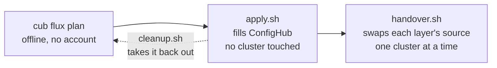
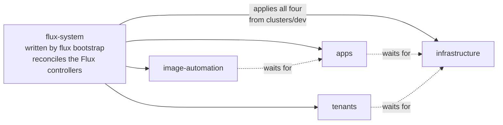
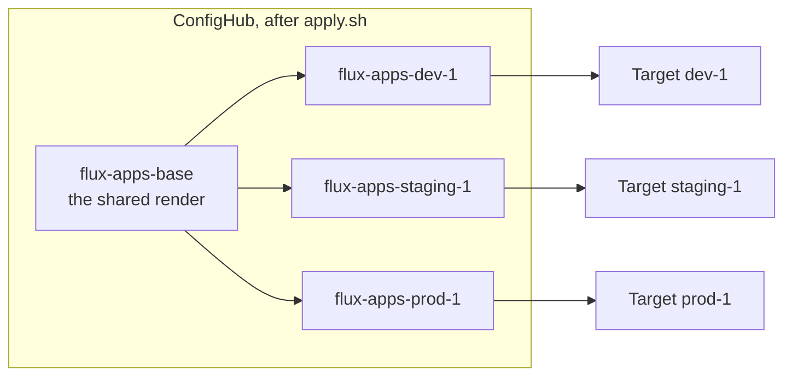
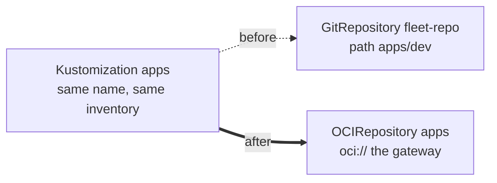
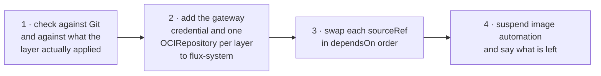
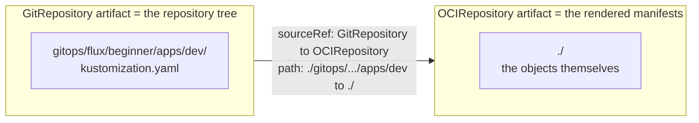
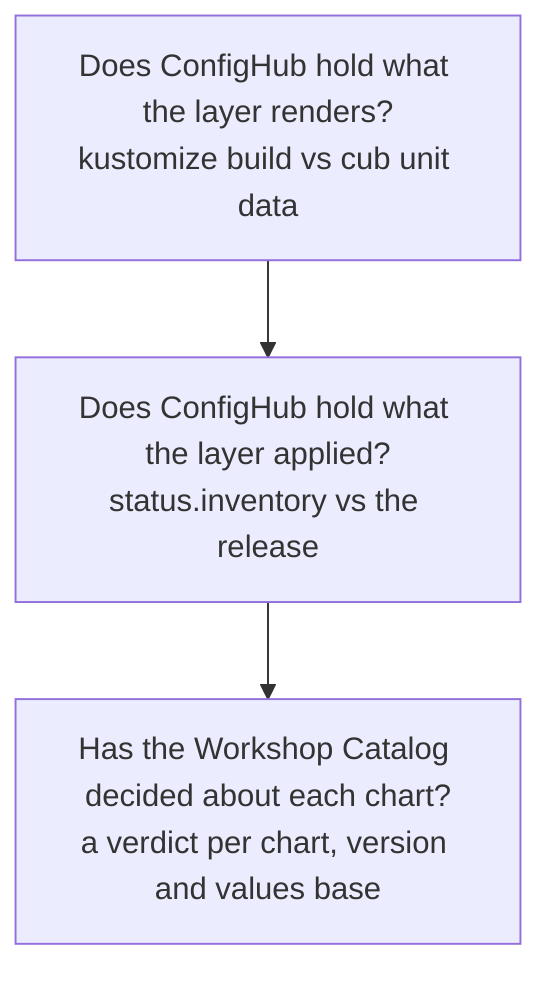
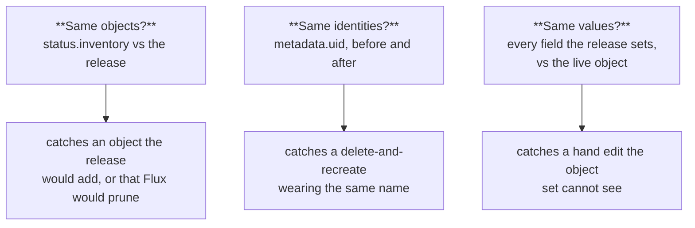
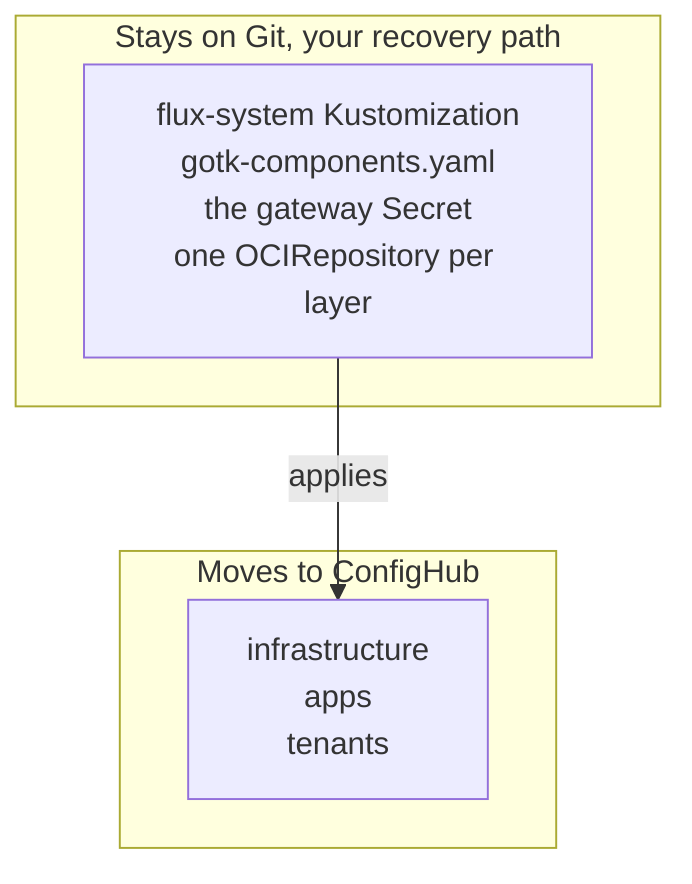

# Onboard your Flux fleet

You already describe your fleet in Flux's own terms: a bootstrap that
reconciles itself, and layered `Kustomization`s that reconcile each other in
`dependsOn` order. This guide turns that into a governed fleet in ConfigHub,
and the first two commands change nothing at all.

It is deliberately two phases, because they carry very different risk:



**Onboarding** fills ConfigHub while Flux carries on reconciling Git.
Afterwards ConfigHub holds a complete parallel copy that nothing reads, and
`cleanup.sh` — written beside `apply.sh` — takes it all back out. It is a
script rather than a line in this guide because the order is not guessable: a
variant's Release points at a Tag in its base Space, so the variants have to go
before the bases they were promoted from. Each Space then goes in one
`cub space delete --recursive --detach`, which takes its contents with it.

**Handover** is the step that changes which source feeds your clusters, and it
is not undone by deleting Spaces — a repointed layer whose Space is gone has no
source at all, and with `prune: true` it empties itself. Put each layer's
`sourceRef` back to its `GitRepository` first, which `cleanup.sh` checks before
it does anything.

You need `cub` logged in (`cub auth login`), `kustomize` on your PATH,
`kubectl` access to each cluster, and the plugin:

```bash
cub plugin install confighub/cub-flux
```

## What the plugin sees in your repository

In Flux each cluster already has its own directory, so you already have
per-cluster records. What you lack is **inheritance**: a fix has to be made in
every cluster's overlay. `plan` works backwards from your overlays to the base
they share, so a change can be made once.



`flux-system` is the parent of every layer, the same relationship an Argo app
of apps has with its children. It is also the one part of the fleet this
handover never touches — see [the bootstrap stays](#the-bootstrap-stays).

## The words you will meet

- **Layer**: one Flux `Kustomization` — `infrastructure`, `apps`, `tenants`.
  A handover swaps a layer's source.
- **Base**: the directory every cluster's overlay builds on, stored once. A
  change to the layer is made here.
- **Variant**: one cluster's copy, holding what that cluster's overlay renders
  differently — its namespace, image tag, patches and `postBuild` values.
- **Departure**: a field in which a variant differs from its base.
- **Space**, **Component**, **Target**, **Change order**, **Workflow**: as in
  [`cub sveltos`](https://github.com/confighub/sveltos-confighub) — a Space per
  base and per variant, a Target per cluster, and stages a change is promoted
  and approved through.

## 1. See the plan

```bash
cub flux plan .
```

Offline, no account, no cluster. For the
[expert example](../../gitops/flux/expert-fleet/) in this repository it finds
three clusters, four layers and ten variants, and reports:

```text
Clusters, one stage each, in order: dev-1 (clusters/dev), staging-1 (clusters/staging), prod-1 (clusters/prod)
Reconcile order (dependsOn): infrastructure -> apps, tenants -> image-automation

apps  (after infrastructure)
  base     flux-apps-base  from gitops/flux/expert-fleet/apps/base/apptique
  stage dev
    dev-1       variant flux-apps-dev-1  ->  Target flux-targets/dev-1
                Kustomization flux-system/apps, path gitops/flux/expert-fleet/apps/dev
                  namespace apptique-dev
                  image nginx 1.27.3-alpine (written by image automation)
                  Deployment/frontend replace /spec/replicas = 1
                  substitutes cluster_name=dev-1
  in flight  nginx: 1.27.3-alpine on dev-1; 1.27.2-alpine on staging-1; 1.26.3-alpine on prod-1
```

Every departure is listed explicitly, so you can see exactly what each cluster
changes before anything moves. The plan also reports what is **not in Git** —
`${cluster_name}` and `${environment}` come from each layer's `postBuild`, and
whatever the `edge-router` chart renders is pulled at reconcile time — and what
**writes to Git by itself**.

## 2. Write the steps, read them, run them

```bash
cub flux apply . --out onboard
bash onboard/apply.sh
```

`apply` writes the workflow files and two scripts, and runs nothing. `apply.sh`
creates a Target per cluster, renders each layer's base and each cluster's path
with `kustomize build`, stores them, and releases the first version stage by
stage. It touches no cluster and is safe to re-run.



A change made on the base reaches every variant; each variant keeps its own
departures. Nothing on any cluster has changed yet.

## 3. Hand one cluster over

```bash
CLUSTER=dev-1 FLUX_CONTEXT=<kubectl context> bash onboard/handover.sh
```

Each layer keeps its `Kustomization`, its name and its inventory. Only the
`sourceRef` changes:



Because the name does not change, Flux keeps the record of what that layer
applied, and nothing is recreated.

**The order matters, and the script enforces it:**



**Step 1 asks two different questions, and only the second can see the
cluster.**

The first compares what ConfigHub holds against what `kustomize build` produces
from Git *now*. Both sides come from Git, so this catches Git moving since
`apply.sh` ran — and nothing else. On its own it would pass while the cluster
held something Git has never described.

The second is `cub flux check`, and it reads Flux's own
`status.inventory`: the record of what that layer actually applied. Every layer
has `prune: true`, so an object in that inventory which the release does not
hold is **deleted** the moment the source is swapped — whether or not it was
ever in Git. Only this question can see it, and the script stops rather than
pruning.

**The swap moves two fields, not one.** `sourceRef` is the obvious one. `path`
is the one that costs an afternoon: it is a path *inside the artifact*, and the
two kinds of artifact are shaped differently.



Change only `sourceRef` and Flux looks for the old Git path inside the new
artifact, finds nothing, and reports `kustomization path not found`. The same
is true going back: restoring `sourceRef` while leaving `path: ./` is a worse
place than where you started, which is why `handover.sh` prints both fields for
the way back.

**Step 2 has to come from Git.** A `Kustomization` cannot read a source that
does not exist yet, so the gateway credential and the `OCIRepository` objects
go into the bootstrap directory. That is the same shape `cub sveltos` uses: a
small hand-managed bootstrap that names ConfigHub, and everything else flowing
from ConfigHub.

## What the plugin checks for you, and what it cannot



The first reads Git on both sides, so it catches Git moving since `apply.sh`
ran and nothing else. The second is the one that can see your cluster:
`cub flux check` reads the Kustomization's `status.inventory` — the
controller's own record of what it applied — and compares it with what the
release holds.

```text
apps: 3 objects match what the layer applied
  ServiceAccount apptique-dev/frontend: the layer applied it and the release
  does not hold it, and this layer prunes, so Flux would DELETE it from the cluster
```

Whether that says DELETE or "left on the cluster, managed by nothing" comes
from the layer's own `spec.prune`, which the Kustomization CRD **requires** — so
it is always an explicit choice, and can be false. Where a layer sets
`targetNamespace`, the check is told, so an object whose manifest names no
namespace is matched where it actually lands rather than counted as missing.

**You run it the way you ran `plan`.** `check` takes the same fleet directory
and works the layers out for itself — there is no per-Kustomization flag to get
right, and no list to keep in step with the repository:

```bash
cub flux check ./my-fleet --cluster prod-1
```

```text
infrastructure: 12 objects match what the layer applied
apps: 3 objects match what the layer applied
2 of 2 clean
```

It exits non-zero if any layer is not clean, so it drops into CI as it is.
`--kube-context` names the cluster to read; without it kubectl uses whatever
context is current, which during a handover is very likely the wrong one.

For charts, the plan reports what the Workshop Catalog has decided, per chart,
version **and values base**. A `HelmRelease` pinned to a range is named rather
than refused: the object is stored as it is, helm-controller goes on resolving
it, and the handover does not change that. It would be fatal only if the chart
were being flattened, which this does not do.

## Three questions, not one: objects, identities, fields

A handover is safe when swapping the source changes nothing. "Nothing" breaks
into three questions, and each needs a different thing to be read.



The object-set check is above. The third question is `--fields`:

```bash
cub flux check ./my-fleet --fields
```

For every object the release holds, it reads the live object and compares
**only the fields the release sets**. That restriction is the whole design:
Kubernetes fills in defaults a release never mentions and controllers own
others, so comparing everything the cluster holds would report noise as drift.
It is the same rule a reconciler applies.

Each difference carries Kubernetes' own record of who has written that object.
For a layer whose Deployment someone had scaled by hand, that reads:

```text
Deployment apptique-dev/frontend .spec.replicas: cluster has 4, the release
holds 1 (written on this object by kube-controller-manager, kustomize-controller, kubectl)
  kubectl has written this object, so this is likely a hand edit rather than the source moving on
```

`managedFields` is that record, and `kubectl get -o json` **strips it** unless
asked — the plugin passes `--show-managed-fields`, without which attribution
comes back silently empty. The managers are not ordered by time: kubectl leaves
the timestamp off some writes, so naming a last writer would be a guess where a
fact belongs.

`kustomize-controller` writes with server-side Apply, so it owns the fields it
sets and the record above is precise about who owns what. Flux's own drift
detection then corrects a hand edit rather than reporting it: measured, the
scale above was put back on the next reconcile. `--fields` answers a different
question: not "does the cluster match Git" but "would the release I am about to
hand this layer change anything", per field, before the source moves.

`cub scout compare` remains the broader tool: it works across a fleet without a
plan, and infers ownership where nothing declares it.

## The bootstrap stays

`flux-system` is never repointed. It reconciles `gotk-components.yaml` — the
Flux controllers themselves. Putting an approval gate in front of that would
put one between an operator and a Flux upgrade, and if a bad release broke
`source-controller`, the thing that fixes it would be the thing that is broken.



Also left alone: SOPS keys and any Secret, and the `team-checkout` tenant —
repointing it would move that team from Git access to ConfigHub access, which
is a decision about delegation rather than a step in a handover. The plan says
so rather than proposing it.

## What changes about the way you work

Two habits in a Flux fleet stop working, and the plan names both.

**Image automation.** `ImageUpdateAutomation` commits new tags into
`apps/dev`. Once that layer reads ConfigHub, those commits feed nothing, so
`handover.sh` suspends it. A tag bump becomes a change on the base, promoted
and approved like any other.

**Promotion by branch.** Production reads the `production` branch, so a
promotion is a merge. Afterwards the workflow's stages decide instead:


ConfigHub refuses to promote into the next stage until this one has released
the change, and refuses each release until it is approved in its stage. Both
refusals come from the server.

## What this leaves alone

- The `flux-system` bootstrap, the Flux controllers and the gateway objects.
- SOPS-encrypted Secrets; their contents do not belong in a review diff.
- The tenant's own `GitRepository` and `ServiceAccount`.
- `postBuild` substitution, which stays Flux's and is applied on the cluster.
- Live exports: `plan` reads a fleet repository, not `kubectl get` output.
- `OCIRepository` and `Bucket` sources as layer inputs.
- Rendering: it reads kustomization files but does not run kustomize or Helm.
  The scripts do that when you run them.

## What has and has not been checked

**Checked here, offline:** all fourteen renders in the example's script run
against kustomize 5.8.1 and give the same bytes twice. Both generated scripts
are valid bash. Tests keep the bootstrap untouched and the swap in `dependsOn`
order. `scripts/verify-gitops-plugins.sh` runs the lot.

**Checked on a live cluster:** `cub flux check` was run against Flux v2.8.6 on
kind, reconciling this repository's `flux/beginner` example from the public
repo. The inventory ids arrived exactly as `<namespace>_<name>_<group>_<kind>`,
with an empty namespace for the cluster-scoped `Namespace`. It reported four
matching objects, and caught a deletion when the release held one fewer.

That rehearsal found two bugs:

- The check read whichever kubectl context was current. On a fleet handed over
  one cluster at a time — which is how this works — it could have reported on
  the wrong cluster and passed. It takes `--kube-context` now, and
  `handover.sh` passes `$FLUX_CONTEXT`.
- It assumed every layer prunes. `spec.prune` is required on the CRD, so a
  layer can and does set it false, and then an object is left behind rather
  than deleted. Those are different outcomes and are now said differently.

**The handover has now been run, end to end.** Flux v2.8.6 on a kind cluster,
reconciling this repository's `flux/beginner` example from GitHub, handed over
to a self-hosted ConfigHub v0.6.2 and then handed back.

What was verified afterwards:

| Question | Answer |
| --- | --- |
| Same objects? | `status.inventory` identical, all four entries |
| Same identities? | every UID unchanged, **including the Pod's** |
| Same workload? | `deployment.kubernetes.io/revision` still 1, so no rollout |
| Right content? | the digest Flux stored equals the release digest ConfigHub published, byte for byte |
| Still clean? | `cub flux check --fields` reports 2 of 2 clean from the new source |

That rehearsal found five bugs, none of which reading the code would have
found:

- **`spec.path` was left pointing into the Git tree.** A path is relative to
  the artifact, and a Git artifact is the repository while a ConfigHub artifact
  is the rendered manifests at its root. Flux reported
  `kustomization path not found: stat /tmp/kustomization-.../<git path>`, which
  reads as a missing directory rather than as the one field the swap forgot.
  The patch now sets `path: ./` with the `sourceRef`.
- **The credential was the wrong kind of Secret.** An `OCIRepository` reads its
  `secretRef` as a `kubernetes.io/dockerconfigjson`. A generic Secret holding
  `username` and `password` — which is what a `GitRepository` takes — fails
  with `failed to determine artifact digest: ... 401 Unauthorized`, naming the
  registry, so it reads like a bad password.
- **The `OCIRepository` URL had no repository path.** The gateway serves one
  repository per Space, at `/space/<space>`, and a layer's Space differs per
  cluster. The script now resolves the variant Space for the cluster being
  handed over.
- **The rollback advice was incomplete.** "Patch each `sourceRef` back" would
  have left `path: ./` in place, which finds no kustomization — a worse place
  than where you started. The script now prints both fields, per layer, with
  the real values.
- **`cleanup.sh` deleted nothing at all.** Its seven-step order was measured
  against ConfigHub v0.5.1, and v0.6.2 has Attestations, which it did not know
  to remove. It is now one `cub space delete --recursive --detach` per Space,
  which cannot fall behind a new entity type the same way.

**A published release arrives on its own.** This is where Flux and Argo CD
differ, and it is worth knowing before you choose how to operate either. A
release published to ConfigHub at 17:16:22 was picked up by the
`OCIRepository` at 17:16:31 — nine seconds, on its own one-minute interval —
and applied to the cluster by 17:17:15. No annotation, no forced
reconciliation. Argo CD caches the digest it resolved for a tag and needs a
hard refresh; Flux re-resolves it.

**Flux corrects a hand edit itself.** A `kubectl scale` to 4 replicas was put
back to 1 on the next reconcile. `--fields` caught it in the window before
that, and named `kubectl` among the managers — recorded against the `scale`
subresource, with no timestamp, which is why the managers are reported
unordered.

**Not claimed at all:** live exports as input (`plan` reads a fleet
repository), `OCIRepository` or `Bucket` sources as layer inputs,
`substituteFrom` values, or rendering Helm charts — the `HelmRelease` is stored
as it is and helm-controller goes on resolving it.
