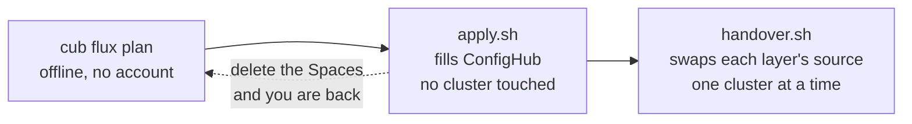
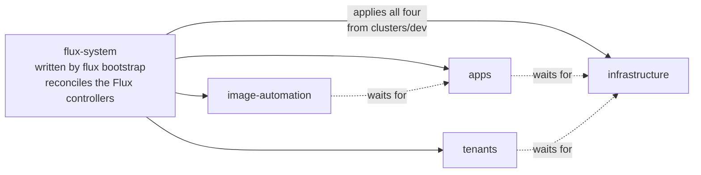
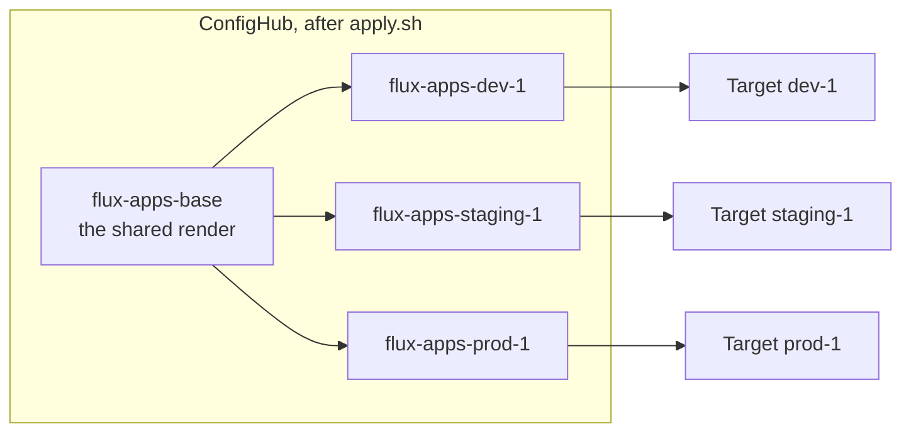
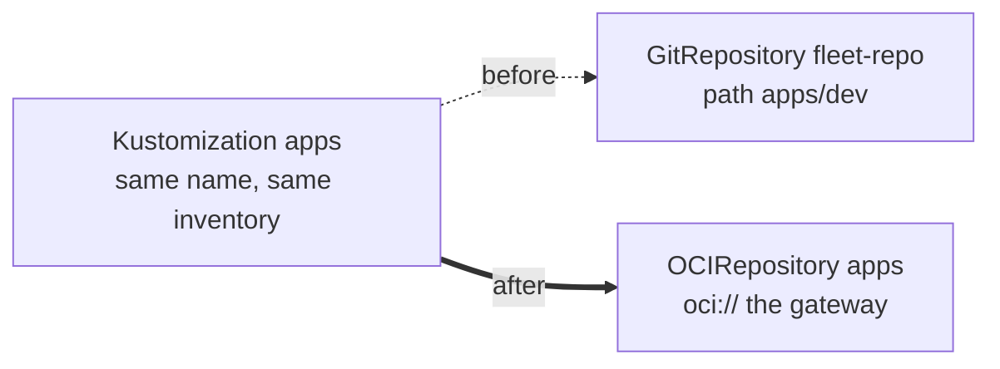
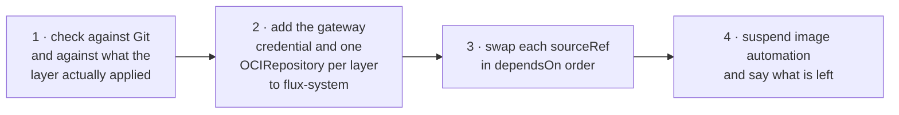
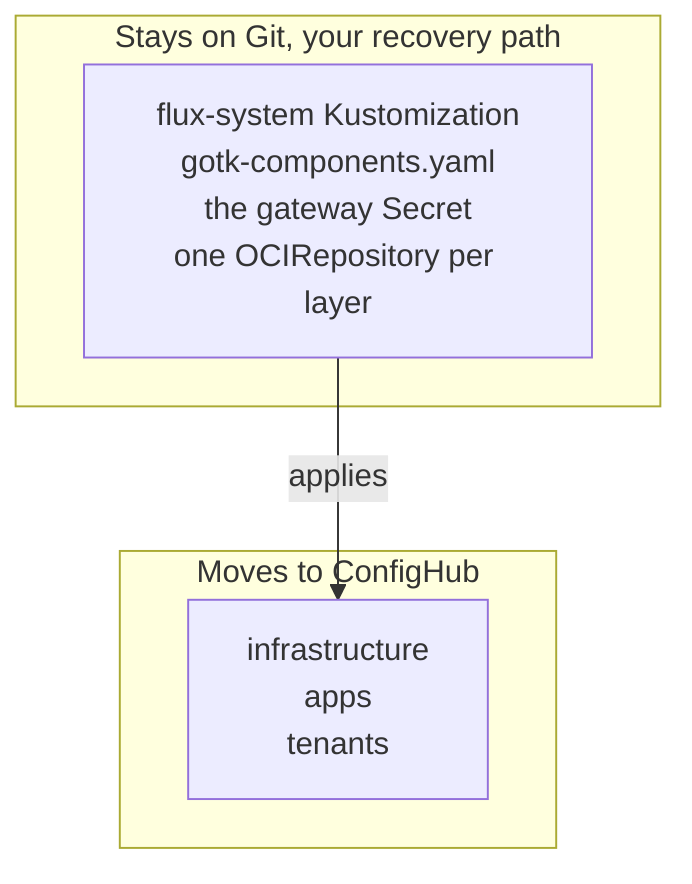

# Onboard your Flux fleet

You already describe your fleet in Flux's own terms: a bootstrap that
reconciles itself, and layered `Kustomization`s that reconcile each other in
`dependsOn` order. This guide turns that into a governed fleet in ConfigHub,
and the first two commands change nothing at all.

It is deliberately two phases, because they carry very different risk:



You need `cub` logged in (`cub auth login`), `kustomize` on your PATH,
`kubectl` access to each cluster, and the plugin:

```bash
cub plugin install confighub/cub-flux
```

## What the plugin sees in your repository

In Flux each cluster already has its own directory, so you already have
per-cluster records. What you lack is **inheritance**: a fix has to be made in
every cluster's overlay. `plan` works backwards from your overlays to the base
they share, so a change can be made once.



`flux-system` is the parent of every layer, the same relationship an Argo app
of apps has with its children. It is also the one part of the fleet this
handover never touches — see [the bootstrap stays](#the-bootstrap-stays).

## The words you will meet

- **Layer**: one Flux `Kustomization` — `infrastructure`, `apps`, `tenants`.
  A handover swaps a layer's source.
- **Base**: the directory every cluster's overlay builds on, stored once. A
  change to the layer is made here.
- **Variant**: one cluster's copy, holding what that cluster's overlay renders
  differently — its namespace, image tag, patches and `postBuild` values.
- **Departure**: a field in which a variant differs from its base.
- **Space**, **Component**, **Target**, **Change order**, **Workflow**: as in
  [`cub sveltos`](https://github.com/confighub/sveltos-confighub) — a Space per
  base and per variant, a Target per cluster, and stages a change is promoted
  and approved through.

## 1. See the plan

```bash
cub flux plan .
```

Offline, no account, no cluster. For the
[expert example](../../gitops/flux/expert-fleet/) in this repository it finds
three clusters, four layers and ten variants, and reports:

```text
Clusters, one stage each, in order: dev-1 (clusters/dev), staging-1 (clusters/staging), prod-1 (clusters/prod)
Reconcile order (dependsOn): infrastructure -> apps, tenants -> image-automation

apps  (after infrastructure)
  base     flux-apps-base  from gitops/flux/expert-fleet/apps/base/apptique
  stage dev
    dev-1       variant flux-apps-dev-1  ->  Target flux-targets/dev-1
                Kustomization flux-system/apps, path gitops/flux/expert-fleet/apps/dev
                  namespace apptique-dev
                  image nginx 1.27.3-alpine (written by image automation)
                  Deployment/frontend replace /spec/replicas = 1
                  substitutes cluster_name=dev-1
  in flight  nginx: 1.27.3-alpine on dev-1; 1.27.2-alpine on staging-1; 1.26.3-alpine on prod-1
```

Every departure is listed explicitly, so you can see exactly what each cluster
changes before anything moves. The plan also reports what is **not in Git** —
`${cluster_name}` and `${environment}` come from each layer's `postBuild`, and
whatever the `edge-router` chart renders is pulled at reconcile time — and what
**writes to Git by itself**.

## 2. Write the steps, read them, run them

```bash
cub flux apply . --out onboard
bash onboard/apply.sh
```

`apply` writes the workflow files and two scripts, and runs nothing. `apply.sh`
creates a Target per cluster, renders each layer's base and each cluster's path
with `kustomize build`, stores them, and releases the first version stage by
stage. It touches no cluster and is safe to re-run.



A change made on the base reaches every variant; each variant keeps its own
departures. Nothing on any cluster has changed yet.

## 3. Hand one cluster over

```bash
CLUSTER=dev-1 FLUX_CONTEXT=<kubectl context> bash onboard/handover.sh
```

Each layer keeps its `Kustomization`, its name and its inventory. Only the
`sourceRef` changes:



Because the name does not change, Flux keeps the record of what that layer
applied, and nothing is recreated.

**The order matters, and the script enforces it:**



**Step 1 asks two different questions, and only the second can see the
cluster.**

The first compares what ConfigHub holds against what `kustomize build` produces
from Git *now*. Both sides come from Git, so this catches Git moving since
`apply.sh` ran — and nothing else. On its own it would pass while the cluster
held something Git has never described.

The second is `cub flux check`, and it reads Flux's own
`status.inventory`: the record of what that layer actually applied. Every layer
has `prune: true`, so an object in that inventory which the release does not
hold is **deleted** the moment the source is swapped — whether or not it was
ever in Git. Only this question can see it, and the script stops rather than
pruning.

**Step 2 has to come from Git.** A `Kustomization` cannot read a source that
does not exist yet, so the gateway credential and the `OCIRepository` objects
go into the bootstrap directory. That is the same shape `cub sveltos` uses: a
small hand-managed bootstrap that names ConfigHub, and everything else flowing
from ConfigHub.

## The bootstrap stays

`flux-system` is never repointed. It reconciles `gotk-components.yaml` — the
Flux controllers themselves. Putting an approval gate in front of that would
put one between an operator and a Flux upgrade, and if a bad release broke
`source-controller`, the thing that fixes it would be the thing that is broken.



Also left alone: SOPS keys and any Secret, and the `team-checkout` tenant —
repointing it would move that team from Git access to ConfigHub access, which
is a decision about delegation rather than a step in a handover. The plan says
so rather than proposing it.

## What changes about the way you work

Two habits in a Flux fleet stop working, and the plan names both.

**Image automation.** `ImageUpdateAutomation` commits new tags into
`apps/dev`. Once that layer reads ConfigHub, those commits feed nothing, so
`handover.sh` suspends it. A tag bump becomes a change on the base, promoted
and approved like any other.

**Promotion by branch.** Production reads the `production` branch, so a
promotion is a merge. Afterwards the workflow's stages decide instead:


ConfigHub refuses to promote into the next stage until this one has released
the change, and refuses each release until it is approved in its stage. Both
refusals come from the server.

## What this leaves alone

- The `flux-system` bootstrap, the Flux controllers and the gateway objects.
- SOPS-encrypted Secrets; their contents do not belong in a review diff.
- The tenant's own `GitRepository` and `ServiceAccount`.
- `postBuild` substitution, which stays Flux's and is applied on the cluster.
- Live exports: `plan` reads a fleet repository, not `kubectl get` output.
- `OCIRepository` and `Bucket` sources as layer inputs.
- Rendering: it reads kustomization files but does not run kustomize or Helm.
  The scripts do that when you run them.

## What has and has not been checked

All fourteen renders in the example's script were run here against kustomize
5.8.1. Both scripts are checked as valid bash, and tests keep the bootstrap
untouched, the swap order in `dependsOn` order, and every rendered path honest.

**Not yet rehearsed on a cluster.** The hazards are read from manifests, not
from watching it work. `cub sveltos`'s equivalent was measured on kind before
it was written up — every Helm release at the revision it had, all 20 pods the
same by UID — and this one should be too. Start with one non-production
cluster, and read `handover.sh` before you run it.
