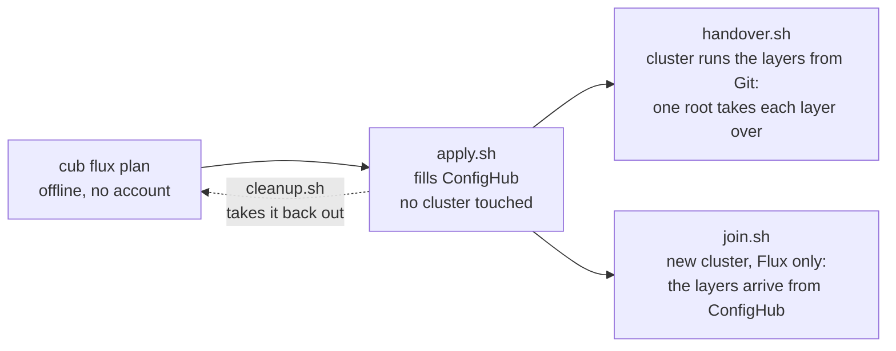
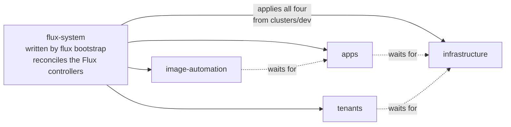
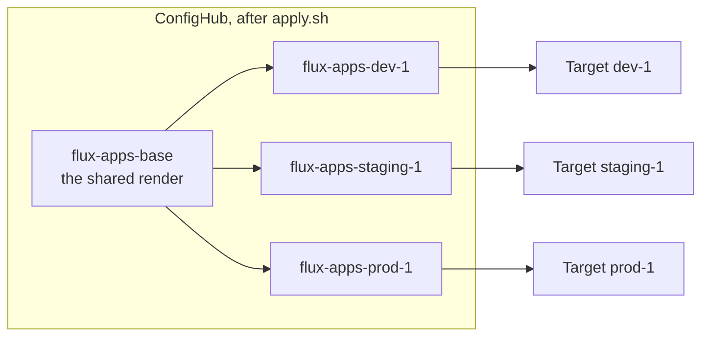
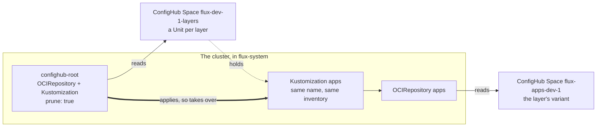
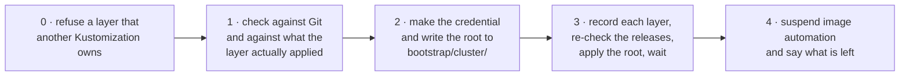
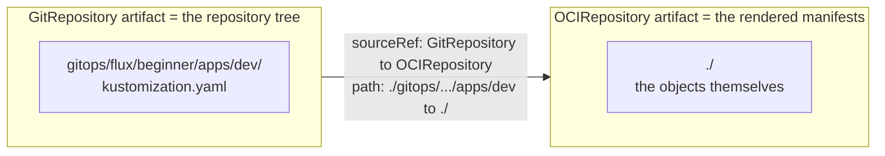
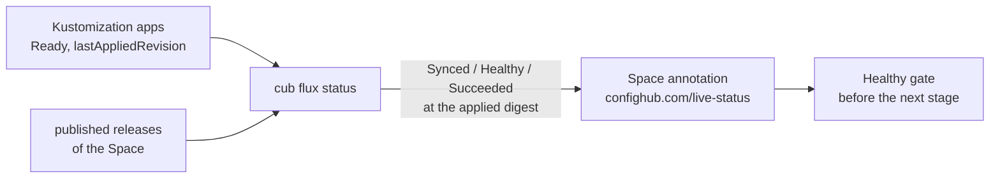
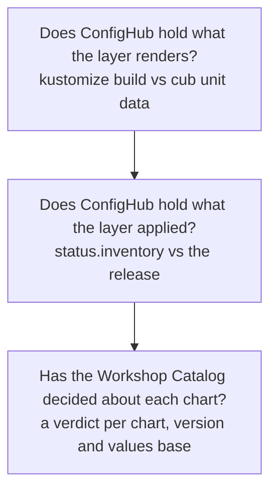
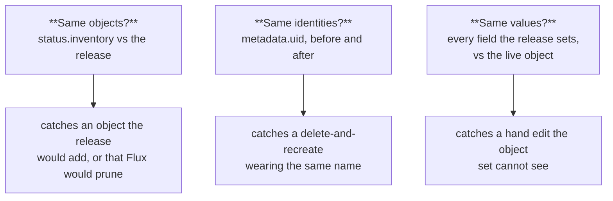
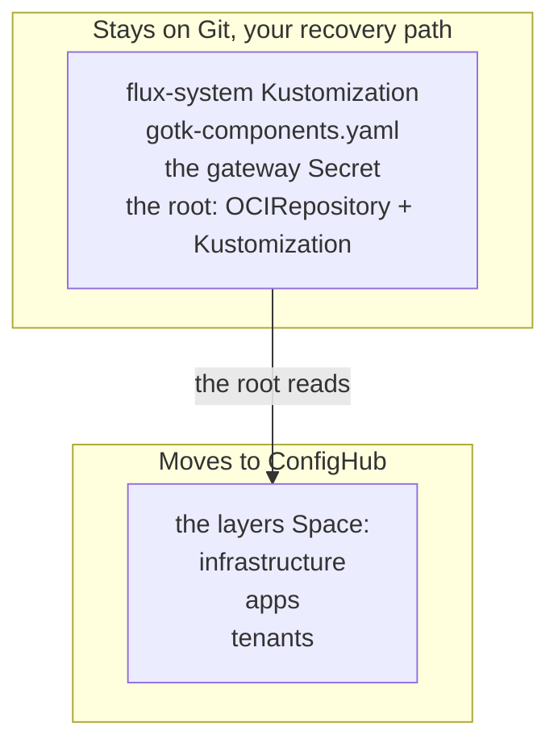

# Onboard your Flux fleet

You already describe your fleet in Flux's own terms: a bootstrap that
reconciles itself, and layered `Kustomization`s that reconcile each other in
`dependsOn` order. This guide turns that into a governed fleet in ConfigHub,
and the first two commands change nothing at all.

It is deliberately two phases, because they carry very different risk:



**Onboarding** fills ConfigHub while Flux carries on reconciling Git.
Afterwards ConfigHub holds a complete parallel copy that nothing reads, and
`cleanup.sh` — written beside `apply.sh` — takes it all back out. It is a
script rather than a line in this guide because the order is not guessable: a
variant's Release points at a Tag in its base Space, so the variants have to go
before the bases they were promoted from. Each Space then goes in one
`cub space delete --recursive --detach`, which takes its contents with it.

**Handover and join** are the steps that change which source feeds a cluster.
`handover.sh` is for a cluster that already runs the layers from Git; `join.sh`
is for a new cluster that has Flux and none of them. Neither is undone by
deleting Spaces: a layer whose Space is gone has no source at all, and with
`prune: true` it empties itself. Put each layer's `sourceRef` back to its
`GitRepository` first, which `cleanup.sh` asks about before it does anything.

Both give a cluster the same thing: one root, and a ConfigHub Space that says
what Flux runs there. It is the shape `cub cluster up` makes for Argo CD, an
apps Space and a root Application, and `cub variant create` then adds one
Application per variant Space. Here the root is a Flux `Kustomization`, and each
layer is a Unit in the cluster's Space.

You need `cub` logged in (`cub auth login`), `kustomize` on your PATH,
`kubectl` access to each cluster, and the plugin. The plugin lives in this repository rather than in one of its own,
so build it from a checkout (it needs Go):

```bash
git clone https://github.com/confighub/examples
cd examples/cub-flux
make install-plugin
cub plugin list   # cub-flux should be listed, status ok
```

## What the plugin sees in your repository

In Flux each cluster already has its own directory, so you already have
per-cluster records. What you lack is **inheritance**: a fix has to be made in
every cluster's overlay. `plan` works backwards from your overlays to the base
they share, so a change can be made once.



`flux-system` is the parent of every layer, the same relationship an Argo app
of apps has with its children. It is also the one part of the fleet this
handover never touches — see [the bootstrap stays](#the-bootstrap-stays).

## The words you will meet

- **Layer**: one Flux `Kustomization` — `infrastructure`, `apps`, `tenants`.
  A handover makes a layer read ConfigHub.
- **Base**: the directory every cluster's overlay builds on, stored once. A
  change to the layer is made here.
- **Variant**: one cluster's copy, holding what that cluster's overlay renders
  differently — its namespace, image tag, patches and `postBuild` values.
- **Departure**: a field in which a variant differs from its base.
- **Layers Space**: one per cluster, `<prefix>-<cluster>-layers`, released to
  that cluster's Target. It holds one Unit per layer.
- **Root**: the one `OCIRepository` and `Kustomization`, both named
  `confighub-root`, that a cluster keeps in `flux-system` to read its layers
  Space.
- **Space**, **Component**, **Target**, **Change order**, **Workflow**: as in
  [`cub sveltos`](https://github.com/confighub/sveltos-confighub) — a Space per
  base and per variant, a Target per cluster, and stages a change is promoted
  and approved through.

## 1. See the plan

```bash
cub flux plan .
```

Offline, no account, no cluster. For the
[expert example](../../gitops/flux/expert-fleet/) in this repository it finds
three clusters, four layers and ten variants, and reports:

```text
Clusters, one stage each, in order: dev-1 (clusters/dev), staging-1 (clusters/staging), prod-1 (clusters/prod)
Reconcile order (dependsOn): infrastructure -> apps, tenants -> image-automation

apps  (after infrastructure)
  base     flux-apps-base  from gitops/flux/expert-fleet/apps/base/apptique
  stage dev
    dev-1       variant flux-apps-dev-1  ->  Target flux-targets/dev-1
                Kustomization flux-system/apps, path gitops/flux/expert-fleet/apps/dev
                  namespace apptique-dev
                  image nginx 1.27.3-alpine (written by image automation)
                  Deployment/frontend replace /spec/replicas = 1
                  substitutes cluster_name=dev-1
  in flight  nginx: 1.27.3-alpine on dev-1; 1.27.2-alpine on staging-1; 1.26.3-alpine on prod-1
```

Every departure is listed explicitly, so you can see exactly what each cluster
changes before anything moves. The plan also reports what is **not in Git** —
`${cluster_name}` and `${environment}` come from each layer's `postBuild`, and
whatever the `edge-router` chart renders is pulled at reconcile time — and what
**writes to Git by itself**.

## 2. Write the steps, read them, run them

```bash
cub flux apply . --out onboard
bash onboard/apply.sh
```

`apply` writes the workflow files and four scripts (`apply.sh`, `handover.sh`,
`join.sh`, `cleanup.sh`), and runs nothing. `apply.sh` creates a Target per
cluster, renders each layer's base and each cluster's path with `kustomize
build`, stores them, and releases the first version stage by stage. It touches
no cluster and is safe to re-run.

Its last step, 5/5, makes each cluster's layers Space and publishes it. That
step needs `CONFIGHUB_OCI`, the gateway host as the *cluster* reaches it, and
`CONFIGHUB_OCI_PLAIN_HTTP=1` if the gateway serves plain HTTP. Without
`CONFIGHUB_OCI` it skips the step and says so; `handover.sh` and `join.sh` need
what it makes, so re-run `apply.sh` with it set.

```bash
CONFIGHUB_OCI=<gateway host> bash onboard/apply.sh
```



A change made on the base reaches every variant; each variant keeps its own
departures. Nothing on any cluster has changed yet.

Each Unit in a layers Space is the layer's own `Kustomization` as Git defines
it, with two fields changed: `sourceRef` names an `OCIRepository`, and `path`
is `./`. Next to it is that `OCIRepository`. It reads the layer's variant Space,
`oci://<gateway>/space/<prefix>-<layer>-<cluster>`, at tag `latest`, with the
credential Secret `confighub-<prefix>-targets`. `insecure` is true only for a
plain-HTTP gateway.

## 3. Hand one cluster over

For a cluster that already runs the layers from Git:

```bash
CONFIGHUB_OCI=<gateway host> CLUSTER=dev-1 FLUX_CONTEXT=<kubectl context> \
  bash onboard/handover.sh
```

The script puts one root on the cluster, and the root takes each layer over.
The layer keeps its `Kustomization`, its name and its inventory:



The root applies a `Kustomization` named `apps` that differs from the one on the
cluster only in `sourceRef` and `path`. Because the name is the same, Flux keeps
the record of what that layer applied, and nothing is recreated.

**The order matters, and the script enforces it:**



Step 3 records each layer's `sourceRef` and `path` as the cluster has them, in
`handover-state/<cluster>.txt`. It then confirms that each checked release is
still the newest one, and stops with nothing moved if a newer one was published.
Only then does it apply the root. It waits for each layer to read its
`OCIRepository`, be Ready, and have applied the digest that was checked.

**If it stops partway, it says where.** The script fixes the kubectl context
once, at the start, and every command it runs or prints names that context.
Before the root is applied, a stop means no layer's source changed, and it says
so. After that, it names the layers the root is moving and prints the way back.
It rolls nothing back by itself. What happened, including why a layer was not
Ready, is in `handover-state/<cluster>.log`.

**The way back is printed in a required order:**

1. Patch `confighub-root` to `suspend: true` and `prune: false`.
2. Restore `sourceRef` and `path` on each layer, as recorded.
3. Delete the root `Kustomization`, then its `OCIRepository`.

The order is the point. The root prunes, so deleting it while it still prunes
would delete the layers it applied. And each layer prunes what it runs, so a
layer left with no source would empty the cluster.

A layer arrives only on the clusters that have it, so `image-automation` moves
on `dev-1` alone. The credential and the root for each cluster go into
`bootstrap/<cluster>/`, so running the script for a second cluster does not
apply the first one's. The script tells you to commit them into that cluster's
`flux-system` path so the root survives a reconcile.

**Step 1 asks two different questions, and only the second can see the
cluster.**

The first compares what ConfigHub holds against what `kustomize build` produces
from Git *now*. Both sides come from Git, so this catches Git moving since
`apply.sh` ran — and nothing else. On its own it would pass while the cluster
held something Git has never described.

The second is `cub flux check`, and it reads Flux's own
`status.inventory`: the record of what that layer actually applied. Every layer
has `prune: true`, so an object in that inventory which the release does not
hold is **deleted** the moment the source changes — whether or not it was
ever in Git. Only this question can see it, and the script stops rather than
pruning.

**Two fields change, not one.** `sourceRef` is the obvious one. `path` is the
one that costs an afternoon: it is a path *inside the artifact*, and the two
kinds of artifact are shaped differently.



The Unit sets both. Change only `sourceRef` and Flux looks for the old Git path
inside the new artifact, finds nothing, and reports `kustomization path not
found`. The same is true going back: restoring `sourceRef` while leaving `path:
./` is a worse place than where you started, which is why `handover.sh` prints
both fields for the way back.

**The root has to come from outside ConfigHub.** A `Kustomization` cannot read a
source that does not exist yet, so the credential and the root are applied
from the script and kept in the bootstrap directory. That is the same shape `cub
sveltos` uses: a small hand-managed bootstrap that names ConfigHub, and
everything else flowing from ConfigHub.

## 4. Join a new cluster

For a cluster that has Flux and none of the layers, `join.sh` is the equivalent
of `cub cluster up` for Argo CD:

```bash
CONFIGHUB_OCI=<gateway host> CLUSTER=prod FLUX_CONTEXT=<kubectl context> \
  bash onboard/join.sh
```

It refuses if any layer already exists on the cluster, because the root would
take that layer over without the checks `handover.sh` makes; use `handover.sh`
for it. Otherwise it makes the credential Secret, writes and applies the root,
and waits for each layer to arrive from ConfigHub.

Adding a cluster later is re-running `plan` and `apply`, which makes its layers
Space, and then `join.sh` for it.

**Changing how a layer is reconciled** — its interval, `healthChecks`,
`dependsOn` — is now a change to its Unit in the layers Space, published like
any other. It is no longer an edit to a `Kustomization` in Git.

## 5. Tell ConfigHub what the cluster is running

Once a layer reads ConfigHub, `cub flux status` reports what Flux applied as
the Space's live status: the `confighub.com/live-status` annotation that
ConfigHub's Healthy gate, its change orders and its UI read. It is what argobot
does for Argo CD and `cub sveltos status` for Sveltos, in the same shape.

```bash
cub flux status ./my-fleet --cluster dev-1 --kube-context <dev-1> --watch
```



It says only what it can back:

| Reading | When |
| --- | --- |
| `Synced` | the digest Flux applied is the **newest** published release of that Space. An older one is `OutOfSync`, with both release numbers |
| `Healthy` | Flux checked the workloads (`spec.wait` or `healthChecks`), or the layer runs none. Otherwise `Unknown`: `Ready` then means applied, not running |
| `revision` | the digest Flux reports it applied, never one inferred from times |
| nothing | the layer reads Git, or another Space. A reading it wrote earlier is replaced with `Unknown`, so a layer handed back to Git does not leave a green gate behind |

A read that fails writes nothing. It writes only when a reading changes, or
when the one ConfigHub holds is older than `--refresh` (10 minutes), which is
how a reader tells a running reporter from a stopped one. It runs as the `cub`
user you run it as, one cluster at a time.

**To make promotions wait for it,** plan and apply with `--require Healthy`.
Each stage after the first then also waits for the stage before to read Synced,
Succeeded and Healthy. The first release of every variant is made before
anything reads ConfigHub, so `apply.sh` makes those under a workflow without
it, and puts the real one in place once they are done.

**Run live on 2026-09-30** against ConfigHub v0.6.8 and Flux v2.8.6, with
`--require Healthy`:
- A change was released to dev and promoted towards prod. ConfigHub refused it
  twice: "live-status not found for Variant 'dev'" with no reading, and "Variant
  'dev' is not synced" while Flux still held release 1, which the reporter wrote
  as `OutOfSync`.
- Once Flux applied release 2, the reporter wrote Synced/Healthy/Succeeded at
  that digest, and the promotion went through.
- The Space's other annotations were untouched. A second pass wrote nothing. `--watch` stopped cleanly on an interrupt.

Replacing a stale reading after a layer returns to Git was added after that run,
so it is covered by tests, not yet by a live run.

## What the plugin checks for you, and what it cannot



The first reads Git on both sides, so it catches Git moving since `apply.sh`
ran and nothing else. The second is the one that can see your cluster:
`cub flux check` reads the Kustomization's `status.inventory` — the
controller's own record of what it applied — and compares it with what the
release holds.

```text
apps: 3 objects match what the layer applied
  ServiceAccount apptique-dev/frontend: the layer applied it and the release
  does not hold it, and this layer prunes, so Flux would DELETE it from the cluster
```

Whether that says DELETE or "left on the cluster, managed by nothing" comes
from the layer's own `spec.prune`, which the Kustomization CRD **requires** — so
it is always an explicit choice, and can be false. Where a layer sets
`targetNamespace`, the check is told, so an object whose manifest names no
namespace is matched where it actually lands rather than counted as missing.

**It checks the release, not the head.** A handover delivers a published
release, and a unit changed since the last publish holds something the cluster
will not get. So `check` reads the newest published release, or the one
`--release sha256:...` names, finds the revision of the unit it bundled, and
compares that. It prints the release number and manifest digest, and says so
when the unit's head has moved past it. `handover.sh` records each digest
before checking it. Before it applies the root, it confirms each checked release
is still the newest, and stops with nothing moved if a newer one was published
in between. Afterwards it confirms each layer applied the digest it checked.

**You run it the way you ran `plan`.** `check` takes the same fleet directory
and works the layers out for itself — there is no per-Kustomization flag to get
right, and no list to keep in step with the repository:

```bash
cub flux check ./my-fleet --cluster prod-1
```

```text
infrastructure: 12 objects match what the layer applied
apps: 3 objects match what the layer applied
2 of 2 clean
```

It exits non-zero if any layer is not clean, so it drops into CI as it is.
`--kube-context` names the cluster to read; without it kubectl uses whatever
context is current, which during a handover is very likely the wrong one.

For charts, the plan reports what the Workshop Catalog has decided, per chart,
version **and values base**. A `HelmRelease` pinned to a range is named rather
than refused: the object is stored as it is, helm-controller goes on resolving
it, and the handover does not change that. It would be fatal only if the chart
were being flattened, which this does not do.

## Three questions, not one: objects, identities, fields

A handover is safe when moving a layer to ConfigHub changes nothing. "Nothing" breaks
into three questions, and each needs a different thing to be read.



The object-set check is above. The third question is `--fields`:

```bash
cub flux check ./my-fleet --fields
```

For every object the release holds, it reads the live object and compares
**only the fields the release sets**. That restriction is the whole design:
Kubernetes fills in defaults a release never mentions and controllers own
others, so comparing everything the cluster holds would report noise as drift.
It is the same rule a reconciler applies.

Each difference carries Kubernetes' own record of who has written that object.
For a layer whose Deployment someone had scaled by hand, that reads:

```text
Deployment apptique-dev/frontend .spec.replicas: cluster has 4, the release
holds 1 (written on this object by kube-controller-manager, kustomize-controller, kubectl)
  kubectl has written this object, so this is likely a hand edit rather than the source moving on
```

`managedFields` is that record, and `kubectl get -o json` **strips it** unless
asked — the plugin passes `--show-managed-fields`, without which attribution
comes back silently empty. The managers are not ordered by time: kubectl leaves
the timestamp off some writes, so naming a last writer would be a guess where a
fact belongs.

`kustomize-controller` writes with server-side Apply, so it owns the fields it
sets and the record above is precise about who owns what. Flux's own drift
detection then corrects a hand edit rather than reporting it: measured, the
scale above was put back on the next reconcile. `--fields` answers a different
question: not "does the cluster match Git" but "would the release I am about to
hand this layer change anything", per field, before the source moves.

`cub scout compare` remains the broader tool: it works across a fleet without a
plan, and infers ownership where nothing declares it.

## The bootstrap stays

`flux-system` is never repointed. It reconciles `gotk-components.yaml` — the
Flux controllers themselves. Putting an approval gate in front of that would
put one between an operator and a Flux upgrade, and if a bad release broke
`source-controller`, the thing that fixes it would be the thing that is broken.

It now also holds two more things: the root and the gateway credential. They are
the only part of the delivery that cannot come from ConfigHub, since a
`Kustomization` cannot read a source that does not exist yet.



**A bootstrapped fleet is not handed over yet.** There, `flux-system` also
applies the directory that holds each layer's `Kustomization`, so it owns the
very objects the root would take over. `handover.sh` reads the owner of every
layer first and, if another Kustomization owns any of them, stops before it
changes anything. It accepts `confighub-root` as the owner, so it can be re-run.
See "Measured: a fleet set up the way `flux bootstrap` sets it up" below for why,
and for the sequence that is safe.

Also left alone: SOPS keys and any Secret, and the `team-checkout` tenant —
repointing it would move that team from Git access to ConfigHub access, which
is a decision about delegation rather than a step in a handover. The plan says
so rather than proposing it.

## What changes about the way you work

Two habits in a Flux fleet stop working, and the plan names both.

**Image automation.** `ImageUpdateAutomation` commits new tags into
`apps/dev`. Once that layer reads ConfigHub, those commits feed nothing, so
`handover.sh` suspends it. A tag bump becomes a change on the base, promoted
and approved like any other.

The script reads `spec.suspend` back before it says so, and a patch that failed
or did not take makes the handover end as INCOMPLETE rather than done. A
suspension can still be undone later. The `image-automation` layer applies that
object, and after the handover that layer reads ConfigHub, so the patch holds
only until the layer reconciles unless its unit says `suspend: true` too. The
script says which source to change.

**Promotion by branch.** Production reads the `production` branch, so a
promotion is a merge. Afterwards the workflow's stages decide instead:


ConfigHub refuses to promote into the next stage until this one has released
the change, and refuses each release until it is approved in its stage. Both
refusals come from the server. As generated, though, one person can give that
approval.

The generated workflow is a single-operator one. It declares the `approval`
attestation with `AllowAuthors: true`, and `apply.sh` promotes, approves and
publishes as the same actor. That is a reviewed workflow for one person trying
this: every step is recorded and the server still refuses to skip a stage. But
an approval recorded that way is not evidence that a separate reviewer looked at
the change.

To require one, use what `cub changeworkflow create --help` describes for an
attestation prerequisite in a workflow file. `AllowAuthors: false` (by default
an author of the change does not count) stops the person who wrote the change
approving it. `Count: 2` asks for that many distinct users recording a pass.
`FromUserIDs: [<user id>]` names who may approve, and `MaxAge: 72h` lets an
approval lapse. Reviewers record theirs with `cub variant approve
--change-order <space>/<order> --stage <stage>`, and `--reject --note "<why>"`
records a refusal, which blocks. Edit the `<layer>/change-workflow.yaml` that
`cub flux apply` wrote and put it on the live workflow with `cub changeworkflow
update --space <base Space> rollout --filename <layer>/change-workflow.yaml`; it applies to change
orders created afterwards, not to one already under way. This has not been run
here. The help shows no other enforcement and does not say what stops one person
holding two logins, so the separation still comes from who holds which
credentials: the person running `apply.sh` should not be a user who can approve.

## What this leaves alone

- The `flux-system` bootstrap, the Flux controllers, the root and the gateway credential.
- SOPS-encrypted Secrets; their contents do not belong in a review diff.
- The tenant's own `GitRepository` and `ServiceAccount`.
- `postBuild` substitution, which stays Flux's and is applied on the cluster.
- Live exports: `plan` reads a fleet repository, not `kubectl get` output.
- `OCIRepository` and `Bucket` sources as layer inputs. (The `OCIRepository`
  objects that handover and join make are outputs, not inputs.)
- Rendering: it reads kustomization files but does not run kustomize or Helm.
  The scripts do that when you run them.

## What has and has not been checked

**Checked here, offline:** all fourteen renders in the example's script run
against kustomize 5.8.1 and give the same bytes twice. All four generated scripts
are valid bash. Tests keep the bootstrap untouched, refuse a layer another
Kustomization owns, and stop before the root is applied when a release has moved. `scripts/verify-gitops-plugins.sh` runs the lot.

**Checked on a live cluster:** `cub flux check` was run against Flux v2.8.6 on
kind, reconciling this repository's `flux/beginner` example from the public
repo. The inventory ids arrived exactly as `<namespace>_<name>_<group>_<kind>`,
with an empty namespace for the cluster-scoped `Namespace`. It reported four
matching objects, and caught a deletion when the release held one fewer.

That rehearsal found two bugs:

- The check read whichever kubectl context was current. On a fleet handed over
  one cluster at a time — which is how this works — it could have reported on
  the wrong cluster and passed. It takes `--kube-context` now, and
  `handover.sh` passes the context it fixed at the start.
- It assumed every layer prunes. `spec.prune` is required on the CRD, so a
  layer can and does set it false, and then an object is left behind rather
  than deleted. Those are different outcomes and are now said differently.

**The earlier handover was run, end to end.** This is the first handover, which
patched each layer's `sourceRef` with kubectl; it has since been replaced by the
root (below). Flux v2.8.6 on a kind cluster,
reconciling this repository's `flux/beginner` example from GitHub, handed over
to a self-hosted ConfigHub v0.6.2 and then handed back. Flux was set up with
`flux install`, and the layer `Kustomization`s were applied with `kubectl
apply`; it was not set up with `flux bootstrap`. That matters: see
"Measured: a fleet set up the way `flux bootstrap` sets it up" below.

What was verified afterwards:

| Question | Answer |
| --- | --- |
| Same objects? | `status.inventory` identical, all four entries |
| Same identities? | every UID unchanged, **including the Pod's** |
| Same workload? | `deployment.kubernetes.io/revision` still 1, so no rollout |
| Right content? | the digest Flux stored equals the release digest ConfigHub published, byte for byte |
| Still clean? | `cub flux check --fields` reports 2 of 2 clean from the new source |

That rehearsal found five bugs, none of which reading the code would have
found:

- **`spec.path` was left pointing into the Git tree.** A path is relative to
  the artifact, and a Git artifact is the repository while a ConfigHub artifact
  is the rendered manifests at its root. Flux reported
  `kustomization path not found: stat /tmp/kustomization-.../<git path>`, which
  reads as a missing directory rather than as the one field the swap forgot.
  The patch now sets `path: ./` with the `sourceRef`.
- **The credential was the wrong kind of Secret.** An `OCIRepository` reads its
  `secretRef` as a `kubernetes.io/dockerconfigjson`. A generic Secret holding
  `username` and `password` — which is what a `GitRepository` takes — fails
  with `failed to determine artifact digest: ... 401 Unauthorized`, naming the
  registry, so it reads like a bad password.
- **The `OCIRepository` URL had no repository path.** The gateway serves one
  repository per Space, at `/space/<space>`, and a layer's Space differs per
  cluster. The script now resolves the variant Space for the cluster being
  handed over.
- **The rollback advice was incomplete.** "Patch each `sourceRef` back" would
  have left `path: ./` in place, which finds no kustomization — a worse place
  than where you started. The script now prints both fields, per layer, with
  the real values.
- **`cleanup.sh` deleted nothing at all.** Its seven-step order was measured
  against ConfigHub v0.5.1, and v0.6.2 has Attestations, which it did not know
  to remove. It is now one `cub space delete --recursive --detach` per Space,
  which cannot fall behind a new entity type the same way.

**A published release arrives on its own.** This is where Flux and Argo CD
differ, and it is worth knowing before you choose how to operate either. A
release published to ConfigHub at 17:16:22 was picked up by the
`OCIRepository` at 17:16:31 — nine seconds, on its own one-minute interval —
and applied to the cluster by 17:17:15. No annotation, no forced
reconciliation. Argo CD caches the digest it resolved for a tag and needs a
hard refresh; Flux re-resolves it.

**Flux corrects a hand edit itself.** A `kubectl scale` to 4 replicas was put
back to 1 on the next reconcile. `--fields` caught it in the window before
that, and named `kubectl` among the managers — recorded against the `scale`
subresource, with no timestamp, which is why the managers are reported
unordered.

**The kubectl-patch handover, run again on 2026-09-30, against ConfigHub
v0.6.8.** Flux v2.8.6 on kind,
`flux/beginner`, the `dev` cluster, a self-hosted gateway over plain HTTP
(`CONFIGHUB_OCI_PLAIN_HTTP=1`, which sets `spec.insecure` on each
`OCIRepository`).

- `check` compared release 1 of each layer, by digest. With the `apps` unit
  changed after that release and not published, it still compared release 1,
  said the head had moved on, and stayed clean, which is what the handover
  would deliver.
- The handover moved both layers. The digest Flux applied equalled the Release's
  `ManifestDigest` for each, and every UID, the Pod's included, and the rollout
  revision were identical. The printed way back restored both fields as they had
  been, on the named context, with the UIDs unchanged again.
- Published between the check and the swap, a new release stopped the run
  before `apps` moved, naming both digests and the one layer already moved, with
  its way back. In that run Flux simply had not fetched yet, as it polls, so
  `handover.sh` now asks it to fetch and waits before calling it a mismatch.

**Run live with the root, also on 2026-09-30.** ConfigHub v0.6.8, Flux v2.8.6,
kind. The `dev` cluster ran the `beginner` layers, hand-applied and not
bootstrapped; `prod` was a fresh cluster with only Flux.

| Run | Result |
| --- | --- |
| `handover.sh` on `dev` | the root took both layers over. Each arrived Ready at its release digest. Every UID, the Pod's and the layer `Kustomization`s' included, and the rollout revision were identical |
| `join.sh` on `prod` | both layers arrived from ConfigHub. `frontend` ran 3/3, which is prod's overlay |
| `cub flux status` | all four layers read Synced, Healthy and Succeeded at their digests |
| the `apps` interval, 5m to 2m | changed by editing its Unit and publishing. UIDs unchanged |
| the printed way back, in order | the root was removed. Both layers survived, back on Git and Ready, and every UID was identical |

**Measured: a fleet set up the way `flux bootstrap` sets it up.** Flux v2.8.6
on kind, with a `flux-system` `Kustomization` applying `flux/beginner`'s
`clusters/dev/` from Git, which is what `gotk-sync.yaml` does. Every layer then
carries the label `kustomize.toolkit.fluxcd.io/name: flux-system`. With the
kubectl patch, `flux-system` put the change back: a patched `sourceRef` was back
to its Git value after one `flux reconcile ks flux-system`, and a patched field
Git never sets, `spec.suspend`, was removed too. That is the ownership problem
`cub argo` met: whatever applies an object puts a patch back.

The root is a second `Kustomization` applying the same layer `Kustomization`s,
and this was measured with it. Ownership, the `kustomize.toolkit.fluxcd.io/name`
label, went to whichever of the two reconciled last. What that means depends on
what happens next, when the layers leave `flux-system`'s source:

- If the root had reconciled last, `flux-system` left the layers alone, and
  their UIDs were identical.
- If `flux-system` had reconciled last, it **deleted both layers**. Their
  pruning deleted every workload, and the `infrastructure` layer's pruning even
  deleted the `GitRepository` the layers read.

So `handover.sh` still refuses a layer that another Kustomization owns. It
accepts `confighub-root` as the owner, so it can be re-run. Run against the
bootstrapped cluster, it named both layers and exited with every
`Kustomization`'s `resourceVersion` unchanged.

The sequence for a bootstrapped fleet follows from that measurement. It is the
design, and is **not built yet**:

1. Suspend `flux-system`.
2. Apply the root and let it take the layers over.
3. Commit the removal of the layer files from `clusters/<name>/`, together with
   `bootstrap/<cluster>/`.
4. Resume `flux-system` only once that commit is what it reads.

Suspending first means `flux-system` cannot reconcile the layers after the root
has. The same goes for image automation: its
`Kustomization` removes a suspend made with kubectl, which is why `handover.sh`
says where `suspend: true` has to be set for it to last.

**Not claimed at all:** live exports as input (`plan` reads a fleet
repository), `OCIRepository` or `Bucket` sources as layer inputs,
`substituteFrom` values, or rendering Helm charts — the `HelmRelease` is stored
as it is and helm-controller goes on resolving it.
