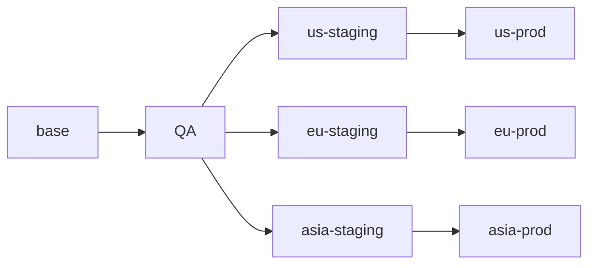
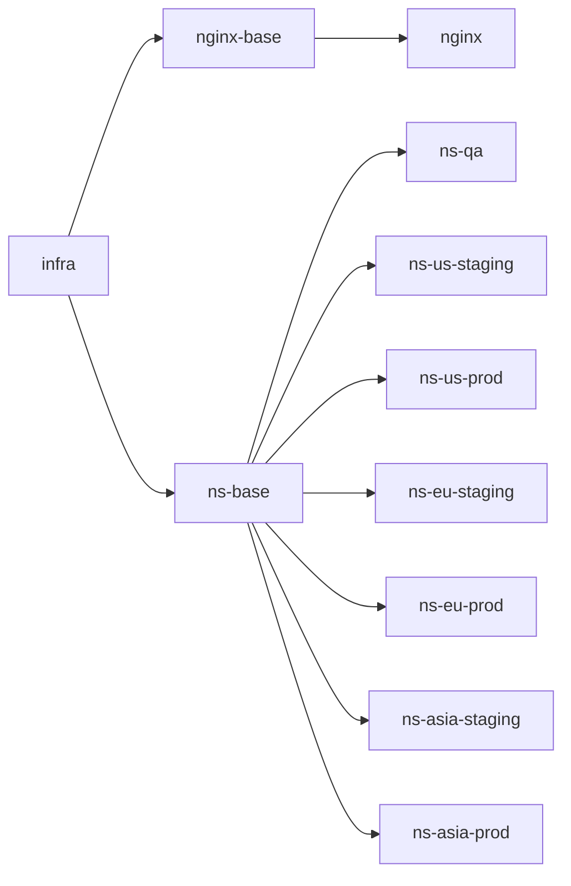

# Global App Deployment

This example demonstrates how to use ConfigHub to manage a typical micro-service application deployed in different variants for testing, staging, and production across multiple regions.

First go through the [setup](#setup) steps to get things ready. Then move on to the scenario tasks:

- [Roll out a new version](#roll-out-a-new-version)
- [Set up a new environment](#set-up-a-new-environment)
- [Lateral promotion](#lateral-promotion)
- [Change multiple environments at once](#change-multiple-environments-at-once)
- [Use changesets](#use-changesets)

## Scenario

The application has 4 micro-services components:

- React frontend
- Go backend
- ollama container
- Postgres database

In this example, the app is deployed in the following environments:

- QA
- Staging
- Prod

where staging and prod each is deployed in 3 regions: US, EU and Asia. This adds up to a total of 7 live environments with 7 associated configs plus some base config.

### ConfigHub Layout

The example is laid out as an app part and an infrastructure part. The purpose is to illustrate how the app config meshes with infrastructure config for each specific environment. A kubernetes namespace is used to simulate this infrastructure config. In reality this would be a whole different kube cluster in each environment along with other infrastructure resources and data.

The app hierarchy uses spaces for each layer because this allows different regions to be governed individually. E.g. each region can have its own line-of-business IT team own their own app. This is of course not required. It could also be laid out in a single space if desired.

The infra config on the other hand is laid out in a single infra space. The idea is that this is all governed by a single platform or infrastructure team.

The following diagram shows the app space hierarchy:



This diagram shows the infra config:



The infrastructure doesn't have the same need as the app to flow from staging to prod. So all environments are downstream from the base config. If the platform team prefers to flow from staging to prod instead, that is a simple design change.

### The purpose of base units

Take the nginx ingress controller as an example, there is both an `nginx-base` and an `nginx` unit. Why is that? This layout takes advantage of ConfigHub's clone upgrade feature to combine external updates to ingress-nginx with local changes.

For example, a new version of ingress-nginx can be installed by updating the base unit with the new yaml. The diff from the old version can be inspected for important changes. Then the downstream nginx unit can be upgraded with the new changes using clone upgrade. This merges the new changes to the downstream without clobbering any local changes that were made in the downstream.

## Setup

### Configure ConfigHub

First, set up units, spaces and other stuff in ConfigHub with:

    bin/install-base

This will:

- Create a unique project name which will be used as space prefix for this example to prevent name collisions in your org
- Create spaces for base units, filters and for infra units
- Create app base units and load config into the base space from ./baseconfig
- Create infra base units and load config into the infra space from ./baseconfig

Next, set up all the individual environments:

    bin/install-envs

This defines the environment hierarchy and sets everything up accordingly in ConfigHub. It's a good idea to read the source of this script and the scripts being called from there to understand what is going on.

To check out what is in ConfigHub now, you can run:

    cub unit tree --node=space --filter $(bin/pre)/app --space '*'

which should print something like:

```
NODE                                     UNIT        STATUS    UPGRADE-NEEDED    UNAPPLIED-CHANGES    APPLY-GATES
└── chubby-paws-base                     backend     NoLive                                           None
    └── chubby-paws-qa                   backend     NoLive    No                                     None
        ├── chubby-paws-us-staging       backend     NoLive    No                                     None
        │   └── chubby-paws-us-prod      backend     NoLive    No                                     None
        ├── chubby-paws-eu-staging       backend     NoLive    No                                     None
        │   └── chubby-paws-eu-prod      backend     NoLive    No                                     None
        └── chubby-paws-asia-staging     backend     NoLive    No                                     None
            └── chubby-paws-asia-prod    backend     NoLive    No                                     None
└── chubby-paws-base                     frontend    NoLive                                           None
    └── chubby-paws-qa                   frontend    NoLive    No                                     None
        ├── chubby-paws-us-staging       frontend    NoLive    No                                     None
        │   └── chubby-paws-us-prod      frontend    NoLive    No                                     None
        ├── chubby-paws-eu-staging       frontend    NoLive    No                                     None
        │   └── chubby-paws-eu-prod      frontend    NoLive    No                                     None
        └── chubby-paws-asia-staging     frontend    NoLive    No                                     None
            └── chubby-paws-asia-prod    frontend    NoLive    No                                     None
└── chubby-paws-base                     ollama      NoLive                                           None
    └── chubby-paws-qa                   ollama      NoLive    No                                     None
        ├── chubby-paws-us-staging       ollama      NoLive    No                                     None
        │   └── chubby-paws-us-prod      ollama      NoLive    No                                     None
        ├── chubby-paws-eu-staging       ollama      NoLive    No                                     None
        │   └── chubby-paws-eu-prod      ollama      NoLive    No                                     None
        └── chubby-paws-asia-staging     ollama      NoLive    No                                     None
            └── chubby-paws-asia-prod    ollama      NoLive    No                                     None
└── chubby-paws-base                     postgres    NoLive                                           None
    └── chubby-paws-qa                   postgres    NoLive    No                                     None
        ├── chubby-paws-us-staging       postgres    NoLive    No                                     None
        │   └── chubby-paws-us-prod      postgres    NoLive    No                                     None
        ├── chubby-paws-eu-staging       postgres    NoLive    No                                     None
        │   └── chubby-paws-eu-prod      postgres    NoLive    No                                     None
        └── chubby-paws-asia-staging     postgres    NoLive    No                                     None
            └── chubby-paws-asia-prod    postgres    NoLive    No                                     None
```

You can see the infra config with:

    cub unit tree --filter $(bin/pre)/infra --space "*"

which will print something like:

```
NODE                       SPACE                STATUS    UPGRADE-NEEDED    UNAPPLIED-CHANGES    APPLY-GATES
└── ns-base                chubby-paws-infra    NoLive                                           None
    ├── ns-asia-prod       chubby-paws-infra    NoLive    No                                     None
    ├── ns-asia-staging    chubby-paws-infra    NoLive    No                                     None
    ├── ns-us-prod         chubby-paws-infra    NoLive    No                                     None
    ├── ns-qa              chubby-paws-infra    NoLive    No                                     None
    ├── ns-us-staging      chubby-paws-infra    NoLive    No                                     None
    ├── ns-eu-staging      chubby-paws-infra    NoLive    No                                     None
    └── ns-eu-prod         chubby-paws-infra    NoLive    No                                     None
└── nginx-base             chubby-paws-infra    NoLive                                           None
    └── nginx              chubby-paws-infra    NoLive    No                                     None
```

Note that since all the infra is in a single space, you can also do:

    cub unit tree --space $(bin/pre)-infra

### Start a cluster

Start and configure a Kind cluster with:

    bin/create-cluster

After it completes, you will notice that all units except the base units now have a cluster target:

```
cub unit list --space '*' --filter $(bin/pre)/all --columns Name,Space.Slug,Target.Slug
NAME               SPACE                       TARGET
backend            chubby-paws-base
frontend           chubby-paws-base
nginx              chubby-paws-base
frontend           chubby-paws-qa              cluster-target
ollama             chubby-paws-base
postgres           chubby-paws-base
ns-base            chubby-paws-base
nginx              chubby-paws-infra           cluster-target
backend            chubby-paws-qa              cluster-target
ollama             chubby-paws-eu-prod         cluster-target
backend            chubby-paws-eu-staging      cluster-target
frontend           chubby-paws-us-staging      cluster-target
...(truncated)
```

### Apply Infrastructure

Apply the infrastructure units first:

    cub unit apply --space $(bin/pre)-infra --where "Labels.targetable = 'true'"

### Apply apps

Start with the QA environment just to check that things are working:

    cub unit apply --space $(bin/pre)-qa

Once all units are ready, see if you can access the app at http://qa.local.cubby.bz:8080. This is a DNS record pointing to 127.0.0.1, so your browser will connect to localhost on a port used by Kind which will forward to nginx ingress which will forward to the app.

The apply command may report a failed apply. Check the final status with:

    cub unit list --space $(bin/pre)-qa

Once you have confirmed that it works, you can apply other environments in a similar way or you can apply all apps with:

    cub unit apply --where "Space.Labels.prefix = '$(bin/pre)' AND Labels.targetable = 'true'" --space '*' --wait=false

However, this will cause a total of 7 ollama containers to deploy and they will each try to load a model into memory so things may grind to a halt on a single Kind cluster. Also, this command will currently cause a segfault in the CLI.

## Scenario Tasks

Now that we have everything set up, we can explore various common tasks for this scenario. Don't worry if you did not apply all the units before. You can always do it prior to or during a task.

### Roll out a new version

This is probably the most common operational task. Every time a new software build has been produced and passed tests, it is rolled out by updating the container image tag reference in the various Kubernetes manifests.

#### Bump QA

Let's start by bumping the version of frontend and backend apps in the QA environment:

    cub run set-image-reference --container-name frontend --image-reference :1.1.5 --space $(bin/pre)-qa
    cub run set-image-reference --container-name backend  --image-reference :1.1.5 --space $(bin/pre)-qa

then apply:

    cub unit apply --space $(bin/pre)-qa

Hint: You can perform these 3 commands using the `bin/set-version` script.

Once the apply has completed, go check out http://qa.local.cubby.bz:8080. You should see some visual difference that were introduced in the latest version.

#### Promote to next environment

Next, let's check the upgrade status of other environments:

    cub unit tree --node=space --filter $(bin/pre)/app --space "*" --columns Space.Slug,UpgradeNeeded,UnappliedChanges

You should see something like this:

```
NODE                                     UNIT        SPACE                       UPGRADE-NEEDED    UNAPPLIED-CHANGES
└── chubby-paws-base                     backend     chubby-paws-base
    └── chubby-paws-qa                   backend     chubby-paws-qa              No
        ├── chubby-paws-asia-staging     backend     chubby-paws-asia-staging    Yes
        │   └── chubby-paws-asia-prod    backend     chubby-paws-asia-prod       No
        ├── chubby-paws-eu-staging       backend     chubby-paws-eu-staging      Yes
        │   └── chubby-paws-eu-prod      backend     chubby-paws-eu-prod         No
        └── chubby-paws-us-staging       backend     chubby-paws-us-staging      Yes
            └── chubby-paws-us-prod      backend     chubby-paws-us-prod         No
└── chubby-paws-base                     frontend    chubby-paws-base
    └── chubby-paws-qa                   frontend    chubby-paws-qa              No
        ├── chubby-paws-asia-staging     frontend    chubby-paws-asia-staging    Yes
        │   └── chubby-paws-asia-prod    frontend    chubby-paws-asia-prod       No
        ├── chubby-paws-eu-staging       frontend    chubby-paws-eu-staging      Yes
        │   └── chubby-paws-eu-prod      frontend    chubby-paws-eu-prod         No
        └── chubby-paws-us-staging       frontend    chubby-paws-us-staging      Yes
            └── chubby-paws-us-prod      frontend    chubby-paws-us-prod         No
└── chubby-paws-base                     ollama      chubby-paws-base
    └── chubby-paws-qa                   ollama      chubby-paws-qa              No
        ├── chubby-paws-us-staging       ollama      chubby-paws-us-staging      No
        │   └── chubby-paws-us-prod      ollama      chubby-paws-us-prod         No
        ├── chubby-paws-asia-staging     ollama      chubby-paws-asia-staging    No
        │   └── chubby-paws-asia-prod    ollama      chubby-paws-asia-prod       No
        └── chubby-paws-eu-staging       ollama      chubby-paws-eu-staging      No
            └── chubby-paws-eu-prod      ollama      chubby-paws-eu-prod         No
└── chubby-paws-base                     postgres    chubby-paws-base
    └── chubby-paws-qa                   postgres    chubby-paws-qa              No
        ├── chubby-paws-asia-staging     postgres    chubby-paws-asia-staging    No
        │   └── chubby-paws-asia-prod    postgres    chubby-paws-asia-prod       No
        ├── chubby-paws-eu-staging       postgres    chubby-paws-eu-staging      No
        │   └── chubby-paws-eu-prod      postgres    chubby-paws-eu-prod         No
        └── chubby-paws-us-staging       postgres    chubby-paws-us-staging      No
            └── chubby-paws-us-prod      postgres    chubby-paws-us-prod         No
```

Units directly downstream of the QA units we just changed are now marked for upgrade. Let's dry-run a promotion to US staging:

    cub unit update --dry-run --patch --upgrade --space $(bin/pre)-us-staging

This will dry-run the promotion so you can review the changes before actually performing it in ConfigHub. Assuming you are satisfied, you run the same command without dry-run:

    cub unit update --patch --upgrade --space $(bin/pre)-us-staging

Now if you run the `cub unit tree` command again from above, you will see that US staging no longer needs an upgrade. You will also see that it has unapplied changes because only the config has changed so far. Finally, you will notice that US prod now needs and upgrade because it is directly downstream of US staging which just changed. Let's apply everything in US staging:

    cub unit apply --space $(bin/pre)-us-staging

Once it completes, go check out http://us-staging.local.cubby.bz:8080 and you will see the same nice enhancements rolled out to this environment.

#### Promote to everywhere

Once you have confidence in a new version, you can promote it everywhere in a few steps. First upgrade everything:

    cub unit update --patch --upgrade --filter $(bin/pre)/app --space "*"

You may need to run this twice because there are two layers in the clone tree. Note that you would almost never do it this way. Instead you would continue to use the commands above to upgrade one environment at a time and then apply. But this demonstrates how ConfigHub makes it easy for you to perform operations in bulk when needed.

Once all units have been upgraded, apply all changes with:

    cub unit apply --where "Labels.targetable = 'true' AND Labels.type = 'app'" --space "*" --wait=false

### Set up a new environment

A common task is to set up a new environment. It can be a new dev environment or a test environment dedicated to a specific kind of testing, or it can be a new production environment, e.g. in a new region.

To set up a new environment, you have to set up both the infrastructure and the app. The infrastructure is mimiced simplistically in with just a namespace in this example. Let's set up the infrastructure for a performance test:

    bin/new-infra perftest

Now let's set up the app:

    bin/new-app-env perftest qa perftest performance-testing dev

This clones the qa environment into a new perftest environment and associates it with the perftest infrastructure. The last two arguments are used to set the role and region parameters. They serve as an example of environment specific configuration that varies between environments.

Next, apply the configuration:

    cub unit apply --space $(bin/pre)-perftest

After successful apply, you can reach it in the browser or check the config with curl:

    curl http://perftest.local.cubby.bz:8080/api/config

### Lateral promotion

Previously, we bumped the version number in the QA environment and then promoted the change via clone upgrade to its downstreams. Another common approach is to make a change to one environment and then promote this change "laterally" to another environment and gradually roll out to all environments using lateral promotion. Finally when the change is fully rolled out, the upstream is updated.

This approach is more conservative and offers even better control over when a change is promoted to a specific environment because there is no risk of someone accidentally upgrading an environment from an upstream without knowing that the upstream has been updated by someone else.

Let's update the AI model in US staging and after reviewing the change, we promote it directly to EU staging. The model is stored as an environment variable and can be updated with this function call:

    cub run set-env-var \
            --container-name model-loader \
            --env-var MODEL_NAME \
            --env-value tinydolphin \
            --space $(bin/pre)-us-staging

Then apply:

    cub unit apply ollama --space $(bin/pre)-us-staging

Once applied, the new model should be showed on the chat screen at http://us-staging.local.cubby.bz:8080. Note that it may take a bit for the model to load and show up correctly in the UI.

You can verify what changed in the config by getting a revision list:

    cub revision list ollama --space $(bin/pre)-us-staging

and diff from the revision prior to head, e.g. if that revision is 5:

    cub unit diff -u ollama --space $(bin/pre)-us-staging --from=5

Now that you have confirmed that the change works and looks good, you can promote it to EU staging (remember to update merge base and end revision numbers to match what you have):

    cub unit update ollama \
            --space $(bin/pre)-eu-staging \
            --merge-unit $(bin/pre)-us-staging/ollama \
            --merge-base=5 \
            --merge-end=6

Check the revision list for EU staging ollama:

    cub revision list ollama --space $(bin/pre)-eu-staging

and check the diff of the two last revisions, e.g. revision 4 to 5:

    cub unit diff -u ollama --space $(bin/pre)-eu-staging --from=4

You should see that the model env var has been updated and now that everything looks good, you can apply EU staging:

    cub unit apply --space $(bin/pre)-eu-staging

and once it completes, you can check that the change is live at http://eu-staging.local.cubby.bz:8080

### Change multiple environments at once

While bulk changes to multiple environments are more risky than phased rollouts, there are valid reasons for making bulk changes. It can for example be a trivial and well-tested change that is deemed safe to roll out all at once and save the hassle of doing it one environment at a time. Or it can be an urgent security patch or an urgent rollback where time is of the essence and the risk can be tolerated.

Before continuing, make sure that you have already applied all staging environments by running:

    cub unit apply \
            --space "*" \
            --filter $(bin/pre)/all \
            --where "Labels.role = 'staging'"

In this task, we'll change the app's title in all staging environments. The title is set as an environment variable in the backend unit. First we list the units, to verify that the filter is correct and we have the right set of units:

    cub unit list \
            --filter $(bin/pre)/all \
            --where "Slug = 'backend' AND Labels.role = 'staging'" \
            --space "*" \
            --columns Name,Space.Slug,HeadRevisionNum

which prints something like this:

```
NAME       SPACE                      HEAD-REVISION-NUM 
backend    chubby-paws-asia-staging   9                    
backend    chubby-paws-eu-staging     9                    
backend    chubby-paws-us-staging     10                   
```

These are the 3 correct units. Now we can perform the config change with a function:

    cub run set-env-var \
            --space "*" \
            --container-name backend \
            --env-var CHAT_TITLE \
            --env-value "Updated AI Chat" \
            --where "Slug = 'backend' AND Labels.role = 'staging'"

Next, you can run the list command from above again and verify that the head revision number was incremented for each unit. You can also run a `cub unit diff` to inspect the changes before moving forward. Once you are satisfied, you can apply the changes with:

    cub unit apply \
            --space "*" \
            --where "Slug = 'backend' AND Labels.role = 'staging'"

And that's it. It is not until this last apply command that the live systems are touched. This gives you plenty of time and opportunity to ensure that the update is correct. While it may look similar, this approach is different from the clone upgrade we performed previously. In this case, we can select an arbitrary set of units to perform an operation on as opposed to just downstream units.

### Use changesets

Sometimes you need to make several changes across many units and you don't want someone else to introduce changes in the middle of this process. Changesets help you do this.

Let's say you want to bump the memory and set an environment variable at the same time in all staging environments. You want to ensure other changes are not introduced in between these two changes.

Start by creating a changeset:

    cub changeset create --space $(bin/pre) memory-change --description "Bump memory"

Next, associate the changeset with the units we will be changing which is all the backend units in staging environments:

    cub unit update --patch --space "*" \
            --changeset $(bin/pre)/memory-change \
            --filter $(bin/pre)/all \
            --where "Slug = 'backend' AND Labels.role='staging'"

When a unit is associated with a changeset, all changes must belong to that changeset. This prevents other users or automations from introducing new revisions. Now perform the changes:

    cub run set-env-var \
            --space "*" \
            --changeset $(bin/pre)/memory-change \
            --container-name backend \
            --env-var LARGE_MEMORY \
            --env-value "true" \
            --where "Slug = 'backend' AND Labels.role = 'staging'"

and:

    cub run set-container-resources \
            --space "*" \
            --changeset $(bin/pre)/memory-change \
            --container-name backend \
            --memory 1Gi \
            --cpu "" \
            --operation floor \
            --limit-factor 0 \
            --where "Slug = 'backend' AND Labels.role = 'staging'"

To confirm that changesets prevent unintended changes, try to make a change without providing a changeset:

    cub run set-env-var \
            --space "*" \
            --container-name backend \
            --env-var testvar \
            --env-value "testvalue" \
            --where "Slug = 'backend' AND Labels.role = 'staging'"

This should fail because the change is not part of the active changeset.

Now that you have made your changes, you can remove the changeset from the units:

    cub unit update \
            --patch \
            --changeset - \
            --filter $(bin/pre)/all \
            --space "*" \
            --where "Slug = 'backend' AND Labels.role='staging'"

This "unlocks" the units so they can be changed again. Now you can apply the changeset by referencing it in the revision flag on the apply command:

    cub unit apply \
            --filter $(bin/pre)/all \
            --where "Slug = 'backend' AND Labels.role = 'staging'" \
            --revision "ChangeSet:$(bin/pre)/memory-change"
            --space "*"

Note that you can safely unlock the units before performing the apply because when you perform the apply, you reference the specific revision tag produced by the changeset. If a new revision is created just before this command is executed it will create a new head revision but it will not affect what is being applied.

## Notes

If you have GPU acceleration, add something like the following to the ollama container:

```
        resources:
          limits:
            nvidia.com/gpu: 1  # Request 1 GPU
            memory: "8Gi"
          requests:
            memory: "4Gi"
```
