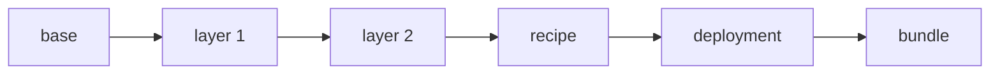

# Recipes and Layers in ConfigHub

## Purpose

This note proposes a simple ConfigHub convention for recipes and layers.

The goal is not to add a large new subsystem. The goal is to make layered configuration easier to teach, review, reuse, and later productize.

## Short Definition

A recipe is the ordered chain of configuration variants that leads to a deployable result.

A layer is one specialization step in that chain.

A bundle is the published deployment artifact produced from the final deployment unit.

## Core Model

The clean way to think about it is:

- `clone` = make a variant
- `link` = keep it upgraded from upstream
- `bundle` = publish the resolved result for deployment

So the recipe is not the bundle itself. The recipe is the ordered chain of variants that leads to the deployable bundle.

## Recommended Standard

### 1. One materialized chain per component

For one component, the chain should be explicit and ordered.

Generic pattern:



### 2. Three levels of organization

- `catalog`: reusable base and layer stages
- `recipe`: resolved combinations worth naming and reusing
- `deploy`: actual cluster or environment instances

### 3. Explicit metadata even if execution stays implicit

ConfigHub does not need a hard `Recipe` object type to make this work.

But the example, CLI, GUI, and AI should still have an explicit recipe manifest for:

- teaching
- provenance
- review
- later automation

### 4. Ordered precedence

Layers should always be applied in a clear order from general to specific.

Recommended order:

1. base
2. environment or platform
3. hardware or region
4. role or intent
5. recipe
6. deployment

Not every example needs every layer. Simpler chains are fine.

## Required Metadata Convention

At minimum, each unit and space in the chain should carry labels such as:

- `ExampleName`
- `ExampleChain`
- `Recipe`
- `Component`
- `Layer`

The explicit recipe manifest should list:

- ordered layers
- source spaces and units
- revisions
- hashes if available
- target reference if set
- bundle hint or bundle digest when known

## Worked Example Package

The package for this convention should live at:

- `examples/incubator/global-app-layer/`

It should contain:

- `01-nvidia-aicr-fit.md`
- `02-recipes-and-layers-spec.md`
- `04-review-and-next-steps.md`
- `single-component/`
- `frontend-postgres/`
- `realistic-app/`
- `gpu-eks-h100-training/`

That keeps the analysis, the spec, and the worked examples together.

## Suggested Initial Implementation

### A. First simple example: `single-component`

This is the smallest proof of the model.

Use one component only:

- source: `global-app/baseconfig/backend.yaml`

Materialized chain:

1. `backend-base`
2. `backend-us`
3. `backend-us-staging`
4. `backend-recipe-us-staging`
5. `backend-cluster-a`

Space layout:

- `catalog-base`
- `catalog-us`
- `catalog-us-staging`
- `recipe-us-staging`
- `deploy-cluster-a`

Layer semantics:

- `base`: original backend manifest
- `region`: set region-specific values
- `role`: set staging-specific values
- `recipe`: set recipe-specific identity or presentation values
- `deployment`: set cluster-local target values

This example should keep the explicit recipe manifest alongside the real clone chain. That is the right balance between simplicity and clarity.

### Why this is a good first example

- it teaches the model with one component
- it keeps the source of truth understandable
- it shows downstream upgrades without flattening local mutations
- it demonstrates that the bundle is an output, not the recipe itself

## Suggested Second Example

### B. Small app example: `frontend-postgres`

This is the next step up.

Use two components:

- `frontend`
- `postgres`

Both move through the same layer spaces:

- `catalog-base`
- `catalog-us`
- `catalog-us-staging`
- `recipe-us-staging`
- `deploy-cluster-a`

But the mutations are component-specific.

This example teaches a more realistic recipe truth:

- layers keep the same meaning across the app
- components still change differently inside those layers

That is the minimum step from a single-unit mechanism to an app-level recipe model.

## Suggested Third Example

### C. Fuller app example: `realistic-app`

This is the next step up from the two-component example.

Use three coordinated components:

- `backend`
- `frontend`
- `postgres`

All three move through the same shared spaces:

- `catalog-base`
- `catalog-us`
- `catalog-us-staging`
- `recipe-us-staging`
- `deploy-cluster-a`

This example should prove that:

- one app-level recipe can describe multiple coordinated components
- layer names can stay stable across the app
- recipe-stage mutations can express cross-component coordination
- one shared target path can produce a coherent deployment story

This is the minimum realistic app example for the pattern.

## Suggested Bigger Example

### D. GPU recipe example: `eks-h100-ubuntu-training`

This is the larger example that shows why the pattern matters.

Suggested chain for one component, for example `gpu-operator`:

1. `gpu-operator-base`
2. `gpu-operator-eks`
3. `gpu-operator-eks-h100`
4. `gpu-operator-eks-h100-ubuntu`
5. `gpu-operator-eks-h100-ubuntu-training`
6. `gpu-operator-cluster-a`

Suggested space layout:

- `catalog/base`
- `catalog/eks`
- `catalog/h100`
- `catalog/ubuntu`
- `catalog/training`
- `recipe/eks-h100-ubuntu-training`
- `deploy/customer-a-prod`

The same pattern can be applied across multiple components, for example:

- `gpu-operator`
- `network-operator`
- `prometheus`
- `kubeflow-trainer`
- `nvidia-device-plugin`

In that larger example:

- the recipe space represents a known-good combination
- the deployment space represents a specific cluster instance
- the bundle is emitted from the deployment target

The current package now includes a first implemented version of this idea:

- `gpu-eks-h100-training/`

It keeps the example intentionally reviewable by using two related components, `gpu-operator` and `nvidia-device-plugin`, while still making the platform, accelerator, OS, and intent layers explicit.

### Why this bigger example matters

It shows that recipes are not just environment cloning. They are a reusable composition model across:

- platform
- hardware
- OS
- workload intent
- cluster-local deployment values

## Should Recipe Be a First-Class Type?

Not yet.

The first implementation should stay light:

- execution implicit in clone chains
- explanation explicit in a recipe manifest

That keeps the model easy to implement and review now, while leaving room for a future first-class `Recipe` feature if the UX proves it is needed.

## Suggested Example Output Shape

The recipe manifest should look roughly like this:

```yaml
kind: Recipe
name: eks-h100-ubuntu-training
layers:
  - name: base
    unit: catalog/base/gpu-operator
  - name: cloud
    unit: catalog/eks/gpu-operator
  - name: accelerator
    unit: catalog/h100/gpu-operator
  - name: os
    unit: catalog/ubuntu/gpu-operator
  - name: intent
    unit: catalog/training/gpu-operator
output:
  deploymentUnit: deploy/customer-a-prod/gpu-operator
  bundle: oci://.../target/customer-a-prod/cluster-a:latest
```

This should be treated as explicit metadata and provenance, not as a new execution engine.

## Bottom Line

The proposed ConfigHub standard is:

1. recipe = ordered clone chain
2. deployment = final cluster or environment clone
3. bundle = deployable artifact from the target
4. recipe manifest = explicit provenance and teaching layer

That is enough to support a small example now and a larger AICR-like example later.
