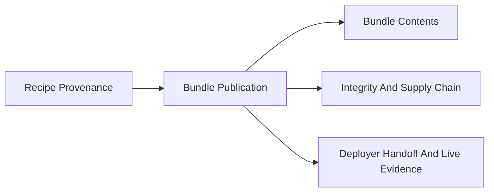

# Bundle Evidence GUI Spec

This page describes a GUI-first view for the AICR bundle story.

It is intentionally product-facing.
The goal is to make the bundle story visible in one place rather than forcing a user to reconstruct it from CLI output, JSON artifacts, and memory.

## User Question

The page should answer this quickly:

- what bundle was published, why should I trust it, and where did it go?

## Primary Screen

A single page should show five sections side by side or in stacked cards.

### 1. Recipe Provenance

Show:

- recipe manifest
- deployment variant
- target
- upstream layer chain
- exact revisions used

### 2. Bundle Publication

Show:

- bundle URI
- bundle digest
- publication time
- deployer type
- producing target

### 3. Bundle Contents

Show:

- component list
- payload types such as Helm or Flux
- values or manifest references
- generated deployment notes when present

### 4. Integrity And Supply Chain

Show:

- checksum manifest status
- SBOM reference
- attestation references
- signature verification result
- image digests covered by the evidence

### 5. Deployer Handoff And Live Evidence

Show:

- which deployer consumed the bundle
- when it consumed it
- exact digest consumed
- linked cluster evidence

## Suggested Page Layout

## Minimum Interactions

The GUI should support:

- click from bundle digest to publication record
- click from publication record to recipe manifest and deployment variant
- click from SBOM or attestation references to the external artifact location
- click from deployer handoff to the consuming controller object
- click from live evidence to the current cluster object view

## What The Current Package Can Already Approximate

The closest current approximation is:

- [`bundle-evidence-sample`](./bundle-evidence-sample/README.md)
- its generated local page: `sample-output/bundle-evidence.html`

That sample is not the final GUI.
It is a small fixture-backed mock of the information architecture.

## Feature Ask Summary

The future GUI page should answer all of these on one screen:

- what produced this bundle?
- what is inside it?
- how do I verify it?
- who consumed it?
- does live evidence match it?
