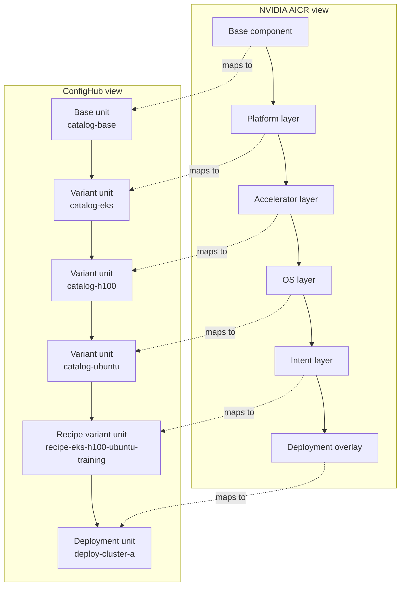

# Global App Layer — Layered Recipes for ConfigHub

ConfigHub gives you an **easy way to model and manage NVIDIA AI software patterns correctly** and then **to operate them** with updates, patches, integrations, customisations and fleets.

Four working examples are provided as "layered recipes".  These are reproducible configuration recipes for combining multiple components correctly, using [NVIDIA AICR](https://developer.nvidia.com/blog/validate-kubernetes-for-gpu-infrastructure-with-layered-reproducible-recipes/) which is open source.

Important note:

- the GPU example in this package is a **structural proof**, not a full functional NVIDIA deployment
- it uses stub images so the recipe shape can be reviewed and exercised on ordinary clusters, including local `kind`
- to run real NVIDIA GPU software, swap in the real NVIDIA images and point the deployment at GPU-capable nodes

## Bundle Status

The AICR bundle material in this package is useful, but it is not yet a fully real end-to-end bundle publication proof.

Today the honest status is:

- recipe and layering side: real and better proven
- bundle publication side: explained clearly, with a fixture-backed evidence sample
- full real bundle publication and inspection flow: not yet proven here

Use these files accordingly:

- [05-bundle-publication-walkthrough.md](./05-bundle-publication-walkthrough.md) for the staged story
- [bundle-evidence-sample/README.md](./bundle-evidence-sample/README.md) for the smallest concrete evidence sample
- [04-bundles-attestation-and-todo.md](./04-bundles-attestation-and-todo.md) for the current gap list

## What This Package Is For

Use this package when the reason for the demo is layered composition.

This is the place to show that ConfigHub can materialize one ordered recipe chain across spaces, preserve ancestry with clone links, and optionally carry that recipe all the way to a real target.

Do not use this package as the first-stop GitOps import wedge. Use it when you specifically need layered recipes, deployment variants, or the NVIDIA-shaped chain model.

## Stack And Scenario

This package is for:
- ConfigHub-managed Kubernetes application manifests
- layered multi-component app recipes
- NVIDIA AICR-style layered software stacks

It demonstrates how to turn a layered recipe into real ConfigHub spaces, units, variants, recipe manifests, and optional deployment targets.

## WET-First, Not Live-First

These examples are intended-state first.

They start by materializing and verifying layered config in ConfigHub as concrete WET objects.
Live delivery is a later optional step.

In other words:
- `setup.sh` is ConfigHub-first, not cluster-first
- target binding is optional
- `cub unit apply` is a later explicit action, not the starting point

## Current Demo Wedge

For the current `GitHub + Argo/Flux + AI/CLI + ConfigHub` wedge, lead with import and evidence, not with apply.

In that first demo, ConfigHub's job is to:

- ingest existing WET config from GitHub
- organize it into ConfigHub units and manifests
- run validation and scan immediately
- show one concrete issue or policy result quickly
- compare imported WET with real cluster evidence
- support review and approvals before any later mutation path

That also means:

- AI and CLI are the primary operator path
- the GUI is where ConfigHub should shine for tables, trees, diffs, policy results, evidence, and approvals
- if runtime status is not yet trustworthy enough, do not center the demo on ConfigHub apply or claim ConfigHub is the runtime source of truth; show direct cluster evidence side by side with ConfigHub

This package supports that story, but it is usually the second stop rather than the first one. For the first-stop import demos, start with the published [GitOps Import docs](https://docs.confighub.com/get-started/examples/gitops-import/) and then use the Argo and Flux references in [Choose The Right Demo First](#choose-the-right-demo-first).

## What This Reads And Writes

What it reads:
- base YAML manifests from `global-app/baseconfig/` for the app examples
- local example YAML files for the GPU example
- current ConfigHub context, spaces, targets, and workers

What it writes:
- new ConfigHub spaces for each layer
- units for base, shared layers, recipe, and deploy stages
- clone links / variant ancestry between those units
- one recipe manifest unit per assembled recipe
- optional target bindings if you choose a live delivery path
- optional live cluster or GitOps delivery state only if you explicitly bind and apply

## What You Should Expect To See

In ConfigHub-only mode you should expect:
- five, six, or seven new spaces sharing one prefix
- units for each layer in the chain
- one recipe manifest unit
- `verify.sh` passing

In live mode you should additionally expect:
- `./preflight-live.sh <space/target>` showing `applyReady: true` before any mutation
- deployment units bound to a real target
- successful `cub unit apply`
- for direct targets: worker-mediated apply evidence plus live cluster resources
- for delegated targets: agent-side objects and sync/health evidence plus live cluster resources

## What Good Demos Should Prove

For the current wedge, a believable demo should show:

- imported WET config visible in ConfigHub quickly
- validation or `confighub-scan` results immediately after import
- one real issue that a platform team would care about, not just a successful import
- direct cluster evidence shown beside ConfigHub evidence when runtime behavior matters
- AI and CLI as the main operator flow, with the GUI used for inspection, review, and approvals

If you take this package further into live delivery follow-ons, a believable live demo should then also show:

- target visibility is not enough; worker or agent readiness must be shown first
- which delivery mode is in use: direct worker apply or delegated GitOps agent
- evidence from the executor, not only from ConfigHub intent objects
- cluster-side results after the delivery step

What these demos should also make visible:

- direct worker delivery is already a strong proof path in this package
- delegated GitOps-agent delivery is a must-have proof path for the AICR story
- worker resilience still needs to be demonstrated more explicitly through reconnect, retry, and resume behavior rather than treated as a hidden assumption

## AI-Safe Path

If you want to use this package with an AI assistant, start here:

- [AI_START_HERE.md](./AI_START_HERE.md)
- [prompts.md](./prompts.md)
- [contracts.md](./contracts.md)
- [whole-journey.md](./whole-journey.md)

## Choose The Right Demo First

This package is no longer the front door for every ConfigHub story.
Use it when you specifically want layered recipes, deployment units, and the NVIDIA-shaped chain model.

If your goal is earlier or simpler, start with these first:

| Goal | Start here | Why |
|---|---|---|
| Official GitOps import walkthrough | [GitOps Import docs](https://docs.confighub.com/get-started/examples/gitops-import/) | Best first stop for the current wedge: one published import/evidence path |
| Argo import from GitHub | [cub-scout: argo-import-confighub-demo](https://github.com/confighub/cub-scout/tree/main/examples/argo-import-confighub-demo) | Concrete Argo repo example behind the published docs story |
| Flux import from GitHub | [cub-scout: flux-import-confighub-demo](https://github.com/confighub/cub-scout/tree/main/examples/flux-import-confighub-demo) | Same import-first story, but for Flux |
| Helm-oriented workflow | [helm-platform-components](../../helm-platform-components/README.md) and [cub-scout Helm quickstart](https://github.com/confighub/cub-scout/blob/main/docs/reference/cub-track-quickstart-helm.md) | Simpler path for chart-centric teams |
| Direct apply, smallest example | [single-component](./single-component/README.md) | The simplest layered apply story in this package |
| Multi-env App-Deployment-Target model | [promotion-demo-data](../../promotion-demo-data/README.md) | Jesper's app/deployment/target model with many deployments |
| Microservices and app styles | [global-app](../../global-app/README.md) and [cub-scout apptique examples](https://github.com/confighub/cub-scout/tree/main/examples/apptique-examples) | Concrete app layouts across Argo, Flux, monorepo, and app-of-apps styles |

Use `global-app-layer` after those when you want to show:
- one shared recipe turning into concrete deployment units
- layered updates and downstream specialization
- NVIDIA AICR-shaped config chains

## Start Here

If you are new to ConfigHub, start here:

- [00-config-hub-hello-world.md](./00-config-hub-hello-world.md)

If you already understand the NVIDIA AICR idea and want the clearest explanation of what ConfigHub adds on top, read:

- [confighub-aicr-value-add.md](./confighub-aicr-value-add.md)

Supporting documents:

- [AI_START_HERE.md](./AI_START_HERE.md)
- [prompts.md](./prompts.md)
- [contracts.md](./contracts.md)
- [preflight-live.sh](./preflight-live.sh) for live-target readiness checks
- [whole-journey.md](./whole-journey.md)
- [05-bundle-publication-walkthrough.md](./05-bundle-publication-walkthrough.md)
- [bundle-evidence-sample/README.md](./bundle-evidence-sample/README.md)
- [06-bundle-evidence-gui-spec.md](./06-bundle-evidence-gui-spec.md)
- [how-it-works.md](./how-it-works.md)
- [../AGENTS.md](../AGENTS.md) for the incubator AI protocol
- [../AI-README-FIRST.md](../AI-README-FIRST.md) for fuller incubator AI guidance
- [../ai-example-playbook.md](../ai-example-playbook.md) for the reusable example standard
- [../ai-example-template.md](../ai-example-template.md) for the reusable file bundle/template
- [confighub docs](https://docs.confighub.com/)
- use `cub upgrade` to download the latest `cub`, then `cub --help` for CLI guidance
- [find-runs.sh](./find-runs.sh) if you need to discover active global-app-layer runs in live ConfigHub

## Prerequisites

Before running any examples, ensure you have the following in place:

| Requirement | Purpose |
|------------|---------|
| `cub` CLI | ConfigHub command-line tool ([install docs](https://docs.confighub.com/)) |
| `cub auth login` | Authenticated session with ConfigHub |
| `jq` | JSON processing for scripts |
| Kubernetes cluster + ConfigHub worker | Required for actual deployments (see [gitops-import](../../gitops-import/) for setup) |

Without the `cub` CLI authenticated, the setup scripts will fail immediately.

## Quick Glossary

| Term | Plain meaning | Why it matters here |
|---|---|---|
| `space` | A named workspace in ConfigHub | Each layer or deployment stage gets its own space so updates and local overrides stay separate |
| `unit` | One versioned config object, usually one manifest or manifest set | Units are the concrete things ConfigHub stores, mutates, and deploys |
| `variant` | A specialized unit derived from an earlier unit | This is the user-facing idea of a "layered copy" |
| `clone link` | The ConfigHub mechanism behind a variant | ConfigHub uses clone links so shared changes can flow downstream with provenance |
| `worker` | A long-lived agent that can act on real systems | Workers register delivery endpoints and execute apply/import work |
| `target` | A named delivery endpoint owned by a worker | A target tells ConfigHub where to apply or publish rendered config |
| `bundle` | The deployable output produced for a target | Bundles belong to targets, not to the recipe itself |
| `recipe manifest` | A metadata unit that explains how a recipe was assembled | The variant chain is what ConfigHub executes; the recipe manifest is the receipt that explains it |

## If You Are New to NVIDIA AICR

You do not need prior AICR knowledge to use these examples.

Treat AICR as one motivating example of a layered configuration system:

- start from a base component
- apply a few shared specialization layers
- produce a known-good deployment shape

ConfigHub uses that same idea, but stores the result as real versioned config objects that can keep evolving over time.

## What Is NVIDIA AICR and how does ConfigHub manage it?

Quoting from AICR "Every AI cluster running on Kubernetes requires a full software stack that works together, from low-level driver and kernel settings to high-level operator and workload configurations. You get one cluster working, and spend days getting the next one to match. Upgrade a component, and something else breaks. Move to a new cloud and start over. AI Cluster Runtime is a new open-source project designed to remove cluster configuration from the critical path. It publishes optimized, validated, and reproducible Kubernetes configurations as recipes you can deploy onto your clusters."

NVIDIA ships GPU software as "recipes" — curated, tested combinations of drivers, operators, and plugins for specific hardware/OS/cloud combinations. Their model is: start with a base component, layer on platform choices (EKS vs GKE), hardware choices (H100 vs A100), OS choices (Ubuntu vs RHEL), and workload intent (training vs inference). The result is a reproducible, auditable configuration. The software is known as [NVIDIA AICR](https://developer.nvidia.com/blog/validate-kubernetes-for-gpu-infrastructure-with-layered-reproducible-recipes/).

ConfigHub also enables reproducible, auditable configurations, as well as additonal management, operational and compliance capabilities. Where NVIDIA creates a stack out of a sequence of layers, ConfigHub stores a concrete unit at each stage and connects them into a layered variant chain. The underlying ConfigHub mechanism is a set of clone links, but the user-facing idea is simple: each layer becomes one more specialized variant that can still receive safe upstream updates.

For AICR, this means customers can adopt recipes through one managed path and keep using that same mechanism as new recipes appear and critical updates are released.

## How NVIDIA Layers Map to ConfigHub



Read the diagram from left to right:

- each AICR layer becomes a concrete unit in ConfigHub
- each new unit is a more specialized variant of the previous one
- ConfigHub records how that specialization happened
- the deployment unit is the final environment-specific form that can be applied or published

## Why These Examples Use Multiple Spaces

The smallest layered example still uses several spaces because each space captures one level of shared meaning.

| Space role | Example names | Why it exists |
|---|---|---|
| Base catalog | `catalog-base` | Holds the starting manifest that other variants build from |
| Shared specialization catalogs | `catalog-us`, `catalog-eks`, `catalog-h100`, `catalog-ubuntu` | Holds shared changes that many downstream deployments may want to inherit |
| Recipe space | `recipe-us-staging`, `recipe-eks-h100-ubuntu-training` | Holds the resolved recipe-level intent shared by deployments |
| Deploy space | `deploy-cluster-a` | Holds the final cluster- or environment-specific overrides |

For the app examples there are five spaces because they use `base -> region -> role -> recipe -> deploy`.

For the GPU example there are six spaces because it uses `base -> platform -> accelerator -> os -> recipe -> deploy`.

The point is not to create lots of spaces for their own sake. The point is to keep shared updates separate from deployment-local choices so changes can move safely without flattening everything into one file.

## Where the Base Manifests Come From

These examples are a package, not a standalone application source tree.

The package reuses real manifests from elsewhere in this repo:

| Example | Base manifests |
|---|---|
| `single-component` | [`global-app/baseconfig/backend.yaml`](../../global-app/baseconfig/backend.yaml) |
| `frontend-postgres` | [`global-app/baseconfig/frontend.yaml`](../../global-app/baseconfig/frontend.yaml), [`global-app/baseconfig/postgres.yaml`](../../global-app/baseconfig/postgres.yaml) |
| `realistic-app` | `global-app/baseconfig/backend.yaml`, `global-app/baseconfig/frontend.yaml`, `global-app/baseconfig/postgres.yaml` |
| `gpu-eks-h100-training` | local base YAML files in the example directory |

## The Examples

These four examples prove it works, in increasing complexity:

### single-component

The simplest case: one app (`backend`), five layers, one stub dependency (`postgres`). Proves the layered variant model works end-to-end. The postgres stub is a ConfigHub unit — not a manual `kubectl apply` — so the entire deployment goes through ConfigHub.

### frontend-postgres

Two components (`frontend` + `postgres`) with a stub dependency (`backend`). The frontend's nginx config expects a `backend` upstream, so a minimal backend stub fills that gap. Proves that multi-component recipes work and that stub dependencies stay inside ConfigHub.

### realistic-app

Three components (`backend` + `frontend` + `postgres`) — no stubs needed because all dependencies are real components in the recipe. Proves a recognizable multi-tier app works end-to-end through the layered model.

### gpu-eks-h100-training

This is NVIDIA's actual layering model: `base → platform(EKS) → accelerator(H100) → OS(Ubuntu) → recipe(training)` with two deployment variants at the leaf. Two components (`gpu-operator` + `nvidia-device-plugin`) with one direct deployment variant and one Flux deployment variant. Uses stub container images (`nginx:1.27-alpine`, `busybox:1.37`) so it runs on any cluster including local `kind`, but the structure is real — swap the images for NVIDIA's actual operator images and point at a GPU node pool and it works. Proves ConfigHub can express the same structure as NVIDIA's AICR pattern with real units, real variant links, real provenance tracking, and explicit deployment variants.

If you can model NVIDIA's most complex recipe pattern in ConfigHub, you can model many layered patterns.

### Summary

Every example creates real ConfigHub spaces, units, and layered variant chains. Every example can deploy real pods to a Kubernetes cluster via `cub unit apply`. All four can run simultaneously in different namespaces with zero conflicts.

| Example | Components | Layers | What it proves |
|---|---|---|---|
| [single-component](./single-component/) | backend + postgres stub | 5 (base → region → role → recipe → deploy) | The layered variant model works end-to-end |
| [frontend-postgres](./frontend-postgres/) | frontend + postgres + backend stub | 5 | Dependencies can be stubs inside ConfigHub |
| [realistic-app](./realistic-app/) | backend + frontend + postgres | 5 | A real multi-tier app works without stubs |
| [gpu-eks-h100-training](./gpu-eks-h100-training/) | gpu-operator + nvidia-device-plugin | 5 shared layers + 2 deployment variants | NVIDIA's actual layering model in ConfigHub with explicit direct and Flux leaves |

## How It Works

ConfigHub is a database for organising software config manifests plus a management platform for executing operations. Each config is organised into apps, which connect to Sources (eg GitHub) and may be deployed to Targets (eg Argo or Flux in Kubernetes). Thus ConfigHub may be 'inserted' into an existing GitOps flow. The management layer can then act as a point of operational control for all changes to the connected software.

See [how-it-works.md](./how-it-works.md) for the full explanation of:

- Manifest lifecycle in the ConfigHub database
- How name conflicts are avoided across concurrent recipes
- The role of workers, targets, and GitOps delivery
- Where AI fits (and doesn't fit) in the runtime path
- How ArgoCD integration works when you swap the delivery target
- How the package e2e tests cover brownfield, greenfield, bridge, and delivery modes

## Quick Start

Every layered example uses the same script pattern:

1. `setup.sh --explain` shows the full plan without mutating ConfigHub
2. `setup.sh --explain-json` shows the same plan as stable JSON for AI or tooling
3. `setup.sh` creates spaces, base units, downstream variants, and the recipe-manifest receipt
4. `verify.sh` checks the variant chain and the receipt
5. `set-target.sh` optionally binds the deployment units to a real target
6. `upgrade-chain.sh` proves shared updates can move downstream safely
7. `cleanup.sh` removes the created spaces and units

Each example follows the same script interface:

```bash
# Pick an example
cd single-component    # or frontend-postgres, realistic-app, gpu-eks-h100-training

# See the full plan first without writing anything
./setup.sh --explain

# Machine-readable plan for AI or tooling
./setup.sh --explain-json | jq

# Ready for a fresh run
./setup.sh                              # ConfigHub-only
./setup.sh <prefix> <space/target>     # with live target
./verify.sh

# Optional: start ConfigHub-only, then bind a target later
./set-target.sh <space/target>
cub unit apply --space <deploy-space> --unit <deploy-unit>

# Optional: change the base and watch it propagate
./upgrade-chain.sh

# Tear down all spaces and units
./cleanup.sh
```

After `./setup.sh`, prefer the durable artifacts over terminal scrollback:

- the printed clickable GUI URLs
- `.logs/setup.latest.log`
- `.logs/set-target.latest.log`
- `.logs/verify.latest.log`
- `.logs/cleanup.latest.log`

If you want the **full** story after that, continue with:
- live target binding and apply
- shared upstream upgrades
- custom downstream deployment variants

The exact walkthrough lives in [whole-journey.md](./whole-journey.md).

Before any live claim, preflight the target first:

```bash
./preflight-live.sh <space/target>
./preflight-live.sh <space/target> --json | jq
```

`cub target list` only proves target visibility. It does not prove the worker is ready for apply.

The two explain modes are safe to run before authentication or before choosing a target:

- they do not create spaces
- they do not create units
- they do not bind targets
- they do not apply anything to a cluster

About the placeholders:

- `./setup.sh` and `./verify.sh` work without any target at all; they only load and check manifests in the ConfigHub database
- placeholders like `<target-ref>` or `<space/target>` are only needed for optional live delivery
- find a real target reference with:

```bash
cub target list --space "*" --json
```

To discover active global-app-layer runs in ConfigHub without knowing the prefix:

```bash
./find-runs.sh
./find-runs.sh realistic-app
./find-runs.sh --json | jq
```

The helper uses the labels already written by the examples:

```bash
cub space list --where "Labels.ExampleName = 'global-app-layer-realistic-app'" --json
cub space list --where "Labels.ExampleChain = '<prefix>'" --json
```

To deploy to a specific namespace (default is `cluster-a`):

```bash
DEPLOY_NAMESPACE=recipe-sc ./setup.sh
```

To run all four simultaneously:

```bash
DEPLOY_NAMESPACE=recipe-sc   ./single-component/setup.sh
DEPLOY_NAMESPACE=recipe-fp   ./frontend-postgres/setup.sh
DEPLOY_NAMESPACE=recipe-ra   ./realistic-app/setup.sh
DEPLOY_NAMESPACE=recipe-gpu  ./gpu-eks-h100-training/setup.sh
```

## Contributor Notes

These documents explain the design thinking behind the examples and the current open gaps:

1. [01-nvidia-aicr-fit.md](./01-nvidia-aicr-fit.md) — Why the NVIDIA AICR pattern matters for ConfigHub
2. [02-recipes-and-layers-spec.md](./02-recipes-and-layers-spec.md) — The recipes-and-layers spec for ConfigHub
3. [04-bundles-attestation-and-todo.md](./04-bundles-attestation-and-todo.md) — Current status plus the AICR bundle, integrity, and attestation gap
4. [05-bundle-publication-walkthrough.md](./05-bundle-publication-walkthrough.md) — Honest staged walkthrough for the bundle publication story
5. [bundle-evidence-sample/README.md](./bundle-evidence-sample/README.md) — Fixture-backed sample for bundle publication, integrity, and handoff evidence
6. [06-bundle-evidence-gui-spec.md](./06-bundle-evidence-gui-spec.md) — GUI-first view of the bundle evidence story

## End-to-End Testing

The package test layer is now all in one place:

- [e2e/](./e2e/) — full lifecycle tests plus delivery helpers for direct and Argo-oriented flows
