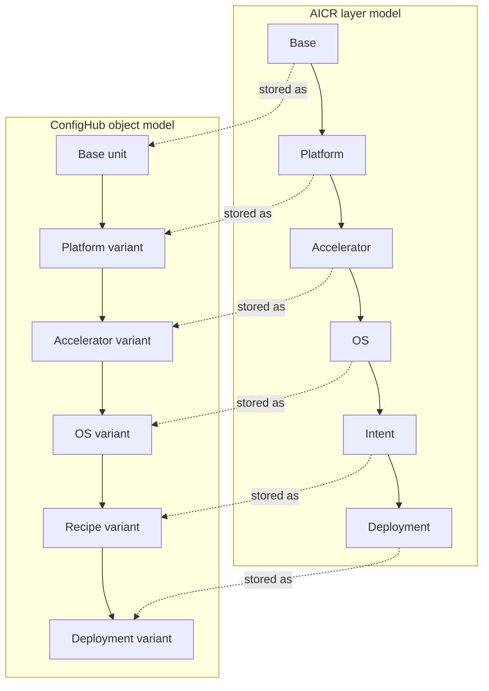

# ConfigHub + NVIDIA AICR: What You Can Do Next

This guide is for people who already like the NVIDIA AICR idea and want to understand what ConfigHub adds on top.

The positioning here is simple:

- AICR gives you validated, reproducible layered recipes.
- Then you want to keep using those recipes in real environments.
- ConfigHub helps you do that next part.

In other words:

- AICR helps you create and validate a good recipe.
- ConfigHub helps you manage that recipe over time.

For AICR itself, that means customers can adopt recipes through one managed path and keep using that same mechanism as new recipes appear and critical updates are released.

## If You Are New To This

AICR is a strong model for packaging a working software stack as a layered recipe.

For example:

- base component
- platform choice like EKS
- accelerator choice like H100
- OS choice like Ubuntu
- workload intent like training

That gets you to a tested, reproducible combination.

The natural next questions are:

1. How do I patch and upgrade this safely?
2. How do I deliver it using the GitOps systems I already use?
3. How do I manage many slightly different variants without losing track of why they differ?

Those are the three stories in this guide.

## One Picture of the Mapping

NVIDIA AICR talks about layers.
ConfigHub stores one concrete unit at each stage of specialization.



The important point is:

- AICR gives you the layered recipe idea
- ConfigHub turns each stage into a real object with provenance and later updates

## Before You Start

You will get the clearest demos if you first verify the examples repo and have an authenticated `cub` CLI.

```bash
cd <your-examples-checkout>
cub auth login
./scripts/verify.sh
```

For GUI demos, open ConfigHub in your browser and keep it available while you run the CLI steps.

Recommended examples for this guide:

- [`realistic-app`](./realistic-app/README.md)
- [`gpu-eks-h100-training`](./gpu-eks-h100-training/README.md)
- [`how-it-works.md`](./how-it-works.md)

## Story 1: Safe Updates, Patches, and Upgrades

### What AICR gives you

AICR gives you a known-good layered recipe.

That is exactly what you want at the start.

### What you want next

Once the recipe is in use, you almost always want to make a safe shared change:

- roll out a CVE fix
- update a certificate
- reduce over-provisioning
- refresh a base image

The problem is not making the change once.
The problem is making it without breaking deployment-specific values that must stay different.

### What ConfigHub adds

ConfigHub stores the layered recipe as a chain of real config objects.

That means you can:

- change the base
- propagate that change down the chain
- preserve deployment-local values that should remain different
- inspect the chain afterwards and understand what came from where

This is the most straightforward value-add over a recipe tool by itself.

### Demo: upgrade a realistic app without flattening its customizations

#### CLI

```bash
cd incubator/global-app-layer/realistic-app

# Create the layered chain in ConfigHub
./setup.sh

# Verify the chain before changing anything
./verify.sh

# Push a shared base update through the app
./upgrade-chain.sh 1.1.8 1.1.8 16.1

# Verify again after the upgrade
./verify.sh

# Show the variant ancestry
cub unit tree --edge clone --where "Labels.ExampleName = 'global-app-layer-realistic-app'"
```

What to notice:

- the shared base versions changed
- the recipe still contains app-specific values such as regional settings, staging values, and deployment namespace choices
- the chain still has clear provenance from base to deploy

#### GUI

1. Open the spaces for the example prefix.
2. Compare the base space, recipe space, and deploy space.
3. Open one chain such as `backend-base -> backend-us -> backend-us-staging -> backend-recipe-us-staging -> backend-cluster-a`.
4. Confirm that the base change propagated.
5. Confirm that deployment-specific values still exist at the deploy layer.

What this proves:

- AICR gets you a valid recipe.
- ConfigHub helps you keep that recipe current without losing the local changes that matter.

## Story 2: Use Standard GitOps Delivery Patterns

### What AICR gives you

AICR gives you layered output that can feed deployers.

That is already useful.

### What you want next

Most teams do not want to replace their existing delivery patterns.
They want to keep using familiar GitOps mechanisms such as:

- ArgoCD
- Flux
- App of Apps
- ApplicationSet

What they want is better control over what gets delivered.

### What ConfigHub adds

ConfigHub lets you keep the layered recipe as the managed source of truth, and then choose how to deliver it.

That means:

- the same recipe chain can be delivered directly or through Argo
- the delivery mode can change without rewriting the recipe chain
- ConfigHub remains the governing system for the materialized config

This is explained in [how-it-works.md](./how-it-works.md).

### Demo: same GPU recipe, different delivery modes

#### CLI

Use the GPU example because it mirrors the AICR shape most clearly.

```bash
cd incubator/global-app-layer/gpu-eks-h100-training

# Materialize the layered recipe in ConfigHub
./setup.sh
./verify.sh

# Read the generated prefix so the next commands are exact
source ./.state/state.env
deploy_space="${PREFIX}-deploy-cluster-a"

# Optional: attach a direct target and apply
./set-target.sh <direct-target>
cub unit approve --space "${deploy_space}" gpu-operator-cluster-a
cub unit approve --space "${deploy_space}" nvidia-device-plugin-cluster-a
cub unit apply --space "${deploy_space}" gpu-operator-cluster-a
cub unit apply --space "${deploy_space}" nvidia-device-plugin-cluster-a
```

About the placeholder:

- `<direct-target>` means a real ConfigHub target reference such as `worker-space/worker-kubernetes-yaml-cluster`
- you do **not** need a target to materialize the recipe or verify it in the ConfigHub database
- you only need a target for the optional live delivery step above

To find available targets:

```bash
cub target list --space "*" --json
```

Then compare that with the package e2e delivery helpers:

```bash
cd ../e2e
./deliver-direct.sh gpu-eks-h100-training
# or
./deliver-argo.sh gpu-eks-h100-training
```

#### GUI

1. Open the recipe space and deploy space for the GPU example.
2. Confirm that the chain itself is unchanged.
3. Inspect the target binding on the deployment units.
4. If you use the Argo-oriented path, inspect the corresponding Argo application and sync state alongside the ConfigHub objects.

What this proves:

- AICR gives you a layered recipe ready for delivery.
- ConfigHub lets you keep that recipe under management while still using the delivery pattern your team already trusts.

## Story 3: Variants, Customizations, Integrations, and Fleets

### What AICR gives you

AICR gives you a layered recipe for a known-good configuration.

That is the right starting point.

### What you want next

In real use, one recipe turns into a family of near-identical variants.

Examples:

- one customer needs a different storage class
- one environment has a different integration endpoint
- one cluster keeps a local override that must survive upstream updates
- one fleet needs different memory or resource values for different task types

The challenge is not just storing these differences.
It is preserving them safely while still inheriting useful upstream changes.

### What ConfigHub adds

ConfigHub turns these variants into real managed objects with lineage.

That means you can:

- create per-environment or per-fleet deployment variants
- preserve local overrides that should stay different
- understand why a value differs by following the variant chain and recipe manifest
- keep a fleet of similar deployments without flattening them into one giant hand-maintained output

This is where provenance and causality matter most.

### Demo: one recipe, two deployment variants

You can do this with either `realistic-app` or the GPU example. Start with `realistic-app` because it is easier to read.

#### CLI

```bash
cd incubator/global-app-layer/realistic-app
./setup.sh
./verify.sh

# Read the generated prefix so the next commands are exact
source ./.state/state.env
recipe_space="${PREFIX}-recipe-us-staging"
deploy_space_a="${PREFIX}-deploy-cluster-a"
deploy_space_b="${PREFIX}-deploy-cluster-b"

# Create a second deployment space for a fleet variant
cub space create "${deploy_space_b}" \
  --label "ExampleName=global-app-layer-realistic-app" \
  --label "ExampleChain=${PREFIX}" \
  --label "App=global-app" \
  --label "LayerKind=deployment" \
  --label "FleetVariant=cluster-b"

# Clone one component from the shared recipe into the second variant space
cub unit create --space "${deploy_space_b}" backend-cluster-b \
  --upstream-unit backend-recipe-us-staging \
  --upstream-space "${recipe_space}" \
  --label "ExampleName=global-app-layer-realistic-app" \
  --label "ExampleChain=${PREFIX}" \
  --label "App=global-app" \
  --label "Component=backend" \
  --label "Layer=deployment" \
  --label "FleetVariant=cluster-b"

# Apply deployment-local customizations that should stay different
cub function do set-namespace cluster-b --space "${deploy_space_b}" --unit backend-cluster-b
cub function do set-env-var \
  --container-name backend \
  --env-var CLUSTER \
  --env-value cluster-b \
  --space "${deploy_space_b}" \
  --unit backend-cluster-b

# Now push a shared upgrade from the base
./upgrade-chain.sh 1.1.9 1.1.9 16.2

# Inspect both deployment variants
cub unit get --space "${deploy_space_a}" --data-only backend-cluster-a
cub unit get --space "${deploy_space_b}" --data-only backend-cluster-b
cub unit tree --edge clone --where "Labels.ExampleName = 'global-app-layer-realistic-app'"
```

#### GUI

1. Open both deployment spaces.
2. Compare the two deployment units for the same component.
3. Inspect the chain back to the shared recipe layer.
4. Confirm that the fleet-specific difference remains where it should.
5. Confirm that the shared update still propagated from the base.

What this proves:

- AICR gives you a strong starting recipe.
- ConfigHub lets you operate a fleet of related variants while preserving the differences that matter.

## Suggested Demo Order

If you want a simple and believable sequence, use this order:

1. `realistic-app` upgrade propagation
2. `gpu-eks-h100-training` with direct and Argo delivery options
3. two deployment variants of the same recipe with one preserved local override

That order works well because:

- the first story is easiest to understand
- the second connects clearly to standard GitOps deployment practice
- the third shows why long-lived managed variants matter in real operations

## If You Are An AI Agent

Use this guide as an operating script, not just as background reading.

Recommended behavior:

1. Start by stating which story you are demonstrating.
2. Run the example setup and verification commands exactly.
3. After each step, explain what changed in ConfigHub in plain English.
4. Ask the human to inspect the matching GUI view while you continue with CLI steps.
5. When showing an upgrade or variant, explicitly call out:
   - what came from the shared base
   - what is local to the variant
   - what was preserved after the update
6. Do not invent cluster or GPU behavior that the example is not actually exercising.
7. Use the GUI to prove provenance and the CLI to prove repeatability.

A good AI-led walkthrough sounds like this:

- "First we materialize the recipe in ConfigHub."
- "Now we verify the chain exists and the recipe manifest was written."
- "Now we push a shared update."
- "Now we check that the shared change moved downstream but the deployment-local values stayed intact."

That is the core story.

## Final Summary

AICR already gives you a strong recipe model.

Then real users want more:

1. safe updates and rollouts
2. delivery through standard GitOps patterns
3. managed variants, integrations, and fleets

ConfigHub adds that next layer of management while keeping the original layered recipe idea intact.
