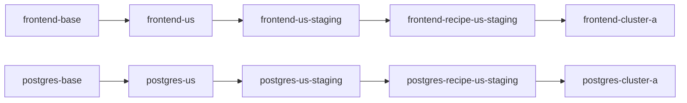

# `frontend-postgres`

This worked example extends [single-component](../single-component/README.md) from one component to a small app-level recipe.

It keeps the same model:

- `variant` = a unit specialized from an earlier unit
- `clone link` = the ConfigHub mechanism that keeps it connected upstream
- `bundle` = publish the resolved deployment output from a target

The recipe is still the ordered chain of variants, not the bundle. The difference here is that two components move through the same layer spaces together.

## Delivery Matrix

| Delivery Mode | Status | Notes |
|---------------|--------|-------|
| **Direct Kubernetes** | Fully working | Worker applies YAML via `kubectl apply`. |
| **Flux OCI** | Not yet implemented | Same contract as `single-component`. |
| **Argo OCI** | Not yet implemented | Target-state direction. |
| **ArgoCDRenderer** | Incompatible | Expects Argo `Application` payloads, not raw manifests. |

This example currently proves **Direct Kubernetes** delivery only. For Flux OCI, see [`gpu-eks-h100-training`](../gpu-eks-h100-training/README.md).

## What This Example Is For

Use this when `single-component` is too small but a full three-tier app would hide the point.

This example exists to show the first app-level recipe in the package: two components, shared layers, component-specific mutations, and one recipe manifest that proves the app moves as a coordinated unit.

## Stack And Scenario

This example is for:
- ConfigHub-managed Kubernetes manifests
- a small two-component app recipe
- shared layers with component-specific mutations

## What You Need Installed

- `cub` in `PATH`
- an authenticated ConfigHub CLI context for any mutating step
- `jq` for the JSON preview path
- optional: a live target only if you want to bind and apply

## What This Reads And Writes

What it reads:
- `../../../global-app/baseconfig/frontend.yaml`
- `../../../global-app/baseconfig/postgres.yaml`
- `./backend-stub.yaml`
- current ConfigHub context and optional target ref

What it writes:
- five ConfigHub spaces with a shared prefix
- two layered component chains
- one deploy-stage `backend-stub`
- one app-level recipe manifest
- optional target bindings
- optional live deployment state only if you explicitly bind and apply

## What You Should Expect To See

In ConfigHub-only mode:
- five spaces sharing one prefix
- two layered chains
- one deploy-stage stub
- one recipe manifest unit
- `verify.sh` passing

In live mode:
- deployment units bound to a target
- successful `cub unit apply`
- live resources visible in the chosen target path

## AI-Safe Path

If you want to use this example with an AI assistant, start here:

- [AI_START_HERE.md](./AI_START_HERE.md)
- [prompts.md](./prompts.md)
- [contracts.md](./contracts.md)

## What It Builds

Two components from `global-app`:

- `../../../global-app/baseconfig/frontend.yaml`
- `../../../global-app/baseconfig/postgres.yaml`

Each component gets a materialized chain in the same five spaces:



Shared spaces:

- `catalog-base`
- `catalog-us`
- `catalog-us-staging`
- `recipe-us-staging`
- `deploy-cluster-a`

The example also writes one explicit app-level recipe manifest unit into the recipe space. The variant chains are what ConfigHub executes; the recipe manifest is the receipt that shows both components together and records their provenance.

The recipe source has two forms:

- [recipe.base.yaml](./recipe.base.yaml): placeholder-based base recipe for the whole app
- `.state/recipe-us-staging-app.rendered.yaml`: rendered concrete recipe instance for this run

## Layer Semantics

Shared layer names:

- `base`
- `region`
- `role`
- `recipe`
- `deployment`

Component-specific mutations:

- `frontend`
  - `region`: set the ingress host to `frontend.us.demo.confighub.local`
  - `role`: set `replicas=2` and `PUBLIC_ENV=staging`
  - `recipe`: set `RELEASE_CHANNEL=us-staging-recipe`
  - `deployment`: set namespace, cluster host, and `CLUSTER=cluster-a`
- `postgres`
  - `region`: add `REGION=US`
  - `role`: set PVC size to `10Gi` and `ROLE=staging`
  - `recipe`: set `POSTGRES_DB=chatdb_us_staging`
  - `deployment`: set namespace and `CLUSTER=cluster-a`

This is the point of the example: the layer names are shared, but the mutations can still be component-specific.

## Quick Start

```bash
cd incubator/global-app-layer/frontend-postgres

# Inspect the full plan without mutating ConfigHub
./setup.sh --explain

# Machine-readable plan for AI or tooling
./setup.sh --explain-json | jq

# Ready for a fresh run
./setup.sh                              # ConfigHub-only
./setup.sh <prefix> <space/target>     # with live target
./verify.sh
```

After `./setup.sh`, prefer the printed clickable GUI URLs and `.logs/*.latest.log` files over terminal scrollback alone.

## Upgrade Flow

This example shows how a small app recipe upgrades across multiple components.

```bash
# Update the base image tags, then push upgrades stage by stage
./upgrade-chain.sh 1.1.8 16.1

# Verify that both components still carry their layer-specific mutations
./verify.sh
```

## Optional Target + Bundle Story

If you did not pass a target during setup:

```bash
./set-target.sh <space/target>
```

Then you can use normal ConfigHub apply flow on both deployment units:

```bash
cub unit approve --space <prefix>-deploy-cluster-a frontend-cluster-a
cub unit approve --space <prefix>-deploy-cluster-a postgres-cluster-a
cub unit apply --space <prefix>-deploy-cluster-a frontend-cluster-a
cub unit apply --space <prefix>-deploy-cluster-a postgres-cluster-a
```

The bundle belongs to the target. The recipe manifest records the layered provenance for both components and includes a bundle hint once a target is set.

## Inspecting the Result

```bash
# Show the deployment data for one component
cub unit get --space <prefix>-deploy-cluster-a --data-only frontend-cluster-a

# Show the app-level recipe manifest
cub unit get --space <prefix>-recipe-us-staging --data-only recipe-us-staging-app

# Show variant ancestry (implemented with clone links)
cub unit tree --edge clone --where "Labels.ExampleName = 'global-app-layer-frontend-postgres'"
```

## Cleanup

```bash
./cleanup.sh
```

## Why This Example Exists

This is the next step after [single-component](../single-component/README.md).

`single-component` proves the recipe-chain model for one component.
`frontend-postgres` proves that the same model also works for a small app where:

- multiple components share the same layer spaces
- layers keep a consistent meaning across components
- mutations are still component-specific
- the app-level recipe can be described explicitly in one manifest
