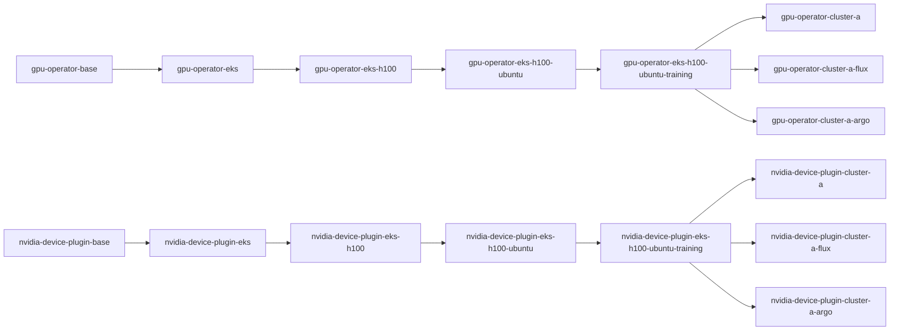

# `gpu-eks-h100-training`

This worked example turns the GPU recipe sketch into a real runnable multi-component ConfigHub example.

It keeps the recipe-and-layer model intentionally reviewable:

- two components:
  - `gpu-operator`
  - `nvidia-device-plugin`
- one ordered chain per component
- four shared recipe dimensions:
  - platform = `eks`
  - accelerator = `h100`
  - os = `ubuntu`
  - intent = `training`

The point is not to recreate all of NVIDIA AICR. The point is to show how ConfigHub can model the same kind of layered, reproducible recipe with real units, real variant links, and an explicit recipe manifest that spans more than one related component.

## Delivery Matrix

| Delivery Mode | Status | Notes |
|---------------|--------|-------|
| **Direct Kubernetes** | Fully working | Worker applies YAML via `kubectl apply`. |
| **Flux OCI** | Fully working | Explicit Flux deployment variant. Current standard controller path. |
| **Argo OCI** | Fully working | Explicit Argo deployment variant. Requires ArgoCD v3.1+. See [`07-argo-oci-spec.md`](../07-argo-oci-spec.md). |
| **ArgoCDRenderer** | Incompatible | Expects Argo `Application` payloads, not raw manifests. |

This example has **all three delivery modes** working:

- Direct deployment variant: `<prefix>-deploy-cluster-a`
- Flux deployment variant: `<prefix>-deploy-cluster-a-flux`
- Argo deployment variant: `<prefix>-deploy-cluster-a-argo`

Use this as the reference implementation for OCI bundle delivery in the layered recipe examples.

## What This Example Is For

Use this when the reason for the demo is the NVIDIA-shaped chain model rather than a generic web app.

This example exists to make layered GPU-oriented recipes reviewable on ordinary clusters. It proves the structure, provenance, and deployment variants of that stack without pretending to be a full functional NVIDIA runtime.

## Stack And Scenario

This example is for:
- ConfigHub-managed Kubernetes manifests
- NVIDIA AICR-style layered recipe structure
- multi-component GPU-related software stacks

## What You Need Installed

- `cub` in `PATH`
- an authenticated ConfigHub CLI context for any mutating step
- `jq` for the JSON preview path
- optional: a live target only if you want to bind and apply
- optional: GPU-capable nodes and real NVIDIA images only if you want functional proof rather than structural proof

## What This Reads And Writes

What it reads:
- local base YAML files in this example directory
- current ConfigHub context and optional target ref

What it writes:
- eight ConfigHub spaces with a shared prefix
- units for each layer of both components
- clone links / variant ancestry
- one stack-level recipe manifest
- one direct deployment unit per component in the direct deploy space
- one Flux deployment unit per component in the Flux deploy space
- one Argo deployment unit per component in the Argo deploy space
- optional target bindings
- optional live deployment state only if you explicitly bind and apply

## What You Should Expect To See

In ConfigHub-only mode:
- eight spaces sharing one prefix
- two layered GPU chains
- three deployment variants at the leaf
- one recipe manifest unit
- `verify.sh` passing

In live mode:
- deployment variants bound to compatible targets
- successful `cub unit apply`
- live resources or delegated delivery objects visible

## AI-Safe Path

If you want to use this example with an AI assistant, start here:

- [AI_START_HERE.md](./AI_START_HERE.md)
- [prompts.md](./prompts.md)
- [contracts.md](./contracts.md)

If you want the full lifecycle after setup + verify, including live deployment, shared updates, and an extra downstream deployment variant, use:

- [../whole-journey.md](../whole-journey.md)

## Stub Images

The base manifests use **stub container images** (`nginx:1.27-alpine` and `busybox:1.37`) so the example runs on any cluster, including local kind clusters with no GPU hardware. The layering, variant chains, and recipe structure are identical to what a real deployment would use.

To point at real NVIDIA images, replace the `image:` lines in the base YAMLs:

```yaml
# gpu-operator.base.yaml
image: nvcr.io/nvidia/gpu-operator:24.6.0

# nvidia-device-plugin.base.yaml
image: nvcr.io/nvidia/k8s-device-plugin:v0.16.2
```

Or use `set-image-reference` after setup to swap them in through the chain.

## What It Builds

Two base manifests local to this example:

- [gpu-operator.base.yaml](./gpu-operator.base.yaml)
- [nvidia-device-plugin.base.yaml](./nvidia-device-plugin.base.yaml)

Two materialized chains in the same shared spaces:



The chains are split across eight shared spaces:

- `catalog-base`
- `catalog-eks`
- `catalog-h100`
- `catalog-ubuntu`
- `recipe-eks-h100-ubuntu-training`
- `deploy-cluster-a`
- `deploy-cluster-a-flux`
- `deploy-cluster-a-argo`

The example also writes one explicit recipe manifest unit into the recipe space:

- `recipe-eks-h100-ubuntu-training-stack`

The recipe source has two forms:

- [recipe.base.yaml](./recipe.base.yaml): placeholder-based base recipe
- `.state/recipe-eks-h100-ubuntu-training-stack.rendered.yaml`: rendered concrete recipe instance for this run

## Layer Semantics

Shared layers:

- `platform`: `eks`
- `accelerator`: `h100`
- `os`: `ubuntu`
- `intent`: `training`

Component-specific mutations:

- `gpu-operator`
  - `platform`: set `CLOUD_PROVIDER=eks` and `STORAGE_CLASS=gp3`
  - `accelerator`: set `ACCELERATOR=h100` and `NODE_SELECTOR=nvidia-h100`
  - `os`: set `OS_FAMILY=ubuntu` and `DRIVER_BRANCH=550-ubuntu22.04`
  - `recipe`: set `WORKLOAD_INTENT=training` and `VALIDATION_PROFILE=training-smoke`
  - `deployment variants`: set namespace and `CLUSTER=cluster-a` on all three leaves (direct, flux, argo)
- `nvidia-device-plugin`
  - `platform`: set `CLOUD_PROVIDER=eks` and `PLUGIN_CONFIG=eks-gp3`
  - `accelerator`: set `ACCELERATOR=h100` and `NODE_SELECTOR=nvidia-h100`
  - `os`: set `OS_FAMILY=ubuntu` and `PLUGIN_CONFIG=ubuntu-h100`
  - `recipe`: set `WORKLOAD_INTENT=training` and `PLUGIN_CONFIG=training-smoke`
  - `deployment variants`: set namespace and `CLUSTER=cluster-a` on all three leaves (direct, flux, argo)

This is the main user-facing point of the example: one recipe can govern multiple related components while keeping shared layer meaning and component-specific changes separate. The variant chains are what ConfigHub executes; the recipe manifest is the receipt that explains the full GPU stack.

It also fits the App-Deployment-Target model used elsewhere in the examples:
- the shared recipe layers are the app-level intent
- the deployment units are the concrete deployment variants at the leaf
- this example now materializes:
  - one direct deployment variant
  - one Flux deployment variant
  - one Argo deployment variant

## Quick Start

```bash
cd incubator/global-app-layer/gpu-eks-h100-training

# Inspect the full plan without mutating ConfigHub
./setup.sh --explain

# Machine-readable plan for AI or tooling
./setup.sh --explain-json | jq

# Ready for a fresh run
./setup.sh                                            # ConfigHub-only
./setup.sh <prefix> <kubernetes-target>               # bind direct variant during setup
./setup.sh <prefix> <kubernetes-target> <fluxoci-target>  # bind direct and Flux variants during setup
./setup.sh <prefix> <kubernetes-target> <fluxoci-target> <argocdoci-target>  # bind all three variants
./verify.sh
```

After `./setup.sh`, prefer the printed clickable GUI URLs and `.logs/*.latest.log` files over terminal scrollback alone.

## Upgrade Flow

This example also demonstrates how base image updates propagate through the layered chains without flattening the higher-level recipe choices.

```bash
./upgrade-chain.sh 24.6.1 v0.16.3
./verify.sh
```

## Optional Target + Bundle Story

If you did not pass a target during setup:

```bash
./set-target.sh <kubernetes-target>
./set-target.sh <fluxoci-target>
./set-target.sh <argocdoci-target>
```

Then you can use normal ConfigHub apply flow on any deployment variant.

Direct Kubernetes variant:

```bash
cub unit approve --space <prefix>-deploy-cluster-a gpu-operator-cluster-a
cub unit approve --space <prefix>-deploy-cluster-a nvidia-device-plugin-cluster-a

cub unit apply --space <prefix>-deploy-cluster-a gpu-operator-cluster-a
cub unit apply --space <prefix>-deploy-cluster-a nvidia-device-plugin-cluster-a
```

Flux deployment variant:

```bash
cub unit approve --space <prefix>-deploy-cluster-a-flux gpu-operator-cluster-a-flux
cub unit approve --space <prefix>-deploy-cluster-a-flux nvidia-device-plugin-cluster-a-flux

cub unit apply --space <prefix>-deploy-cluster-a-flux gpu-operator-cluster-a-flux
cub unit apply --space <prefix>-deploy-cluster-a-flux nvidia-device-plugin-cluster-a-flux
```

Argo deployment variant:

```bash
cub unit approve --space <prefix>-deploy-cluster-a-argo gpu-operator-cluster-a-argo
cub unit approve --space <prefix>-deploy-cluster-a-argo nvidia-device-plugin-cluster-a-argo

cub unit apply --space <prefix>-deploy-cluster-a-argo gpu-operator-cluster-a-argo
cub unit apply --space <prefix>-deploy-cluster-a-argo nvidia-device-plugin-cluster-a-argo
```

Important:
- this example now supports three honest live paths:
  - `Kubernetes` target -> direct deployment variant
  - `FluxOCI` or `FluxOCIWriter` target -> Flux deployment variant
  - `ArgoCDOCI` target -> Argo deployment variant
- the deployment units here are raw Kubernetes manifests
- the current `ArgoCDRenderer` path is renderer-oriented and expects Argo CD `Application` payloads, so the helper scripts still reject it for this example instead of implying a real Argo-sync proof
- `FluxRenderer` is the import-and-render path for existing Flux resources, not the deployment bridge for this example

The bundle belongs to the target. The recipe manifest records the full multi-component chain and includes bundle hints per deployment variant once targets are set.

## Inspecting the Result

```bash
# Show one deployment unit
cub unit get --space <prefix>-deploy-cluster-a --data-only gpu-operator-cluster-a

# Show the Flux deployment variant
cub unit get --space <prefix>-deploy-cluster-a-flux --data-only gpu-operator-cluster-a-flux

# Show the Argo deployment variant
cub unit get --space <prefix>-deploy-cluster-a-argo --data-only gpu-operator-cluster-a-argo

# Show the explicit recipe manifest
cub unit get --space <prefix>-recipe-eks-h100-ubuntu-training --data-only recipe-eks-h100-ubuntu-training-stack

# Show variant ancestry (implemented with clone links)
cub unit tree --edge clone --where "Labels.ExampleName = 'global-app-layer-gpu-eks-h100-training'"
```

## Cleanup

```bash
./cleanup.sh
```

## Why This Example Exists

This is the first domain-shaped multi-component example in the `global-app-layer` package.

The earlier examples prove the variant-chain model with `global-app` components. This example proves that the same ConfigHub pattern can express a more domain-specific recipe with dimensions like platform, accelerator, OS, and intent across multiple related GPU components.

That makes it the bridge between the small `global-app` teaching examples and the larger NVIDIA-style recipe story.
