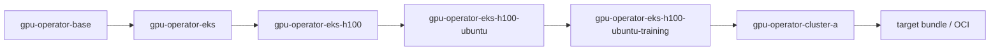

# `gpu-eks-h100-training`

This worked example turns the earlier GPU recipe sketch into a real runnable ConfigHub example.

It keeps the recipe-and-layer model deliberately small:

- one component: `gpu-operator`
- one ordered chain
- four meaningful recipe dimensions:
  - platform = `eks`
  - accelerator = `h100`
  - os = `ubuntu`
  - intent = `training`

The point is not to recreate all of NVIDIA AICR. The point is to show how ConfigHub can model the same kind of layered, reproducible recipe with real units, real clone links, and an explicit recipe manifest.

## What It Builds

One base manifest local to this example:

- [gpu-operator.base.yaml](./gpu-operator.base.yaml)

One materialized chain:



The chain is split across six spaces:

- `catalog-base`
- `catalog-eks`
- `catalog-h100`
- `catalog-ubuntu`
- `recipe-eks-h100-ubuntu-training`
- `deploy-cluster-a`

The example also writes one explicit recipe manifest unit into the recipe space:

- `recipe-eks-h100-ubuntu-training`

The recipe source has two forms:

- [recipe.base.yaml](./recipe.base.yaml): placeholder-based base recipe
- `.state/recipe-eks-h100-ubuntu-training.rendered.yaml`: rendered concrete recipe instance for this chain

## Layer Semantics

- `base`: generic `gpu-operator` manifest with non-specialized defaults
- `platform`: set `CLOUD_PROVIDER=eks` and `STORAGE_CLASS=gp3`
- `accelerator`: set `ACCELERATOR=h100` and `NODE_SELECTOR=nvidia-h100`
- `os`: set `OS_FAMILY=ubuntu` and `DRIVER_BRANCH=550-ubuntu22.04`
- `recipe`: set `WORKLOAD_INTENT=training` and `VALIDATION_PROFILE=training-smoke`
- `deployment`: set namespace and `CLUSTER=cluster-a`

This is the key teaching point: the recipe is the ordered chain of those specializations. The target bundle is the deployment output of the final deployment unit.

## Quick Start

```bash
cd incubator/global-app-layer/gpu-eks-h100-training

# Build the chain only
./setup.sh

# Or build it and wire a real target immediately
./setup.sh <prefix> <space/target>

# Verify the chain and explicit recipe manifest
./verify.sh
```

## Upgrade Flow

This example also demonstrates how a base image update propagates through the layered chain without flattening the higher-level recipe choices.

```bash
./upgrade-chain.sh 24.6.1
./verify.sh
```

## Optional Target + Bundle Story

If you did not pass a target during setup:

```bash
./set-target.sh <space/target>
```

Then you can use normal ConfigHub apply flow on the deployment unit:

```bash
cub unit approve --space <prefix>-deploy-cluster-a gpu-operator-cluster-a
cub unit apply --space <prefix>-deploy-cluster-a gpu-operator-cluster-a
```

The bundle belongs to the target. The recipe manifest records the full chain that produced the deployment and includes a bundle hint once a target is set.

## Inspecting the Result

```bash
# Show the deployment data
cub unit get --space <prefix>-deploy-cluster-a --data-only gpu-operator-cluster-a

# Show the explicit recipe manifest
cub unit get --space <prefix>-recipe-eks-h100-ubuntu-training --data-only recipe-eks-h100-ubuntu-training

# Show clone relationships
cub unit tree --edge clone --where "Labels.ExampleName = 'global-app-layer-gpu-eks-h100-training'"
```

## Cleanup

```bash
./cleanup.sh
```

## Why This Example Exists

This is the first domain-shaped example in the `global-app-layer` package.

The earlier examples prove the clone-chain model with `global-app` components.
This example proves that the same ConfigHub pattern can express a more domain-specific recipe with dimensions like platform, accelerator, OS, and intent.

That makes it the bridge between the small `global-app` teaching examples and the larger NVIDIA-style recipe story.
