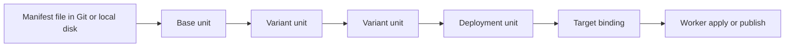
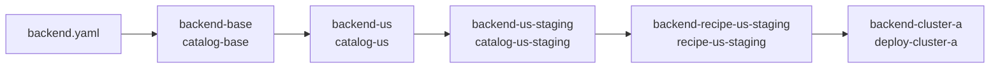
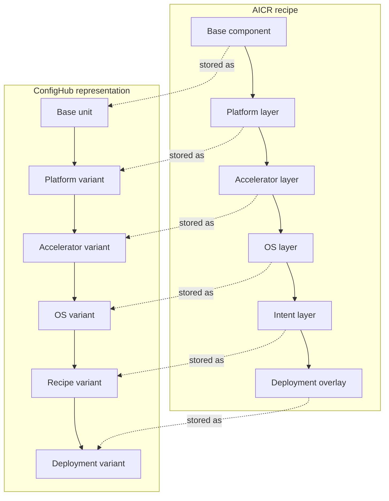
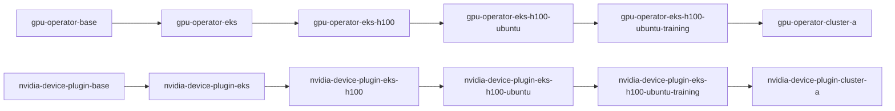

# How This Works

This document explains the mechanics behind the four `global-app-layer` examples: how manifests move through ConfigHub, how name conflicts are avoided, what the worker does, and where AI fits.

## 1. Config Manifests live in the Database

Every piece of Kubernetes YAML lives in ConfigHub as a **unit** — a versioned, content-addressed blob. The lifecycle is:



The user-facing idea is a **layered variant chain**:

- one base unit
- one more specialized variant at each layer
- one final deployment unit

The underlying ConfigHub mechanism is a set of **clone links** between those units. That is how shared updates can flow downstream with provenance.

### `single-component`: one layered variant chain



Layer-by-layer, that means:

- `backend-base`: original manifest stored as a unit
- `backend-us`: region specialization
- `backend-us-staging`: role specialization
- `backend-recipe-us-staging`: recipe-level shared intent
- `backend-cluster-a`: final deployment-specific variant

Each variant is a new revision that inherits its parent’s data. Mutations are applied via `cub function do`, which writes a new revision to the unit. The database tracks every revision with a content hash.

The **recipe manifest** unit is separate metadata in the recipe space. It is not another executable layer. It is the receipt that records the full provenance: which spaces, units, revisions, and hashes compose the recipe.

When you change the base, the change propagates down through clone links. When you mutate a leaf, only that leaf changes. The database holds the complete history.

## 2. How NVIDIA AICR Layers Map to ConfigHub

NVIDIA AICR talks about layers.
ConfigHub stores one unit at each specialization stage.



For the GPU example that becomes:



The important shift is:

- AICR describes a stack as layers
- ConfigHub stores each layer outcome as a real unit
- clone links record how one specialized variant came from an earlier one

## 3. GitOps with Workers and Targets

Traditional GitOps sources YAML from Git. ConfigHub is different: config units are literal deployment manifests that are **deployed to targets** — named delivery endpoints.

All targets are created, registered, and managed using **workers**. Each **worker** is a long-lived agent running inside the Kubernetes cluster (in the `confighub` namespace). It maintains a persistent connection to the ConfigHub management plane and registers one or more **targets**, scoped to the worker's space.

When you `cub unit set-target` + `cub unit apply`:

1. ConfigHub renders the unit's current data (the accumulated base + all clone mutations)
2. Sends it to the worker via the target reference
3. The worker applies the rendered YAML to the cluster

The worker supports two target types in this example:

| Target | Slug | What it does |
|---|---|---|
| **Kubernetes (direct)** | `worker-kubernetes-yaml-cluster` | Worker applies YAML directly via `kubectl apply` |
| **ArgoCDRenderer** | `worker-argocdrenderer-kubernetes-yaml-cluster` | Worker pushes YAML through ArgoCD |

In these examples we use the direct target. You could swap the direct target for ArgoCD and the layered variant chain is unchanged — only the delivery mode differs.

### How ArgoCD Integration Works

When you use the `ArgoCDRenderer` target, the flow is:

```
ConfigHub (materialized config)
    → worker (in-cluster agent)
        → ArgoCD (as a rendering/delivery engine)
            → cluster
```

The worker hands ArgoCD the rendered YAML that ConfigHub materialized through the layered variant chain. ArgoCD applies it and then does what ArgoCD does — drift detection, self-heal, health checks, sync status. But the **source of truth is ConfigHub**, not a Git repo.

This is the opposite of the typical ArgoCD model where Argo watches a Git repo. Here, ArgoCD is demoted from "source of truth" to "delivery and reconciliation engine."

### Brownfield: The Reverse Direction

The brownfield flow goes the other way — `cub gitops discover` finds existing ArgoCD Applications on the cluster and `cub gitops import` pulls their rendered manifests into ConfigHub as units. That's Git→Argo→ConfigHub (one-time import). After that, the ongoing flow is ConfigHub→worker→Argo→cluster.

### Label Mapping (Open Design Question)

When ArgoCD Applications carry labels like `team=payments` or `env=prod`, there is currently no deterministic convention for how those map to ConfigHub spaces and unit labels. This is a [known gap with a proposed design](../planning/2026-03-17-label-mapping-convention.md). The labels are preserved in imported YAML but don't yet influence ConfigHub organizational placement.

## 4. End-to-End Testing

The [e2e/](./e2e/) directory now contains the full lifecycle tests for this package.

It covers:

- **Brownfield**: import an existing cluster app into ConfigHub, mutate it, apply
- **Greenfield**: create layered chains from scratch, deploy all four recipes
- **Bridge**: import first, then layer greenfield config on top
- **Direct delivery**: apply a single materialized example through the worker
- **Argo-oriented delivery**: deliver a single materialized example through the Argo path

## 5. Role of AI

ConfigHub does **not use AI internally** but we recommend using it to "drive" the management plane and config data APIs.

ConfigHub mutations are explicit, deterministic function calls:

| Function | What it does |
|---|---|
| `set-env` | Set an environment variable on a container |
| `set-replicas` | Set replica count on a Deployment/StatefulSet |
| `set-namespace` | Set the metadata.namespace on all resources |
| `set-string-path` | Set any string value at an arbitrary YAML path |

Same input always produces same output. No model inference, no probabilistic output, no training data dependency.

Where AI fits in the ConfigHub vision is **operating assistance** — helping humans design layered variant chains, choose which mutations to apply at which layer, generate recipe manifests, and reason about config drift. Eg Helm is a deterministic generator that could be AI-assisted (e.g., "given this Helm chart, propose a layered chain").

In this demo our example scripts were written with AI assistance (designing the layering structure, debugging deployment failures, creating stub dependencies, iterating on the chain design). But the artifacts produced are plain bash scripts calling deterministic CLI commands. There is no AI in the loop at runtime.

## 6. Avoiding Name Conflicts

Each recipe run gets a random prefix (e.g. `hug-hug`, `den-cub`, `roll-cub`, `berry-sun`) generated by `cub space new-prefix`. Every space name is `{prefix}-{suffix}`:

- `hug-hug-catalog-base`, `hug-hug-deploy-cluster-a` (single-component)
- `den-cub-catalog-base`, `den-cub-deploy-cluster-a` (frontend-postgres)

This means four recipes create ~20 spaces with zero name collisions.

On the cluster side, `DEPLOY_NAMESPACE` is overridable (`recipe-sc`, `recipe-fp`, `recipe-ra`, `recipe-gpu`), so each recipe's pods land in a different namespace.

Unit names within a space are fixed per-component (`backend-base`, `frontend-cluster-a`) — they don't conflict because they live in prefix-scoped spaces.
