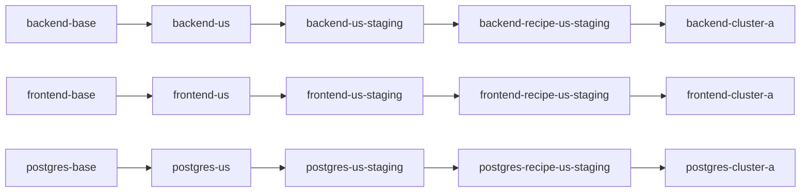

# `realistic-app`

This worked example extends [frontend-postgres](../frontend-postgres/README.md) into a fuller `global-app` recipe with three coordinated components:

- `backend`
- `frontend`
- `postgres`

It keeps the same recipe model:

- `variant` = a unit specialized from an earlier unit
- `clone link` = the ConfigHub mechanism that keeps it connected upstream
- `deployment variant` = the final unit you can bind to a target and deploy
- `bundle` = a deployable artifact produced for a controller-oriented target
- `bundle evidence` = receipts about that artifact, such as digests, SBOMs,
  attestations, or GUI views

The recipe is still the ordered chain of variants plus the app-level provenance
record, not the bundle. What changes here is that the layer model now governs a
recognisable small app, not just a pair of components.

## What This Example Is For

Use this when you need the clearest layered recipe story that still feels like a real application.

This example exists to prove that the same chain model can govern a backend, frontend, and database together, and then carry that app cleanly into the live deployment follow-on path.

## Stack And Scenario

This example is for:
- ConfigHub-managed Kubernetes application manifests
- a small three-tier app recipe
- safe app-level layered propagation across backend, frontend, and database

## What You Need Installed

- `cub` in `PATH`
- an authenticated ConfigHub CLI context for any mutating step
- `jq` for the JSON preview path
- optional: a live target only if you want to bind and apply

## What This Reads And Writes

What it reads:
- `../../../global-app/baseconfig/backend.yaml`
- `../../../global-app/baseconfig/frontend.yaml`
- `../../../global-app/baseconfig/postgres.yaml`
- current ConfigHub context and optional target ref

What it writes:
- five ConfigHub spaces with a shared prefix
- units for each layer of each component
- one deployment-bootstrap namespace unit for the live path
- clone links / variant ancestry
- one app-level recipe manifest
- optional target bindings
- optional live deployment state only if you explicitly bind and apply

## What You Should Expect To See

In ConfigHub-only mode:
- five spaces sharing one prefix
- three coordinated layered chains
- one recipe manifest unit
- `verify.sh` passing

In live mode:
- deployment units bound to a target
- successful `./apply-live.sh`
- live resources visible in the chosen target path

## AI-Safe Path

If you want to use this example with an AI assistant, start here:

- [AI_START_HERE.md](./AI_START_HERE.md)
- [prompts.md](./prompts.md)
- [contracts.md](./contracts.md)

If you want the full lifecycle after setup + verify, including live deployment, shared updates, and a custom downstream deployment variant, use:

- [../whole-journey.md](../whole-journey.md)

## What It Builds

Three components from `global-app`:

- `../../../global-app/baseconfig/backend.yaml`
- `../../../global-app/baseconfig/frontend.yaml`
- `../../../global-app/baseconfig/postgres.yaml`

Each component gets a materialized chain in the same five spaces:



Shared spaces:

- `catalog-base`
- `catalog-us`
- `catalog-us-staging`
- `recipe-us-staging`
- `deploy-cluster-a`

The example also writes one explicit app-level recipe manifest unit into the recipe space:

- `recipe-us-staging-realistic-app`

And one deployment bootstrap unit into the deploy space:

- `cluster-a-namespace`

That manifest records the layer provenance for all three components together. The variant chains are what ConfigHub executes; the recipe manifest is the receipt that explains the assembled app.

The recipe source has two forms:

- [recipe.base.yaml](./recipe.base.yaml): placeholder-based base recipe for the whole app
- `.state/recipe-us-staging-realistic-app.rendered.yaml`: rendered concrete recipe instance for this run

## Layer Semantics

Shared layer names:

- `base`
- `region`
- `role`
- `recipe`
- `deployment`

Component-specific mutations:

- `backend`
  - `region`: set `REGION=us` and backend ingress host
  - `role`: set `replicas=2` and `ROLE=staging`
  - `recipe`: set an explicit backend `DATABASE_URL` for `chatdb` and set `CHAT_TITLE`
  - `deployment`: set namespace, deployment host, and `CLUSTER=cluster-a`
- `frontend`
  - `region`: set the ingress host to `frontend.us.demo.confighub.local`
  - `role`: set `replicas=2` and `PUBLIC_ENV=staging`
  - `recipe`: set `RELEASE_CHANNEL=us-staging-recipe`
  - `deployment`: set namespace, deployment host, and `CLUSTER=cluster-a`
- `postgres`
  - `region`: add `REGION=US`
  - `role`: set PVC size to `10Gi` and `ROLE=staging`
  - `recipe`: keep `POSTGRES_DB` aligned with the backend contract
  - `deployment`: set namespace and `CLUSTER=cluster-a`

This is what makes it more realistic than the earlier examples: the layers still have one shared meaning, but the app components now coordinate on a consistent staged deployment shape.

## Quick Start

```bash
cd incubator/global-app-layer/realistic-app

# Inspect the full plan without mutating ConfigHub
./setup.sh --explain

# Machine-readable plan for AI or tooling
./setup.sh --explain-json | jq .

# Ready for a fresh run
./setup.sh                              # ConfigHub-only
./setup.sh <prefix> <space/target>     # with live target
./verify.sh
./verify.sh --json
```

`--explain` and `--explain-json` are read-only. They describe the spaces,
clone chains, recipe manifest, and target behavior that `setup.sh` would create,
but they do not mutate ConfigHub.

After `./setup.sh`, prefer the printed clickable GUI URLs and `.logs/*.latest.log` files over terminal scrollback alone.

## Upgrade Flow

This example shows how a small app recipe upgrades across backend, frontend, and postgres together.

```bash
./upgrade-chain.sh 1.1.8 1.1.8 16.1
./verify.sh
```

## Optional Target + Bundle Story

If you did not pass a target during setup:

```bash
./set-target.sh <space/target>
```

The simplest honest live path is:

```bash
./apply-live.sh
```

`apply-live.sh` now does the whole safe live sequence for you:
- preflights the target and stops if it is not actually apply-ready
- refreshes the deploy-space clones from the latest upstream recipe revisions
- refreshes the app-level recipe receipt
- approves and applies the deployment bootstrap namespace unit first
- then approves and applies the backend, frontend, and postgres deployment units
- waits for completion instead of treating "apply started" as success

Important:
- this example's proven live path is the direct `Kubernetes` target
- the deployment units here are raw Kubernetes manifests, not Argo CD `Application` resources
- so `ArgoCDRenderer` is not a drop-in target swap for `realistic-app` today; the helper scripts now stop early and tell you that instead of failing later with `failed to parse Application`

The bundle belongs to the target path, not to the recipe itself:

- for the direct Kubernetes path, the honest proof is the applied live state and
  the deployment receipts
- for Flux OCI or Argo OCI paths, the bundle would be the controller-consumed
  OCI artifact

The explicit recipe manifest records the layered provenance for the whole app
and can carry bundle hints once a target is set, but it is not the deployable
artifact by itself.

## Inspecting the Result

```bash
# Show one deployment unit
cub unit get --space <prefix>-deploy-cluster-a --data-only backend-cluster-a

# Show the app-level recipe manifest
cub unit get --space <prefix>-recipe-us-staging --data-only recipe-us-staging-realistic-app

# Show variant ancestry (implemented with clone links)
cub unit tree --edge clone --where "Labels.ExampleName = 'global-app-layer-realistic-app'"
```

## Cleanup

```bash
./cleanup.sh
```

## Why This Example Exists

This is the next step after [frontend-postgres](../frontend-postgres/README.md).

- `single-component` proves the recipe-chain model for one component.
- `frontend-postgres` proves that shared layers work across more than one component.
- `realistic-app` proves that the same model scales to a small, recognisable app with coordinated backend, frontend, and database layers.
