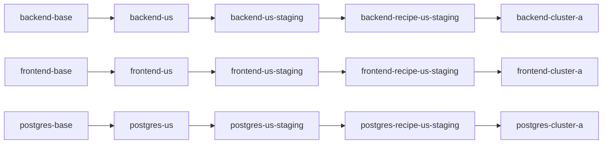

# `realistic-app`

This worked example extends [frontend-postgres](../frontend-postgres/README.md) into a fuller `global-app` recipe with three coordinated components:

- `backend`
- `frontend`
- `postgres`

It keeps the same recipe model:

- `clone` = make a variant
- `link` = keep it upgraded from upstream
- `bundle` = publish the resolved deployment output from a target

The recipe is still the ordered chain of variants, not the bundle. What changes here is that the layer model now governs a recognisable small app, not just a pair of components.

## What It Builds

Three components from `global-app`:

- `../../../global-app/baseconfig/backend.yaml`
- `../../../global-app/baseconfig/frontend.yaml`
- `../../../global-app/baseconfig/postgres.yaml`

Each component gets a materialized chain in the same five spaces:



Shared spaces:

- `catalog-base`
- `catalog-us`
- `catalog-us-staging`
- `recipe-us-staging`
- `deploy-cluster-a`

The example also writes one explicit app-level recipe manifest unit into the recipe space:

- `recipe-us-staging-realistic-app`

That manifest records the layer provenance for all three components together.

The recipe source has two forms:

- [recipe.base.yaml](./recipe.base.yaml): placeholder-based base recipe for the whole app
- `.state/recipe-us-staging-realistic-app.rendered.yaml`: rendered concrete recipe instance for this run

## Layer Semantics

Shared layer names:

- `base`
- `region`
- `role`
- `recipe`
- `deployment`

Component-specific mutations:

- `backend`
  - `region`: set `REGION=us` and backend ingress host
  - `role`: set `replicas=2` and `ROLE=staging`
  - `recipe`: point `DATABASE_URL` at `chatdb_us_staging` and set `CHAT_TITLE`
  - `deployment`: set namespace, deployment host, and `CLUSTER=cluster-a`
- `frontend`
  - `region`: set the ingress host to `frontend.us.demo.confighub.local`
  - `role`: set `replicas=2` and `PUBLIC_ENV=staging`
  - `recipe`: set `RELEASE_CHANNEL=us-staging-recipe`
  - `deployment`: set namespace, deployment host, and `CLUSTER=cluster-a`
- `postgres`
  - `region`: add `REGION=US`
  - `role`: set PVC size to `10Gi` and `ROLE=staging`
  - `recipe`: set `POSTGRES_DB=chatdb_us_staging`
  - `deployment`: set namespace and `CLUSTER=cluster-a`

This is what makes it more realistic than the earlier examples: the layers still have one shared meaning, but the app components now coordinate on a consistent staged deployment shape.

## Quick Start

```bash
cd incubator/global-app-layer/realistic-app

# Build the chain only
./setup.sh

# Or build it and wire a real target immediately
./setup.sh <prefix> <space/target>

# Verify all three chains and the app-level recipe manifest
./verify.sh
```

## Upgrade Flow

This example shows how a small app recipe upgrades across backend, frontend, and postgres together.

```bash
./upgrade-chain.sh 1.1.8 1.1.8 16.1
./verify.sh
```

## Optional Target + Bundle Story

If you did not pass a target during setup:

```bash
./set-target.sh <space/target>
```

Then you can use normal ConfigHub apply flow on all deployment units:

```bash
cub unit approve --space <prefix>-deploy-cluster-a backend-cluster-a
cub unit approve --space <prefix>-deploy-cluster-a frontend-cluster-a
cub unit approve --space <prefix>-deploy-cluster-a postgres-cluster-a

cub unit apply --space <prefix>-deploy-cluster-a backend-cluster-a
cub unit apply --space <prefix>-deploy-cluster-a frontend-cluster-a
cub unit apply --space <prefix>-deploy-cluster-a postgres-cluster-a
```

The bundle belongs to the target. The explicit recipe manifest records the layered provenance for the whole app and includes a bundle hint once a target is set.

## Inspecting the Result

```bash
# Show one deployment unit
cub unit get --space <prefix>-deploy-cluster-a --data-only backend-cluster-a

# Show the app-level recipe manifest
cub unit get --space <prefix>-recipe-us-staging --data-only recipe-us-staging-realistic-app

# Show clone relationships
cub unit tree --edge clone --where "Labels.ExampleName = 'global-app-layer-realistic-app'"
```

## Cleanup

```bash
./cleanup.sh
```

## Why This Example Exists

This is the next step after [frontend-postgres](../frontend-postgres/README.md).

- `single-component` proves the recipe-chain model for one component.
- `frontend-postgres` proves that shared layers work across more than one component.
- `realistic-app` proves that the same model scales to a small, recognisable app with coordinated backend, frontend, and database layers.
