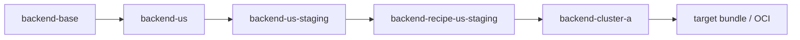

# `global-app-layers`

This incubator example turns one `global-app` component into an explicit layered recipe chain.

It demonstrates the model:

- `clone` = make a variant
- `link` = keep it upgraded from upstream
- `bundle` = publish the resolved deployment output from a target

The recipe is the ordered chain of variants, not the bundle.

## What It Builds

One component from `global-app`:

- source manifest: `../../global-app/baseconfig/backend.yaml`

One materialized chain:



The chain is split across five spaces:

- `catalog-base`
- `catalog-us`
- `catalog-us-staging`
- `recipe-us-staging`
- `deploy-cluster-a`

The example also writes an explicit recipe manifest unit into the recipe space. That manifest is metadata for teaching and provenance; ConfigHub does not need a first-class `Recipe` type for the chain to work.

The recipe source now has two forms:

- [recipe.base.yaml](/Users/alexis/Public/github-repos/examples/incubator/global-app-layers/recipe.base.yaml): placeholder-based base recipe, analogous to base config units that still need environment-specific values filled in
- `.state/recipe-us-staging.rendered.yaml`: rendered concrete recipe instance for this chain

The setup scripts render the concrete recipe instance from the placeholder-based base recipe.

## Layer Semantics

- `base`: original `global-app` backend manifest
- `region`: set `REGION=US` and a regional hostname
- `role`: set `ROLE=staging`, `replicas=2`, and `LOG_LEVEL=info`
- `recipe`: stamp a resolved recipe-specific chat title
- `deployment`: set namespace, cluster-local hostname, and cluster env var

## Quick Start

```bash
cd incubator/global-app-layers

# Build the chain only
./setup.sh

# Or build it and wire a real target immediately
./setup.sh <prefix> <space/target>

# Verify the chain and explicit recipe manifest
./verify.sh
```

## Upgrade Flow

This is the important part of the example: upgrades move down the chain without flattening the layers.

```bash
# Update the base image tag, then push upgrades stage by stage
./upgrade-chain.sh 1.1.8

# Verify the chain still has its layer-specific mutations
./verify.sh
```

## Optional Target + Bundle Story

If you did not pass a target during setup:

```bash
./set-target.sh <space/target>
```

Then you can use normal ConfigHub apply flow on the deployment unit:

```bash
cub unit approve --space <prefix>-deploy-cluster-a backend-cluster-a
cub unit apply --space <prefix>-deploy-cluster-a backend-cluster-a
```

The bundle belongs to the target. The recipe manifest records the chain that produced the deployment, and includes a bundle hint once a target is set.

## Inspecting the Result

```bash
# Show the deployment data
cub unit get --space <prefix>-deploy-cluster-a --data-only backend-cluster-a

# Show the explicit recipe manifest
cub unit get --space <prefix>-recipe-us-staging --data-only recipe-us-staging

# Show clone relationships
cub unit tree --edge clone --where "Labels.ExampleName = 'global-app-layers'"
```

## Cleanup

```bash
./cleanup.sh
```

## Why This Example Exists

This is a worked answer to the question:

- do we need a first-class recipe object?

For now, the answer is:

- execution can stay implicit in clones + links
- teaching and provenance should be explicit in metadata

That is why this example uses both:

- real clone-chain units for execution
- one explicit recipe manifest unit for explanation and review
- one placeholder-based base recipe file to show the source shape before values are materialized
