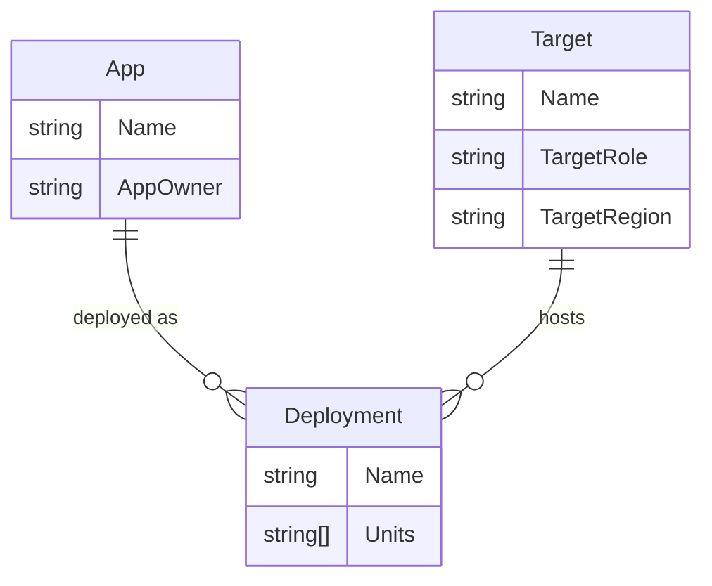

# ConfigHub Demo Data

Scripts and data files to populate a ConfigHub org with a representative multi-app, multi-environment dataset. The data set is specifically designed to experience the promotion UI in ConfigHub. 

## Prerequisites

- [`cub` CLI](https://docs.confighub.com/get-started/setup/#install-the-cli) built and on PATH.
- Run `cub upgrade` to make sure you have the latest build
- Authenticated to ConfigHub: `cub auth login`

## Quick Start

WARNING: These scripts do not set any prefixes on spaces being created in your ConfigHub org, so there is a possibility of conflict with existing spaces. The following spaces are created:

```
demo-infra
eu-*
us-*
```

Multiple spaces are created with the `eu` and `us` prefix. If this conflicts with your current setup, either don't run the scripts or modify them to suit your needs.

```bash
./setup.sh      # Create all demo data
./cleanup.sh    # Delete all demo data
```

## Conceptual Model

This demo aligns to an **App-Deployment-Target** model on top of ConfigHub. The core idea is a many-to-many relationship between Apps and Targets, with Deployment as the junction object:



**App** represents a software product (e.g. `aichat`, `eshop`). Each app belongs to a department. Additionally it can also represent a set of platform components.
**Target** represents a deployment destination — a specific Kubernetes cluster. Targets are numbered (e.g. `us-dev-1`, `us-dev-2`) because a given region/role combination can have multiple clusters. **Deployment** is the junction: one app deployed to one target, containing the specific configuration (units) for that combination.

For example, the `eshop` app deployed to the `us-prod-1` target produces the deployment `us-prod-1-eshop`, which contains units like `api`, `frontend`, `postgres`, `redis`, and `worker` — each customized for the prod/US environment.

### Mapping to ConfigHub

ConfigHub doesn't have first-class App or Deployment types with these relationships. Instead, we map the model using **spaces, units, and labels**:

| Concept | ConfigHub Primitive | Example |
|---------|-------------------|---------|
| App | Label on space + units | `App=eshop` |
| Target | Target object in an infra space | `us-prod-1` in space `us-prod-1` |
| Deployment | Space containing units | Space `us-prod-1-eshop` |

Each **deployment space** carries the combined labels from both its App and its Target, making it queryable from either dimension. For example, `us-prod-1-eshop` has `App=eshop`, `AppOwner=Product`, `TargetRole=Prod`, `TargetRegion=US`, etc.

Units within each space also carry the full set of labels. This is a workaround for a current product limitation — ideally, units would inherit labels from their parent space, but today they must be set explicitly.

## What Gets Created

### Apps (6)

| App | Description | AppOwner | Units |
|-----|-------------|----------|-------|
| **aichat** | AI chat application | Support | api, frontend, postgres, redis, worker |
| **website** | Marketing website | Marketing | web, cms, postgres |
| **docs** | Documentation site | Product | server, search |
| **eshop** | E-commerce store | Product | api, frontend, postgres, redis, worker |
| **portal** | Customer self-service | Support | api, frontend, postgres |
| **platform** | Shared infrastructure | Platform | cert-manager, traefik, external-dns, monitoring |

### Targets (7 clusters)

| Target | TargetRole | TargetRegion |
|--------|------------|--------------|
| us-dev-1 | Dev | US |
| us-dev-2 | Dev | US |
| us-qa-1 | QA | US |
| us-staging-1 | Staging | US |
| eu-staging-1 | Staging | EU |
| us-prod-1 | Prod | US |
| eu-prod-1 | Prod | EU |

Note that `us-dev-1` and `us-dev-2` both have TargetRole=Dev and TargetRegion=US — this illustrates that multiple clusters can serve the same role in the same region.

### Total: 49 spaces, ~154 units

- 7 infrastructure spaces (one per target, each with a worker + target)
- 42 app deployment spaces (`{target}-{app}`, e.g. `us-prod-1-aichat`)

## Label Reference

Labels are set on targets, spaces, and units. Spaces and units carry the full combined set so that queries can filter across any dimension.

### Target labels

| Label | Values | Source |
|-------|--------|-------|
| `ExampleName` | `demo-data` | — |
| `TargetRole` | `Dev`, `QA`, `Staging`, `Prod` | Target |
| `TargetRegion` | `US`, `EU` | Target |

### Deployment space and unit labels

| Label | Values | Source |
|-------|--------|-------|
| `ExampleName` | `demo-data` | — |
| `App` | `aichat`, `website`, `docs`, `eshop`, `portal`, `platform` | App |
| `AppOwner` | `Marketing`, `Product`, `Support`, `Platform` | App |
| `TargetRole` | `Dev`, `QA`, `Staging`, `Prod` | Target |
| `TargetRegion` | `US`, `EU` | Target |

## Exploring the Data

```bash
# List all demo spaces
cub space list --where "Labels.ExampleName = 'demo-data'"

# Filter by app
cub space list --where "Labels.App = 'aichat'"

# Filter by target role
cub space list --where "Labels.TargetRole = 'Prod'"

# Filter by region
cub space list --where "Labels.TargetRegion = 'US'"

# Filter by owner
cub space list --where "Labels.AppOwner = 'Product'"

# Cross-dimensional: all prod spaces in US
cub space list --where "Labels.TargetRole = 'Prod' AND Labels.TargetRegion = 'US'"

# List units in a specific deployment
cub unit list --space us-prod-1-aichat

# Compare image versions across environments (shows version skew in eshop)
cub function do get-image api --space us-prod-1-eshop --unit api --output-only
cub function do get-image api --space eu-prod-1-eshop --unit api --output-only
```

## Environment Variations

The setup script customizes deployments per environment:

| Setting | dev | qa | staging | prod |
|---------|-----|----|---------|------|
| Replicas | 1 | 1 | 2 | 3 |
| LOG_LEVEL | debug | debug | info | warn |
| CPU request | 100m | 100m | 100m | 500m |
| Memory request | 256Mi | 256Mi | 256Mi | 512Mi |

An intentional version skew exists in `us-prod-1-eshop` (api image `:4.2.0` vs `:4.2.1` elsewhere) to demonstrate diff capabilities.

## Directory Structure

```
demo-data/
  setup.sh          Main setup script
  cleanup.sh        Delete all demo data
  lib.sh            Shared variables and helpers
  worker.json       Worker template for placeholder workers
  config-data/      Base Kubernetes YAML templates
    aichat/         AI chat app (5 units)
    website/        Marketing website (3 units)
    docs/           Documentation site (2 units)
    eshop/          E-commerce store (5 units)
    portal/         Internal dashboard (3 units)
    platform/       Shared infrastructure (4 units)
```

## The "noop" target bridge

To simplify the setup of this demo, it uses a server hosted worker so you do not have to run any Kubernetes clusters. All targets point to the "noop" bridge hosted on the server. This bridge is a "no operations" bridge which allows you to perform apply and destroy operations in the UI that don't have any effect.
